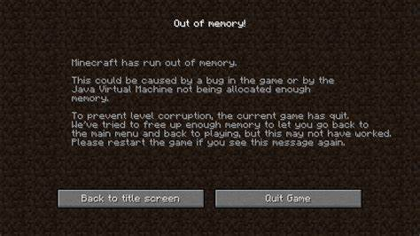
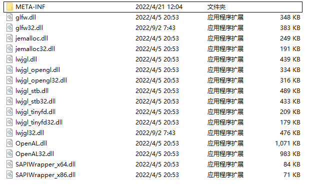
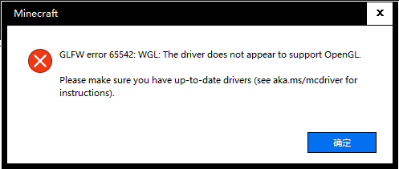
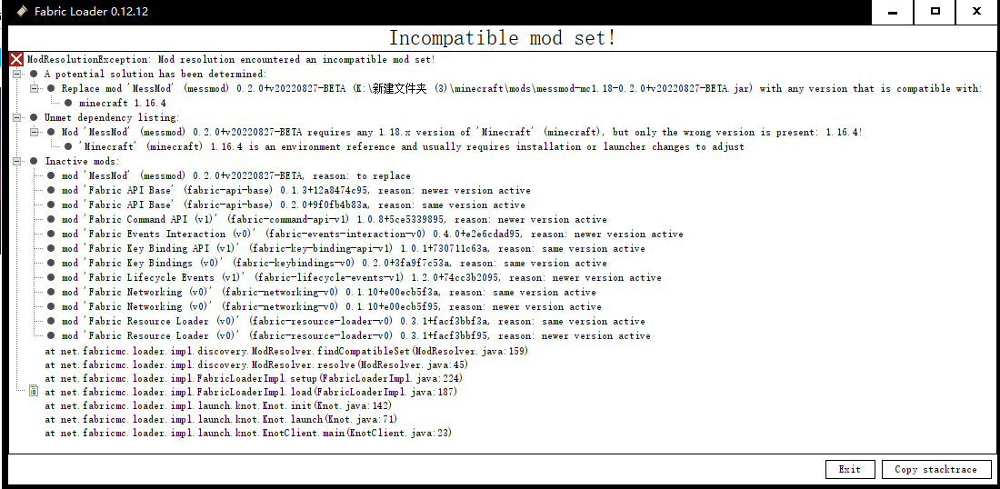

## 常见崩溃的解决（欢迎补充）

此处列举了几种常见的Minecraft崩溃及其解决方案，推荐大家熟悉一遍以便应对不时之需。如果此处有所缺漏，欢迎在Github上创建Issue或在原帖中回复补充，您的反馈会为更多读者指明解决问题的方向。

[Bei_kui-北葵](https://space.bilibili.com/262366744/) 的Minecraft崩溃解决方案：https://www.bilibili.com/read/readlist/rl336711

### Java版本过低

#### 标志性现象

启动Minecraft 1.17或更新的版本时游戏直接崩溃，甚至都没有日志文件和崩溃报告，但会有类似于下面的错误信息：

```
Error: A JNI error has occurred, please check your installation and try again
Exception in thread "main" java.lang.UnsupportedClassVersionError: net/minecraft/client/main/Main has been compiled by a more recent version of the Java Runtime (class file version 60.0), this version of the Java Runtime only recognizes class file versions up to 52.0
        at java.lang.ClassLoader.defineClass1(Native Method)
        at java.lang.ClassLoader.defineClass(Unknown Source)
        at java.security.SecureClassLoader.defineClass(Unknown Source)
        at java.net.URLClassLoader.defineClass(Unknown Source)
        at java.net.URLClassLoader.access$100(Unknown Source)
        at java.net.URLClassLoader$1.run(Unknown Source)
        at java.net.URLClassLoader$1.run(Unknown Source)
        at java.security.AccessController.doPrivileged(Native Method)
        at java.net.URLClassLoader.findClass(Unknown Source)
        at java.lang.ClassLoader.loadClass(Unknown Source)
        at sun.misc.Launcher$AppClassLoader.loadClass(Unknown Source)
        at java.lang.ClassLoader.loadClass(Unknown Source)
        at sun.launcher.LauncherHelper.checkAndLoadMain(Unknown Source)
```

#### 问题原因

注意上面错误信息中的这样一句话：

```
net/minecraft/client/main/Main has been compiled by a more recent version of the Java Runtime (class file version 60.0), this version of the Java Runtime only recognizes class file versions up to 52.0
```

翻译过来大概就是：Minecraft被更（四声）新的Java编译过，太新了，现在的Java认不出了，或者说不敢认了。

#### 解决方案

##### Java版本的选择

还是注意一下崩溃报告中的这句话：

```
net/minecraft/client/main/Main has been compiled by a more recent version of the Java Runtime (class file version 60.0)
```

重点注意数字60，这个数字减去44，即为Minecraft需要的Java版本，也就是Java 16。MC在变，Java在变，刻进了JVM官方标准的这一条，永远不变。

还是要给些现成的：

- 如果需要启动1.16.5或更早的版本，安装Java 8或Java 11。
- 如果需要启动1.17.x，安装Java 16。
- 如果需要启动1.18.x或1.19.x，安装Java 17。
- 如果要启动更新的版本，还是建议先试一下Java17，毕竟Java17是一个LTS版本，短时间内Mojang应该不打算迁移到更新的Java平台上。

当然，直接下载最新版本的Java也是可以的，甚至还会带来性能上的优化，如果，不会出现什么奇怪的问题的话（从Java 9开始，Java不再保证完全地向前兼容）。

##### 在启动器中进行配置

然后是配置Java运行环境，不同启动器会有所不同，此处只演示两款常见的启动器。

###### 官方启动器


将JAVA可执行文件修改成安装的新版本Java中bin文件夹下的java.exe或javaw.exe即可。

###### HMCL


也是将JAVA可执行文件修改成安装的新版本Java中bin文件夹下的java.exe或javaw.exe即可。

### Java版本过高

#### 标志性现象

Java版本过高可能导致很多问题，但其中相当一部分会与Java9引入的模块系统以及后续版本中对访问控制的调整相关：

````
[15:20:56] [main/INFO] [cp.mo.mo.Launcher/MODLAUNCHER]: ModLauncher 8.0.9+86+master.3cf110c starting: java version 17.0.2 by BellSoft
Exception in thread "main" java.lang.IllegalAccessError: class cpw.mods.modlauncher.SecureJarHandler (in unnamed module @0x543788f3) cannot access class sun.security.util.ManifestEntryVerifier (in module java.base) because module java.base does not export sun.security.util to unnamed module @0x543788f3
    at cpw.mods.modlauncher.SecureJarHandler.lambda$static$1(SecureJarHandler.java:41)
    at cpw.mods.modlauncher.api.LamdbaExceptionUtils.uncheck(LamdbaExceptionUtils.java:95)
    at cpw.mods.modlauncher.SecureJarHandler.<clinit>(SecureJarHandler.java:41)
    at cpw.mods.modlauncher.Launcher.lambda$new$6(Launcher.java:55)
    at java.base/java.util.concurrent.ConcurrentHashMap.computeIfAbsent(Unknown Source)
    at cpw.mods.modlauncher.api.TypesafeMap.computeIfAbsent(TypesafeMap.java:52)
    at cpw.mods.modlauncher.api.TypesafeMap.computeIfAbsent(TypesafeMap.java:47)
    at cpw.mods.modlauncher.Environment.computePropertyIfAbsent(Environment.java:62)
    at cpw.mods.modlauncher.Launcher.<init>(Launcher.java:55)
    at cpw.mods.modlauncher.Launcher.main(Launcher.java:66)
````

这是日志，这很可能不会被输出到文件中，也很可能不会产生任何崩溃报告。

注意关键词`IllegalAccessError`和`module`。

Java版本过高有时亦可能导致`ClassNotFoundException`、`NoSuchMethodError`和`NoSuchFieldError`等错误，但此时问题也可能与Java本身关系不大。

一般出现在启动不要求使用新版Java的Minecraft版本，即启动Minecraft 1.16.5或更早的版本时。

#### 问题原因

Minecraft、Mod加载器和Mod的较早版本在开发时没有预料到Java会不再保持与较早版本完全兼容，因而使用了Java SE API之外的工具，而这些是Java的内部API，不同版本间可能会有所差异。模块系统被引入后，那些内部API可能会不再向外开放。

#### 解决方案

降级Java到一个较低的版本，如Java 11或Java 8。但是不一定要将Java降低到支持相应Minecraft的最低Java版本，较新版本的Java，特别是Java 9之后的Java相对于Java 8会有显著的性能提升。

### 内存溢出

#### 标志性现象

可以是突然弹出一个画面：



也有可能发生崩溃，有崩溃报告产生：

```
---- Minecraft Crash Report ----
// You're mean.

Time: 2020/8/13 下午7:43
Description: Exception in server tick loop

java.lang.OutOfMemoryError: Java heap space
    at java.base/java.util.stream.Nodes$IntArrayNode.<init>(Nodes.java:1327)
    at java.base/java.util.stream.Nodes$IntFixedNodeBuilder.<init>(Nodes.java:1489)
    at java.base/java.util.stream.Nodes.intBuilder(Nodes.java:214)
    略略略...
```

而且有这样一个关键词：***`OutOfMemoryError`***

比较罕见的情况下则连通常的崩溃报告都没有，只在游戏文件夹生成一个名称类似于`hs_err_pid2084.log`的文件（JVM的崩溃报告），而且开头类似于这样：

```
#
# There is insufficient memory for the Java Runtime Environment to continue.
# Native memory allocation (mmap) failed to map 14680064 bytes for G1 virtual space
# Possible reasons:
#   The system is out of physical RAM or swap space
#   The process is running with CompressedOops enabled, and the Java Heap may be blocking the growth of the native heap
# Possible solutions:
#   Reduce memory load on the system
#   Increase physical memory or swap space
#   Check if swap backing store is full
#   Decrease Java heap size (-Xmx/-Xms)
#   Decrease number of Java threads
#   Decrease Java thread stack sizes (-Xss)
#   Set larger code cache with -XX:ReservedCodeCacheSize=
#   JVM is running with Unscaled Compressed Oops mode in which the Java heap is
#     placed in the first 4GB address space. The Java Heap base address is the
#     maximum limit for the native heap growth. Please use -XX:HeapBaseMinAddress
#     to set the Java Heap base and to place the Java Heap above 4GB virtual address.
# This output file may be truncated or incomplete.
#
#  Out of Memory Error (os_windows.cpp:3466), pid=2084, tid=5852
#
# JRE version: Java(TM) SE Runtime Environment (16.0.1+9) (build 16.0.1+9-24)
# Java VM: Java HotSpot(TM) 64-Bit Server VM (16.0.1+9-24, mixed mode, sharing, tiered, compressed oops, compressed class ptrs, g1 gc, windows-amd64)
# No core dump will be written. Minidumps are not enabled by default on client versions of Windows
```

（好吧，如果英语过关能看懂这个就OK了，这个比下面说的还得全面。[笑哭]）

经常是一阵一阵地卡，卡着卡着就崩了

#### 问题原因

物理内存不足或为Java分配的内存不足，那种“一阵一阵地卡”就是内存不足时频繁进行GC的结果。

也有可能有内存泄漏导致一些永远用不到的对象被错误地保留作为“助（主）攻（力）”。

#### 解决方案

偶尔的内存溢出可以不做处理，但如果希望除去后患，可以先试着为Minecraft多分配一些内存。

HMCL可以直接在配置界面操作，很简单，不再细说。

官方启动器似乎只能通过编辑JVM参数进行调节，可以在配置菜单中“更多选项”找到。


修改-Xmx后面的内存大小即可。

如果系统内存本来就不多或是出现第三种情况（JVM崩溃），则不建议这样做，因为这样很可能会降低Minecraft的稳定性，有时甚至分配的内存越多反而越卡。这时，推荐再加一个内存条而不是调整内存分配或配置更多的虚拟内存。

### LWJGL本地库链接异常

#### 标志性现象

Minecraft窗口出现前发生崩溃，崩溃报告通常会类似于这样：

```
---- Minecraft Crash Report ----
// Uh... Did I do that?

Time: 22-4-21 上午11:43
Description: Initializing game

java.lang.UnsatisfiedLinkError: Failed to locate library: lwjgl.dll
    at org.lwjgl.system.Library.loadSystem(Library.java:147)
    at org.lwjgl.system.Library.loadSystem(Library.java:67)
    at org.lwjgl.system.Library.<clinit>(Library.java:50)
    at org.lwjgl.system.MemoryUtil.<clinit>(MemoryUtil.java:97)
    at org.lwjgl.system.Pointer$Default.<clinit>(Pointer.java:61)
    at com.mojang.blaze3d.platform.Window.checkGlfwError(SourceFile)
    at com.mojang.blaze3d.platform.GLX._initGlfw(SourceFile)
    at com.mojang.blaze3d.systems.RenderSystem.initBackendSystem(SourceFile)
    at net.minecraft.client.Minecraft.<init>(SourceFile)
    at net.minecraft.client.main.Main.main(SourceFile)
```

正常日志输出的最后一行大概率是这样：

```
[12:45:03] [Render thread/INFO]: Backend library: LWJGL version 3.2.1 build 12
```

#### 问题原因

可能是LWJGL的本地库丢失、损坏或不配套。

可以检查一下游戏目录下`versions/<MC版本>/natives/`文件夹，Windows系统中正常情况下应该和下面差不多：



对于Linux，拓展名应为so而不是dll；对于OS X，拓展名应为dylib。如果文件夹是空的，那么就有较大可能与本地库丢失有关。但是，这一推测的前提是游戏表现出这一故障的特征，如果Java的确能从一些地方（如classpath）找到本地库，上面的文件夹即使是空的游戏也可以正常运行。

#### 解决方案

通常而言，解决这类问题最简单的办法就是使用一个可靠的启动器重装出现问题的Minecraft。

但是，有时，从某处，比如一个版本相同或相近的Minecraft中复制相应的本地库也能更简单地解决问题，尤其是当电脑失去了网络连接时。

如果还是存在问题，检查Minecraft的位置是否存在中文路径，如果有，尝试将其重命名或移至其他位置。

如果是使用启动脚本且参数中缺少类似`"-Djava.library.path=K:/minecraft/versions/1.16.4/natives"`的选项，在修复无果时可以在`java.exe`或`javaw.exe`后补加。

### OpenGL初始化失败

#### 标志性现象

启动过程中未出现游戏窗口，但日志中可以找到如下报错：

```
[23:28:07] [Client thread/INFO]: LWJGL Version: 2.9.4
[23:28:09] [Client thread/ERROR]: Couldn't set pixel format
org.lwjgl.LWJGLException: Pixel format not accelerated
    at org.lwjgl.opengl.WindowsPeerInfo.nChoosePixelFormat(Native Method) ~[lwjgl-2.9.4-nightly-20150209.jar:?]
    at org.lwjgl.opengl.WindowsPeerInfo.choosePixelFormat(WindowsPeerInfo.java:52) ~[lwjgl-2.9.4-nightly-20150209.jar:?]
    at org.lwjgl.opengl.WindowsDisplay.createWindow(WindowsDisplay.java:247) ~[lwjgl-2.9.4-nightly-20150209.jar:?]
    at org.lwjgl.opengl.Display.createWindow(Display.java:306) ~[lwjgl-2.9.4-nightly-20150209.jar:?]
    at org.lwjgl.opengl.Display.create(Display.java:848) ~[lwjgl-2.9.4-nightly-20150209.jar:?]
    at org.lwjgl.opengl.Display.create(Display.java:757) ~[lwjgl-2.9.4-nightly-20150209.jar:?]
    at bib.at(SourceFile:622) [1.12.2.jar:?]
    at bib.aq(SourceFile:458) [1.12.2.jar:?]
    at bib.a(SourceFile:404) [1.12.2.jar:?]
    at net.minecraft.client.main.Main.main(SourceFile:123) [1.12.2.jar:?]
```

还有一个标志性的弹窗：



Windows下可以检查设备管理器，很可能会有一个名为“Microsoft基本显示适配器”的设备。

#### 问题原因

目前的电脑显卡基本上都能满足Minecraft的需求（尽管也有极少数古董机作为例外），所以此时很可能是显卡驱动未被安装或被禁用。

#### 解决方案

可以首先检查显卡驱动是否被禁用，如果是，请将其启用。例如Windows用户可以右键此电脑，在“属性中”打开设备管理器，找到被禁用的显示适配器并右键选中“启用设备”。


安装本机显卡对应的驱动程序。

1. 借助AIDE 64、GPU-Z或其他类似工具确定本机显卡型号。
2. 在网络上搜索相应的显卡驱动，推荐在显卡生产商官方网站下载驱动。
3. 按照提示安装显卡驱动，必要时重启计算机。

### JVM崩溃（并非全部适用）

#### 标志性现象

没有通常意义上的崩溃报告，日志文件好似戛然而止，但部分启动器提供的控制台输出中会有几行警报。游戏根目录下会产生类似于`hs_err_pid8212.log`的JVM崩溃报告，整体比较长，开头类似下面的例子，至少在风格上有些许相似：

```
#
# A fatal error has been detected by the Java Runtime Environment:
#
#  EXCEPTION_ACCESS_VIOLATION (0xc0000005) at pc=0x000007feeec58792, pid=8212, tid=0x00000000000020ec
#
# JRE version: Java(TM) SE Runtime Environment (8.0_241-b07) (build 1.8.0_241-b07)
# Java VM: Java HotSpot(TM) 64-Bit Server VM (25.241-b07 mixed mode windows-amd64 compressed oops)
# Problematic frame:
# C  [ig75icd64.dll+0x68792]
#
# Failed to write core dump. Minidumps are not enabled by default on client versions of Windows
#
# If you would like to submit a bug report, please visit:
#   http://bugreport.java.com/bugreport/crash.jsp
# The crash happened outside the Java Virtual Machine in native code.
# See problematic frame for where to report the bug.
#
```

#### 问题原因

这一类问题的原因很复杂，驱动程序（尤其是但不只是显卡驱动）Bug、Java本身Bug、JVM选项、内存溢出、操作系统问题甚至硬件（[可以怀疑内存](https://gaming.stackexchange.com/questions/166949/minecraft-exception-access-violation)）故障都有可能是JVM崩溃的原因，但通常而言Minecraft本体及其Mod应与此关系不大。

对于普通玩家，很多时候准确地分析JVM崩溃原因几乎是不可能的。然而，通过崩溃报告和问题的一些其他特征，我们仍能对崩溃原因做出一个大致的猜测。

首先可以寻找“insufficient memory”和“out of memory”一类关键词，如果找到了这类关键词，则可判定为内存溢出。偶尔发生的内存溢出可以不去处理，当然也可以按前面“内存溢出”一节中的方案增加内存条或酌情减少（你没看错，就是减少）MC内存分配以除后患。

如果没有找到那些关键词，那么你很可能会找到这一行：

```
#  EXCEPTION_ACCESS_VIOLATION (0xc0000005) at pc=0x000007feeec58792, pid=8212, tid=0x00000000000020ec
```

此处“EXCEPTION_ACCESS_VIOLATION”意为内存访问越界。

然后注意这一行：

```
# C  [ig75icd64.dll+0x68792]
```

这里给出了故障发生的确切位置。尤其注意其中的文件名，你可以根据它来大致地猜测一下问题所在，如“jvm.dll”说明故障与Java本身及其启动选项可能有关，而此处的“ig75icd64.dll”说明了此处的崩溃与[Intel显卡驱动可能有关](https://bugs.mojang.com/browse/MC-32606)。

这里附赠几个DLL数据库，可用于查找DLL文件来源以判断问题原因：

- 这个可以直接搜索https://www.dll4free.com/
- 可以按照首字母查找，建议配合页内搜索https://dll.website/
- 还是按照首字母查找https://systemexplorer.net/file-database/files

另外：

- 如果故障经常但不总是在同一时机出现，可以考虑硬件问题。
- 如果问题出现位置很稳定，那么更可能是软件问题。

#### 解决方案

如果确认为内存溢出，按上文中介绍的内存溢出的第三种情形处理即可。

否则，尝试以下操作：

- 更新或降低Java版本
- 更新、回退或重装值得怀疑的驱动程序，尤其是显卡驱动
- 使用另一个操作系统，也可以借此进一步查找原因
- 扫描内存坏块

### Mod兼容需求未被满足

#### 标志性现象

Fabric会在游戏启动前给出一条相对易懂的提示，英语过关的话可以按照提示自行调整Mod。



当然Forge的更加直观易懂，但是报错也更晚


#### 问题原因

Mod作者事先确定了Mod运行环境，如MC版本，依赖和冲突的Mod等，但是那些条件未被满足。有时也有可能是Mod重复。

#### 解决方案

按照提示替换出现问题的Mod或补全其依赖即可，有条件的可修改Mod元数据重新打包强行适配部分Mod。

### Optifine与Mod加载器不兼容

感谢Github用户**@ZekerZhayard**指正，详见Issue#2。

#### 标志性现象

```
java.lang.NoSuchMethodError: 'void net.minecraft.server.level.DistanceManager.addRegionTicket(net.minecraft.server.level.TicketType, net.minecraft.world.level.ChunkPos, int, java.lang.Object, boolean)'
    at net.minecraft.server.level.ServerChunkCache.addRegionTicket(ServerChunkCache.java:429) ~[client-1.18.2-20220404.173914-srg.jar%2396!/:?] {re:classloading,pl:accesstransformer:B}
    at net.minecraft.server.level.ServerChunkCache.m_8387_(ServerChunkCache.java:425) ~[client-1.18.2-20220404.173914-srg.jar%2396!/:?] {re:classloading,pl:accesstransformer:B}
    at net.minecraft.server.MinecraftServer.m_129940_(MinecraftServer.java:471) ~[client-1.18.2-20220404.173914-srg.jar%2396!/:?] {re:mixin,pl:accesstransformer:B,re:classloading,pl:accesstransformer:B,pl:mixin:APP:balm.mixins.json:MinecraftServerMixin,pl:mixin:A}
    at net.minecraft.server.MinecraftServer.m_130006_(MinecraftServer.java:318) ~[client-1.18.2-20220404.173914-srg.jar%2396!/:?] {re:mixin,pl:accesstransformer:B,re:classloading,pl:accesstransformer:B,pl:mixin:APP:balm.mixins.json:MinecraftServerMixin,pl:mixin:A}
    at net.minecraft.client.server.IntegratedServer.m_7038_(IntegratedServer.java:84) ~[client-1.18.2-20220404.173914-srg.jar%2396!/:?] {re:classloading,xf:OptiFine:default}
    at net.minecraft.server.MinecraftServer.m_130011_(MinecraftServer.java:661) ~[client-1.18.2-20220404.173914-srg.jar%2396!/:?] {re:mixin,pl:accesstransformer:B,re:classloading,pl:accesstransformer:B,pl:mixin:APP:balm.mixins.json:MinecraftServerMixin,pl:mixin:A}
    at net.minecraft.server.MinecraftServer.m_177918_(MinecraftServer.java:261) ~[client-1.18.2-20220404.173914-srg.jar%2396!/:?] {re:mixin,pl:accesstransformer:B,re:classloading,pl:accesstransformer:B,pl:mixin:APP:balm.mixins.json:MinecraftServerMixin,pl:mixin:A}
    at java.lang.Thread.run(Thread.java:833) ~[?:?] {}
```

这一错误有时会与Mod不兼容类似，也是会出现一些以“NoSuch”为关键词的异常信息。由于Mod加载器加入的内容有时会有一个可读的名称（即不是类似于“func_123456_a”的名称），这一错误也可能有类似于误用未混淆Mod的现象。

#### 问题原因

造成这个崩溃的原因是：用了旧版的 OptiFine。

因为 OptiFine 作用于 Minecraft 的方式是运行时整个类覆盖，所以当使用还没有适配新版 Forge 的 OptiFine 会把新版 Forge 对类的修改覆盖掉（这也是为什么 OptiFine 官网会注明推荐的 Forge 小版本号）。这会导致使用了那些修改的模组崩溃。

#### 解决方案

通常可以升级或移除Optifine，或更换涉及的Mod。

### Mod导致的意外崩溃

#### 标志性现象

有崩溃报告，崩溃报告中常常出现直接导致问题的Mod的名称或ID。有时这两者不会出现，但问题的根本原因仍可能是某个Mod（包括Optifine），此时建议翻查日志文件，你可能会在那里找到为你指出那个Mod的报错。

#### 问题原因

Mod存在作者意料之外的Bug或与某Mod发生以外的冲突。

#### 解决方案

用下一节的方法抓取关键词，然后在mods文件夹中增删可疑的Mod，直到找到问题的真正原因。更新Mod到最新或回退Mod到上一个稳定版本。如果未能解决，移除该Mod、寻找其替代品或避免引起问题的行为。

鉴于这些Bug通常不在作者的预料之中，建议将该Bug报告给Mod作者。

### Mod中Mixin注入异常

#### 标志性现象

有崩溃报告，堆栈输出部分差不多是这样（简化了一点）：

```
[14:32:47] [main/ERROR]: Mixin apply for mod carpet failed carpet.mixins.json:StructureBlockBlockEntity_limitsMixin from mod carpet -> net.minecraft.class_2633: org.spongepowered.asm.mixin.injection.throwables.InvalidInjectionException @at("CONSTANT") on net/minecraft/class_2633::outlineRenderDistanceLimit with priority 1000 cannot inject into net/minecraft/class_2633::method_11006()D merged by lovexyn0827.mess.mixins.StructureBlockBlockEntityMixin with priority 1000 [PREINJECT Applicator Phase -> carpet.mixins.json:StructureBlockBlockEntity_limitsMixin from mod carpet -> Prepare Injections -> -> constant$zzl000$outlineRenderDistanceLimit(D)D -> Prepare]
org.spongepowered.asm.mixin.injection.throwables.InvalidInjectionException:             @at("CONSTANT") on net/minecraft/class_2633::outlineRenderDistanceLimit with priority 1000 cannot inject into net/minecraft/class_2633::method_11006()D merged by lovexyn0827.mess.mixins.StructureBlockBlockEntityMixin with priority 1000 [PREINJECT Applicator Phase -> carpet.mixins.json:StructureBlockBlockEntity_limitsMixin from mod carpet -> Prepare Injections -> -> constant$zzl000$outlineRenderDistanceLimit(D)D -> Prepare]
    at org.spongepowered.asm.mixin.injection.code.Injector.findTargetNodes(Injector.java:305) ~[sponge-mixin-0.11.4+mixin.0.8.5.jar:0.11.4+mixin.0.8.5]
    ... 114 more
```

注意关键词“mixin”。

#### 问题原因

Mod不能成功地对Minecraft本体或其他Mod进行修改，可能是其他Mod已经在相同位置进行了改动。这一冲突往往是Mod作者意料之外的。

#### 解决方案

按照堆栈输出可以猜测一下具体原因。上面的例子中，我们可以找到“carpet”和“mess”两处关键词，所以可以怀疑与这两个关键词相关的两Mod间发生了冲突。然后，我们可以在mods文件夹中增删可疑的Mod，直到找到问题的真正原因。

建议将Bug报告给Mod作者，如果两Mod人气差异较大，则报告给人气较小的Mod作者，因为人气较小的Mod通常会为适配其他大众化的Mod进行改动。

### 误用未混淆Mod

#### 标志性现象

Fabric通常会直接报错


Forge未专门测试，不过在之前解答他人问题时发现这一问题会显得比较隐蔽，就像是一般的意外错误，直接的出错原因经常为Mixin注入失败或找不到指定的类（出现关键词`ClassNotFoundException`、`NoClassDefFoundError`或者一些更奇葩的“NoSuch”）。但是通过检查崩溃报告和日志可以发现，导致问题的Mod使用了一些本该被混淆的类，也就是说你很可能可以在日志的末尾或崩溃报告中找到以`net.minecraft`开头的一些看似有意义，像是`net.minecraft.entity.Entity`而不是``net.minecraft.class_1229`的东西（带有`Main`的是个例外，它永远不会被混淆）。

#### 问题原因

原因很简单，Mod下载错了。错误的Mod会使用一些未被混淆（重命名）的名称，而这些名称在一般的Minecraft中是不存在的。

#### 解决方案

在mods文件夹中增删可疑的Mod，直到找到问题的真正原因，然后到正规的渠道下载所需的Mod。

### Minecraft本体导致的崩溃

#### 标志性现象

除了有崩溃报告，崩溃报告中找不到一个Mod的名称（必要不充分条件），原版中可复现外很少有什么标志性现象。

#### 问题原因

原因很多样，通常是原版Bug的结果。

#### 解决方案

减少以至避免可能导致崩溃的行为，或者在[Bug追踪器](https://bugs.mojang.com/)上查找相关信息并切换到不存在该Bug的版本。

当然，如果确定此前从未有人报告过这个Bug，你也可以将其报告给Bugjump。