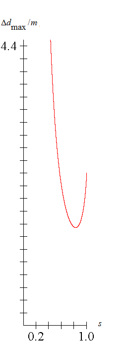
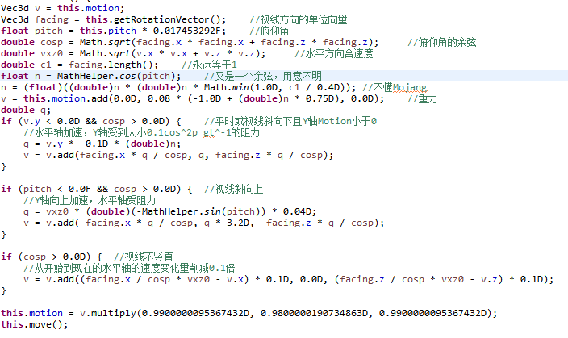
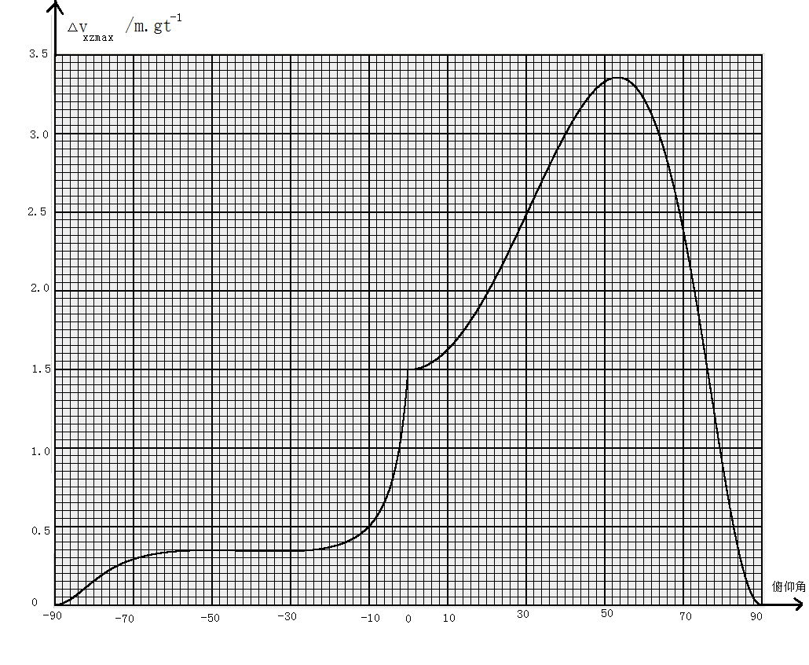

# LivingEntity运动机制

<span id="lovexyn0827-page-metadata" class="motion_of_entities:6" onload="queryPageview()"> </span>

LivingEntity是实体中的一大类，包括了玩家、生物和盔甲架。虽说这里搞理论计算没有弹射物和TNT实用，但见外国跑酷理论已经有所发展了**\[10\]**，我们也不能落后对吧。本节内实体若无特殊说明均指LivingEntity。视线水平投影方向如无特殊说明均指保持偏航角不变平视时的视线方向。

给出一些基础定义：

**流体深度阀值**：一个长度，在实体眼部高度不小于0.4m时为0.4m，否则为0。

**AI加速度**：在AI加速过程中实体受到的加速度的一个决定量，与实体前/右向加速度系数决定实体的真正水平移动加速度，但**通常不等于真正的加速度**。

**地面移动加速度**：实体在地面运动时或有满级深海探索者且在水底地面运动时的AI加速度。

**飞行移动加速度**：实体在空中运动（不算鞘翅飞行）时的AI加速度。值一般固定为$0.02m/gt^2$，疾跑的玩家为$0.026m/gt^2$。

**可攀登方块**：`minecraft:climbable`标签内的方块和下方有同侧梯子的活板门。

## LivingEntity的自由运动

与其它大部分实体不同，LivingEntity的运动没有被直接放到`tick()`方法中，其运动大多是在`travel()`方法中进行的。

默认的travel()方法可以分成四大部分：实体与水接触时，赤足兽以外的实体与熔岩接触但并不与水接触时，鞘翅飞行时和其它情况。如果实体有缓降状态，所有重力加速度变为给出数值的1/4。为防止Y轴Motion落入$\pm 0.003m/gt$之间而被归零，流体中的部分重力作用（包括第一种情况的第9步、第二种情况的第3.2步）中会有特殊处理，将受到重力后Y轴Motion在$\pm 0.003m/gt$之间的实体的Y轴Motion直接设为-0.03m/gt。

在第一种情况中运算过程如下（`LivingEntity.travel(),1936-1970`）：

1. 取0.8（未疾跑时）或0.9（疾跑时）作为$j_0$
2. 获取实体拥有的深海探索者附魔的有效等级h，最大为3，没有这一附魔时为0，实体若未着地则减半。
3. 如果没有海豚的恩惠效果，取$j = j_{0} + \frac{h}{3}(0.546 - j_{0})$，否则直接j=0.96
4. 取$g = 0.02(1 - \frac{h}{3}) + \frac{h \cdot Ms}{3}$，其中Ms为实体的地面移动加速度以$m/gt^2$为单位的数值（见6.2）
5. 以g为AI加速度数值进行AI加速
6. 以当前Motion作为位移趋势进行基于Entity.move()的移动
7. 如果移动过程中发生了水平碰撞且坐标所在方块网格处为可攀登方块，将y轴Motion设为0.2m/gt
8. 将X、Z轴Motion乘以j，将y轴Motion乘以0.8
9. 如果实体没有noGravity标签，受到0.005$m/gt^2$的重力加速度
10. 如果水平方向发生了碰撞则取一个底面中心与现在碰撞箱底面中心在同一竖直线上，底面中心的Y坐标为移动前的坐标上方0.6m的与该实体碰撞箱大小相等的长方体区域，将该区域沿现在Motion指定的偏移量和方向移动，若区域内没有任何固体方块和流体，则将Y轴Motion设为0.3m/gt

**此时实体的运动类型是FCMDG**（即流体加速-\>AI加速-\>移动-\>阻力-\>重力，各字母具体含义见3.1）在实体没有深海探索者附魔是时实体的流体阻力为0.2$gt^{-1}$或0.1$gt^{-1}$，取决于实体是否在疾跑。在实体拥有深海探索者时，实体的AI加速度会随等级递增，最高与该实体的地面行走速度相同；阻力也随等级递增，最高为0.464$gt^{-1}$，与在普通方块地面上的阻力相同，加上运算顺序可以证明**实体在拥有最高等级的深海探索者附魔时在水下的地面上行走的速度和在地面行走的速度相同**。有海豚的恩惠效果时阻力最低，达到0.04$gt^{-1}$。最后一步我怀疑是与实体上岸有关，因为如果去掉这一步实体就无法上去在水面上方0.5m以上（台阶、附魔台或是灵魂沙）的岸边，而正常情况下则完全可以。

在第二种情况中运算过程如下（LivingEntity.travel(),1971-1991）：

1. 以0.02$m/gt^2$作为AI加速度进行AI加速
2. 以当前Motion作为位移趋势进行基于Entity.move()的移动
3. 如果实体浸入熔岩深度不大于流体深度阀值：
   1. 水平轴上受到0.5$gt^{-1}$的阻力，Y轴上受到0.2$gt^{-1}$的阻力
   2. 如果实体没有noGravity标签，受到0.005$m/gt^2$的重力加速度
4. 如果实体如果实体浸入熔岩深度大于流体深度阀值，各轴上受到0.5$gt^{-1}$的阻力
5. 如果实体没有noGravity标签，继续受到0.02$m/gt^2$的重力加速度
6. 同第一种情况的第10步

你没想错，足够深熔岩和水中相比熔岩中实体的下落速度确实比水中快。

好了，说正事，**这里实体的运算流程是$FCMG_0DG_1$**（实体浸入熔岩深度不大于流体深度阀值）**或$FCMGD$**（实体如果实体浸入熔岩深度大于流体深度阀值），别的倒没什么好说的。

第三种情况在6.3节还要详细说明，在此从略。

第四种情况可以说是最常见，也是最常用的情况了，在实体在上面三种情况之外时被用到，流程如下（`LivingEntity.travel(),2036-2055`）：

1. 取实体下方（坐标下方略多于0.5m处）方块的滑度s
2. 在实体着地时，取j=0.91s，否则j=0.91
3. 在实体着地时，取$a = \frac{0.216Ms}{s^{3}}$作为AI加速度进行AI加速，其中Ms为地面移动加速度，否则取实体的飞行加速度作为AI加速度进行AI加速
4. 如果坐标所在方块网格处为可攀登方块，实体的X、Z轴中单轴Motion会被限制在$\pm 0.15m/gt$之间，Y轴Motion小于-0.15m/gt时会被设为0.15m/gt。如果实体是潜行中的玩家，且可攀登方块不是脚手架，实体的Y轴Motion会被归零。
5. 以当前Motion作为位移趋势进行基于Entity.move()的移动
6. 如果移动过程中发生了水平碰撞或在尝试跳跃且坐标所在方块网格处为可攀登方块，将Y轴Motion设为0.2m/gt。
7. Y轴Motion的一些运算
   1. 如果拥有漂浮效果将Y轴Motion改为$0.01 \cdot 漂浮等级\text{+0.8} \cdot 原Y轴\text{Motion}$
   2. 否则如果这是在客户端上的运算，而且实体所在区块未加载（连边界加载都不是），实体的Motion会被设为-0.1m/gt（Y轴坐标大于0时）或直接归零（Y轴坐标不大于0时）
   3. 如果实体上述两步中条件均未被满足且实体的NoGravity标签为false，受到0.08$m/gt^2$的重力加速度。
8. 将水平轴上Motion改为原来的j倍，Y轴Motion改为原来的0.98倍。

**这时实体的运算流程为CMGD**。可以发现，空中运动时Y轴的阻力为0.02$gt^{-1}$，与Wiki相符；而水平轴上为0.09$gt^{-1}$，明显与Wiki不符。另外，滑度还可以决定实体的AI加速度和阻力系数，其中AI加速度与滑度的立方成反比，阻力系数相对于滑度线性递减。

恶魂和幻翼有一套不同的方案：可以说是默认的删减版：

在实体接触水时，每gt以0.02 $m/gt^2$的AI加速度进行AI加速，然后以当前Motion作为位移趋势进行基于Entity.move()的移动，最后各轴的Motion乘以0.08，完成。

在实体接触熔岩但不接触水时，每gt以0.02 $m/gt^2$的AI加速度进行AI加速，然后以当前Motion作为位移趋势进行基于Entity.move()的移动，最后各轴的Motion减半，完成。

在其它情况，实体的AI加速$a$和阻力系数的决定与默认类似，顺序相同，但没有漂浮效果和可攀登方块相关的运算。

除此之外，有些运动运算被安排在了`travel()`方法外部，具体的流程如下：

1. 实体基础运算
2. 跳跃冷却更新
3. 实体绝对值小于0.03m/gt的Motion分量被归零
4. 若已经死亡，将前向和侧向加速度系数都改为0
5. AI或输入更新
6. 跳跃相关判断及运算
7. 前向和侧向加速度系数乘以0.98
8. 鞘翅耐久更新
9. 执行travel()方法
10. 激流相关更新
11. 实体挤压

其中第3步应该是要使实体运动的停止更加干脆利索。

## AI及属性对运动的影响

Minecraft中几乎所有生物都有AI，玩家的控制在某种意义上也可被称为AI。盔甲架没有AI，也不会自己控制自己移动，在此不再考虑。最近红石科技搬运组在搬运一个讲解实体AI的视频系列（目前更新中），如有需要推荐去看一下。

Minecraft中，生物AI主要由`Goal`、`Task`、`GoalSelector`和`EntityNavgation`四个类和`BodyControl`、`JumpControl`、`LookControl`和`MoveControl`四个直接控制生物的类组成。

Goal和Task（可以翻译成目标和任务）表示的是生物的一个整体的行为，或者说就是某种非条件或条件反射，再或者说就是实体将长期拥有的习惯，大部分是从生物创建以来一直就有的，但有时侯也会在生物创建后发生改变，如骷髅的武器被替换，猫被驯服时。

GoalSelector（可以翻译成目标选择器，但请勿与命令中的目标选择器混淆）会根据各Goal的优先级等信息安排Goal对生物各个方面的控制。

EntityNavgation（可以翻译成实体的导航，好吧，很像机翻）负责为生物进行寻路，是比MoveControl和JumpControl高级的运动控制。

Move/Jump/LookControl通过修改生物的AI加速度和加速度系数等属性较直接地控制着生物的运动。

B站上红石科技搬运组搬运了一系列（疑似停更，只有一期但还是很有价值）关于生物AI的讲解视频，讲得很通俗，如果需要了解生物AI建议关注一下。

LivingEntity类定义了几个关于运动的字段：

(1) **movementSpeed**：决定实体的地面移动加速度的一个实数，等于地面移动加速度以$m/gt^2$为单位的数值。对于玩家总为`generic_movement_speed`属性值，对于生物由种类、AI状态和`generic_movement_speed`属性共同决定。

(2) **flyingSpeed**：决定实体的飞行移动加速度的一个实数，等于飞行移动加速度以$m/gt^2$为单位的数值。默认为0.02，疾跑的玩家为0.026，被骑乘且被控制的猪、马和赤足兽由AI状态和`generic_movement_speed`属性共同决定，具体来说是movementSpeed的0.1倍。

(3) **forwardSpeed**：表示实体**前向加速度系数**的一个实数，可以为负数，在每gt中`travel()`方法执行前会被乘以0.98。

(4) **sidewaysSpeed**：表示实体**侧向加速度系数**（准确点说是右向的）的一个实数，可以为负数，在每gt中travel()方法执行前会被乘以0.98。

(5) **upwardSpeed**：实体**向上的加速度系数**，也是实体向上的AI加速度以$m/gt^2$为单位的数值，可以为负数，在每gt中`travel()`方法执行前会被乘以0.98。

在forwardSpeed、sidewaysSpeed和upwardSpeed的平方和不大于1时，实体进行AI加速时会给实体加上一个朝向实体视线的水平投影方向，大小等于AI加速度与forwardSpeed的乘积的加速度、一个方向为实体视线的水平投影方向的正右方，大小等于AI加速度与sidewaysSpeed的乘积的加速度以及一个竖直向上的，大小数值上等于upwardSpeed的加速度。如果AI加速将要进行时forwardSpeed、sidewaysSpeed和upwardSpeed的平方和大于1，实体会保持比例不变缩放这三个speed（得到三个对应的新值，对应字段的内容不变）使其平方和等于1，再使用缩放后的值进行上述加速。大部分实体通常会选择向前直走来到达目的地，所以侧向及向上的速度系数一般为0。在运动过程中，由于加速度与阻力的作用，实体的水平方向Motion会很快地趋近于一个最大值。

在上一节中已经说明，实体脚下的方块滑度越大，加速度就越大，阻力也就越小，那么，就可能存在一个平衡点，使得实体的最终速度达到一个极值。

在无流体的地面上时，陆生生物实体和玩家的水平方向运算流程可表示为CMD（AI加速-\>移动-\>阻力），也就是AMD，假设sidewaysSpeed和upwardSpeed都为0，将上一节的结论代入对应公式，得出最终速度（由每gt的位移表示）的表达式及Ms·forwardSpeed = 1m/gt时的图像，其中Ms为地面移动加速度：

$$
\Delta d_{\max} = \frac{0.216Ms \cdot forwardSpeed}{s^{3} - 0.91s^{4}}
\tag{6.2.1}
$$


> 图6.2 $Δd_{max}$与s之间关系曲线

对其关于s求导，得

$$
\Delta{d_{\max}}_{s}^{'} = - \frac{0.216\left( 3s^{2} - 3.64s^{3} \right)Ms \cdot forwardSpeed}{(s^{3} - 0.91s^{4})^{2}}
\tag{6.2.2}
$$
求得其\[0,1\]间的零点只有一个，约在s=$\frac{75}{91}$（约为0.82418）处，此时最终速度大小最小，约为1.54331Ms·forwardSpeed。另外还可求得s等于各常见方块滑度时的情形：

(1) s=0.6时，最终速度大小约为2.20264Ms·forwardSpeed；

(2) s=0.8时，最终速度大小约为1.55101Ms·forwardSpeed；

(3) s=0.98时，最终速度大小约为2.2103Ms·forwardSpeed；

(4) s=0.989时，最终速度大小约为2.23265Ms·forwardSpeed。

但是粘液块上的实际行走速度要远小于1.55101Ms·forwardSpeed（约0.58807Ms·forwardSpeed），因为粘液块本身就会给实体减速，具体情况可参考5.6节。

`MoveControl`类中为生物提供的最主要的用于进行AI加速的方法是 `moveTo(double x, double y, double z, double speed)`，这个方法需要指定一个目的地(x, y, z)和一个决定速度的实数`speed`。执行后实体的地面移动加速度以$m/gt^2$为单位的数值和forwardSpeed会被设为`generic_movement_speed`属性值与speed的乘积，并在简单判定后决定是否需要跳跃。最后，如果到达了目的地就将forwardSpeed设为0。

研究所有生物的AI加速情况似乎不大现实，这里暂时不再说明。

除了AI加速之外，玩家和生物的跳跃也可以归入AI控制的运动的范围内，不过这里只研究比较一般的情况。在实体尝试跳跃时，游戏会检查下列条件是否成立：

A.  实体在水中

B.  实体在熔岩中

C.  实体着地

D.  实体浸入对应流体（实体接触的流体，如果同时接触水和熔岩则选定熔岩）深度不大于流体深度阀值

E.  实体跳跃冷却时间已经结束

如果满足下列全部条件，则可以执行从地面上跳起的行为（即将Y轴Motion以m/gt为单位的数值改为0.42+0.1跳跃提升等级，并将跳跃冷却时间重设为10gt，此时如果实体正在疾跑，将实体的Motion沿视线的水平投影方向加上0.2m/gt）：

(1) E成立

(2) C成立

(3) D成立或A、B均不成立

写成布尔代数式就是$CE(\overline{A} \cdot \overline{B} + D)$

如果下列条件成立，则尝试执行从水中向上游的行为（即将Y轴Motion加上0.04m/gt，蜜蜂为将Y轴Motion加上0.01m/gt）

(1) A成立

(2) C、D中至少有一个不成立

写成布尔表达式就是$A \cdot (\overline{C} + \overline{D})$

如果满足下列条件，则尝试执行从熔岩向上游的行为（即将Y轴Motion加上0.04m/gt，蜜蜂为将Y轴Motion加上0.01m/gt，岩浆怪较为复杂）

(1) B成立

(2) C、D中至少有一个不成立

(3) 写成布尔表达式就是$B \cdot (\overline{C} + \overline{D})$

如果跳跃运算进行时发现实体中断了对跳跃的尝试，跳跃冷却会立即结束。

实际上目前不是很确定这些条件是正确的，因为找不到合适的实验方案来验证。故此处给出相关代码实现如下以供参考（`LivingEntity.tickMovement()`：2169-2183）：

````java
if (this.jumping && this.method_29920()) {
	double k = this.isInLava() ? this.getFluidHeight(FluidTags.LAVA) : this.getFluidHeight(FluidTags.WATER);
	boolean bl = this.isTouchingWater() && k > 0.0;
	double l = this.getStandingEyeHeight() < 0.4 ? 0.0 : 0.4;
	if (bl && (!this.onGround || k > l)) {
		this.swimUpward(FluidTags.WATER);
	} else if (this.isInLava() && (!this.onGround || k > l)) {
		this.swimUpward(FluidTags.LAVA);
	} else if ((this.onGround || bl && k <= l) && this.jumpingCooldown == 0) {
		this.jump();
		this.jumpingCooldown = 10;
	}
} else {
	this.jumpingCooldown = 0;
}
````

上面说到，`generic_movement_speed`属性与实体的AI加速度的确定有关，进而影响着实体的行走速度。（**玩家速度与它成正比，生物速度与它的平方成正比**，不知道这一差异是否为有意为之的。）余下的部分主要将说明一下这一属性的确定方式。

实体属性值的确定一般有两个元素参与：基础值（base value）与修饰符（attribute modifier）。其中，基础值是一个实数，在Wiki上已经比较详细地给出了**\[11\]**（不过不要过于相信下一列的移动速度）。修饰符是一个获取属性值时对基础值进行的一个运算步骤（不改变基础值本身），Wiki上在那一页同样也说明了，较为常见的有：

(1) 实体在疾跑时generic_movement_speed属性值被增加为原来的1.3倍。

(2) 实体每级速度效果能使其generic_movement_speed属性值增加20%。

(3) 实体每级迟缓效果能使其generic_movement_speed属性值减少15%。

(4) 一些幼年生物的generic_movement_speed属性值较大，如幼年僵尸是成年僵尸的1.5倍，幼年猪灵是成年猪灵的1.2倍等。

(5) 在实体在灵魂沙上面且有灵魂疾行附魔时，generic_movement_speed属性值加上$0.03 \bullet (0.65 + 0.35附魔等级)$。

易知generic_movement_speed属性值的最终值与前三种修饰符的作用顺序无关。第四种修饰符总是最先被应用。

另外generic_movement_speed属性值存在上下限，分别为1024和0

## 鞘翅飞行

我不是很确定研究鞘翅飞行是否很有实用价值，但见它那么常用也就提一下吧。

在实体使用鞘翅飞行时，其运动完全由其视线方向决定，水平速度最终会与视线方向的水平投影同向，不再受AI加速，其它加速也因位置原因一般很少受到。期间如果实体发生水平方向的碰撞，实体会受到一个由速度和碰撞位置决定的碰撞伤害；如果实体着地，鞘翅飞行会终止。

鞘翅飞行时，实体的运动运算流程如下（`LivingEntity.travel(), 1992-2035`，为方便理解做了一定改动）：

{width="5.768055555555556in" height="3.4329757217847767in"}

> 图6.3.1 鞘翅飞行相关代码
>

这里我们主要研究视线平视或斜向下的情形,不考虑其它加速，此时：

$$
a_{y} = gt_{0}\left( 0.75\cos^{2}pitch - 1 \right)
\tag{6.3.1}
$$

$$
k_{y} = 0.98\left( 1 - 0.1\cos^{2}pitch \right)
\tag{6.3.2}
$$

我们也可以看出，在Y轴上，实体的运动明显是ADM型，带入对应公式，有

$$
\Delta y_{\max} = \frac{gt_{0}\left( 0.75\cos^{2}pitch - 1 \right)\left( 98 - 9.8\cos^{2}pitch \right)}{9.8\cos^{2}pitch + 2}
\tag{6.3.3}
$$
由源码也可以得出:

$$
a_{xzmax} = - \frac{0.09\Delta y_{\max}\cos^{2}pitch}{t_{0}k_{y}}
\tag{6.3.4}
$$

$$
k_{x} = k_{z} = 0.99
\tag{6.3.5}
$$

其中$a_{xz\max}$为实体在水平方向上的最大合加速度，

我们发现，鞘翅飞行的实体在X、Z轴上的运动也是ADM型，代入对应公式，又有：

$$
\sqrt{(\Delta x)^{2} + (\Delta z)^{2}} = \frac{891gt_{0}\left( \cos^{2}pitch - 0.75\cos^{4}pitch \right)}{9.8\cos^{2}pitch + 2}
\tag{6.3.6}
$$
这时，我们得到了在视线水平或斜向下时由视线俯仰角得到最终水平合速度以及最终竖直速度的方法。至于斜向上的情况个人能力不足，只能写段小程序做出图像，没有得出表达式。

下面是实体在由静止飞行72000gt后水平速度与俯仰角的关系图：



> 图6.3.2 水平速度与俯仰角的关系图
>

在表达式(6.3.6)中求出$\sqrt{(\Delta x)^{2} + (\Delta z)^{2}}$关于$\cos^{2}pitch$的导函数，求得其在定义域上仅有一个零点$\frac{\sqrt{67.8} - 3}{14.7}$，也就是说图中那个最高点对应俯仰角正切的平方就是这个值，可以求得此时俯仰角约为53.366度。将其带入式(6.3.6)，求得此时实体飞行速度约为3.3888m/gt,即67.776m/s，与实验值3.38879125m/gt高度接近，也明显高于52度俯冲的速度3.38383913m/gt，所以，Wiki上那个说52度俯冲最快的那些个地方又得改了。

如果希望更加详细地了解一些其它方面的实验数据、仰视时的情况和一些实际问题，可以查阅这两个专栏**\[12\]**。