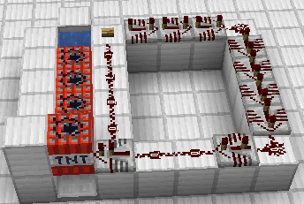
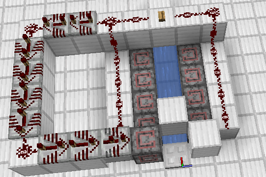
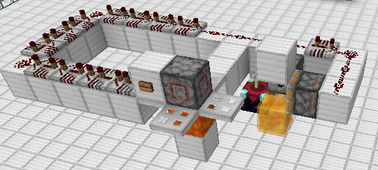
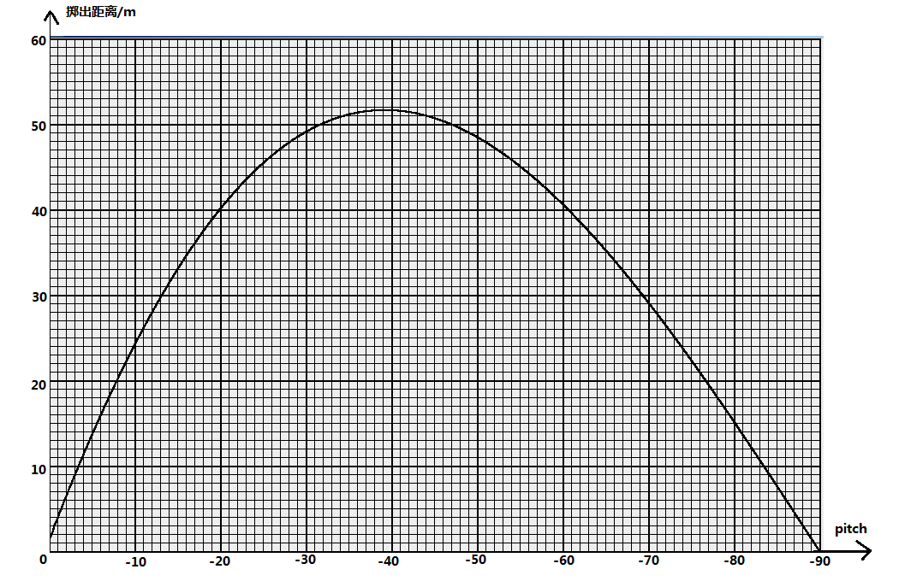
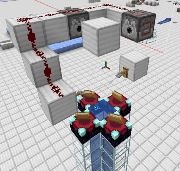
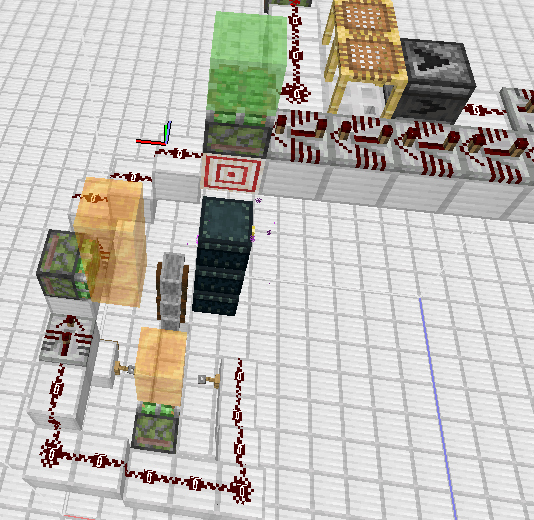
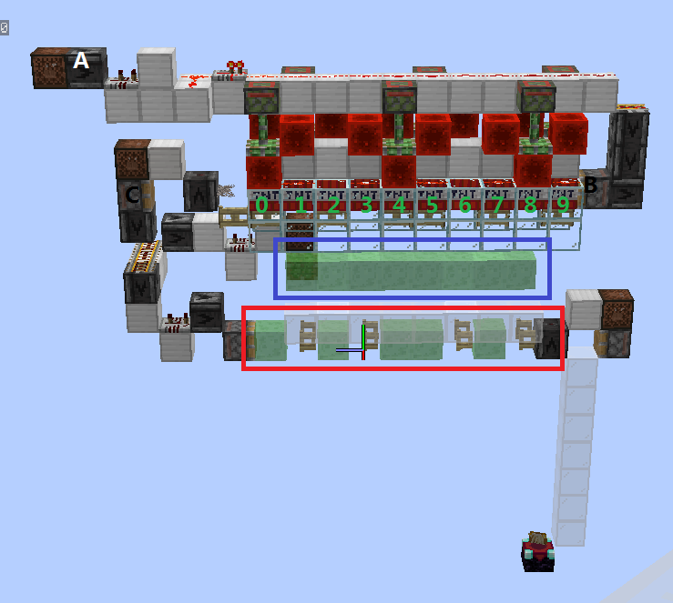

# 实体运动应用举例

只纸上谈兵还是不行的，下面给出几种大家可能比较熟悉的实体运动理论的应用。

## 改造一种TNT大炮

首先在这定义四种效率：

**爆炸半径利用率**：数值为每个爆炸爆炸中心与被推动实体坐标间距离与爆炸半径比值的平均数。

**接触率利用率**：每个爆炸对被推动实体的接触率的平均数

**加速度利用率**：需要的方向上的加速度分量与总加速度的比值

**飞行时间利用率**：只对TNT炮存在，值为$\frac{1 - 0.98^{n}}{1 - 0.98^{80}}$，其中n为TNT炮中炮弹开始飞行时的余剩引信时间，其它炮种取1即可。

**爆炸利用率**：上述四种利用率的乘积

相信图8.1.1中的TNT大炮相信大家基本都见过或做过，它建造与使用都很简单，但是它的效率低（不到30%），射程近（50m左右），而且落点不固定。这里就来试着对它魔改一番，使其做到高效，准确，且射程足够远。下面定个小目标：

(1) 爆炸利用率达到80%以上

(2) 多次发射落点不会出现任何偏差

(3) 可以打击至少10000m外的地面目标

> 图8.1.1 TNT大炮

貌似有点难度，我们一步一步来。

首先看一下原设计，容易发现它有一部分TNT离炮弹较远，利用效率低,不妨给它们推过来。最容易想到的推进方法就是用水推动，在炮膛后面放一格水就好了（在Wiki上，这叫推进力集中器）。这里我们会使水源尽量靠近被发射的TNT，因为如果太长下游的流水就较浅，推力较小，就无法把这些TNT都推过去，后果严重的话不排除炸膛。然后，很容易想到这里垫住被发射的TNT的方块太高了，阻挡住了大部分（对于最近的那个是2/3）的接触率判定射线，造成接触率利用率较低，这也是一个致命缺陷。另外，准确性在两边用方块挡住，并使用红石计时点燃炮弹后就可以大幅提高了。于是就有了下面的一个新设计，因为有水流保护，爆炸炸不坏，这里就不用黑曜石那么令人瞎眼的方块了。

> 图8.1.2 新方案(1)

测试一下，方块似乎垫得太低了，这些TNT根本打不起来炮弹，所以，再改。我们发现，直接摆放TNT堆不了多少，所以在新方案中TNT源被换成了发射器。

> 图8.1.3 新方案(2)

终于有一个能用的了，这次射程大约是在177m左右，效率差不多是在54.7%左右，偏移（由TNT碰撞箱略小于1m造成）已经不到一米了。但是，这离我们的目标还有较大距离。

首先看射程。10000m的射程意味着什么呢？由初始Motion公式可以得出，即使飞行时间达到了80gt（理论最大），初始水平Motion大小也要达到249.58m/gt左右，这意味着即使爆炸率利用率为100%（尽管不可能），也至少需要250个TNT作为推进。

同时，我们是要使TNT落地的，这需要Y轴的初始Motion恰到好处（大约1.9m/gt左右），假设TNT在被推进时的Y轴Motion为0，爆炸点与炮弹的水平距离为1m，使用"万能方程"计算得出，即使飞行时间为80gt，推进时炮弹坐标与爆炸中心的高度差也需要低至0.008147m，这要比所有的方块高度都低，所以暂时不考虑使用方块垫住炮弹了，得让炮弹悬空（悬空推进TNT并不靠谱，因为它们在移动后就会发生爆炸把余下的推进TNT炸飞，可能导致炸膛）。很幸运，经过寻找，我们发现在TNT无初速下落2gt后会达到一个恰到好处的点，这时TNT的坐标仅比某一个像素的顶部高度高0.0058m，也许可以试一下。再次寻找一段时间后，我们可以发现，如果让炮弹从一个高度0.9375m（15px）的方块（如蜂蜜块）上无初速落下，2gt后让推进TNT在附近的一个高度为0.75m（12px）且正好能防爆的方块（如附魔台）上爆炸，这时炮弹坐标与爆炸中心的高度差仅有0.00705m，如果TNT飞行时间足够，这个高度差应该是够小了。

在让被推进的TNT悬空的同时，效率的问题已基本解决了。现在，原先拉低效率最厉害的接触率利用率由于没有方块阻挡已经达到100%，而爆炸半径利用率也早已达到了87.2%左右，剩下就看飞行时间利用率了。

最后是归正。如果炮弹和推进TNT都被完全归正，即Motion和坐标都是确定的了，这个问题也就解决了。经过一段时间的设计，一个炮弹矫正装置设计产生了。

运行时序如下表：

表8.1运行时序表

| 刻数 | 阶段 | 事件|
|------|------|------|
| 1    | NTU  | 发射器激活，炮弹被发射|
|        | BE   | 推动炮弹的活塞开始伸出，B36被创建|
|        | EU   | 用于调整TNT初始Motion的TNT爆炸|
|        |        | 炮弹更新，向一个死角移动，但被阻挡，失去各轴Motion|
|        | TE   | B36更新，推动炮弹|
| 2    | EU   | 炮弹再次更新，更新后引信时间还剩78gt |
|        | TE   | B36再次更新，炮弹离开蜂蜜块上方，水平方向上到位|
| 3    | EU   | 炮弹再次更新，下落到距网格底部0.8975m处，引信时间还剩77gt |
|        | TE   | B36到位并被移除|
| 4    | EU   | 炮弹再次更新，下落到距网格底部0.8183m处，引信时间还剩76gt |
| 5    | EU   | 主要的推进TNT爆炸，加速炮弹|
|        |        | 炮弹再次更新，开始飞行，此后总飞行时间76gt |

不过由于技术及时间原因，到现在还是没有搭建出那种时序比较紧凑的设计，存档中搭建的原理与此类似，但是炮弹飞行时间不是76gt而是74gt。

可以计算出，炮弹被推进时的Y轴Motion是0.0392m/gt，接着由 "万能方程组"计算出射程约为10425m，已经达到目标了。再然后计算出所需初始水平Motion约为268.7716m/gt，进而计算出所需TNT数量约为308个。经过测试该TNT炮的实际射程为10453m，比理论值较大的原因是TNT数量是尽可能多取的。再看效率，现在已经达到了84.414%，过关。至于归正，炮弹归正已经做好了，推进TNT源及归正可以使用8.2.2节中提到的320TNT归中阵列，位置一定时也是不存在随机性的（浮点数误差造成的随机性也可以通过优化底层归中消除），同样过关。

> 图8.1.4 新方案(3)
>

然而，这远不是最优解。可以回想一下，TNT的爆炸高度是TNT坐标上方0.06125m，与地毯的高度只差了0.00125m。利用这个高度差，可以设计出一种推进TNT和炮弹距离1m射程达到60000m以上的TNT炮。

实际上，我们也可以跳出这个思维定式，不再追求多小的高度差，而是在水平和竖直方向上分别加速，这时大炮的射程是可以接近无限的。

无限射程的TNT炮种也有很多变种，这这些TNT炮通常使用TNT矿车作为推进、在弱加载区块堆积TNT，推进弱加载区块的TNT或利用末地传送门不强加载区块的特性在末地堆叠TNT来获取足够的推力。换句话说，只要电脑性能够好且实体不会导致区块过大（1.15后限制为4GB）理论上就能无限地获取推力。如不采用在水平和竖直方向上分别加速的方案，这种TNT炮炮弹的Y轴Motion通常会很大，此时可以设方块阻挡炮弹或用活塞推粘液块弹射炮弹来减少Y轴Motion来防止这种大炮成为"一飞冲天炮"。

目前有一种被称为"电磁炮"的较新炮种，通过发射一系列激活时序不同（可以在同一刻不同顺序激活，也可以在多个游戏刻内激活）的TNT，使靠前的TNT被后面的TNT的爆炸多次推动（可以是加速，也可以减速），最终得到一系列在一条直线上但位置不同的爆炸。

## 科学地使用弹射物

### 珍珠投掷技术

比如说，投掷末影珍珠时我们经常会希望将其尽可能扔到远处，我们可能会套用课本猜测末影珍珠的最佳投射角度是45度，但这在Minecraft中错误的。因为，珍珠在受到重力的同时还会受到一个阻力，导致其运动轨迹并不是抛物线（解析式已经在第三节给出）。事实上，根据程序计算，在珍珠落点高度与掷出点高度差忽略不计时掷出距离和俯仰角的关系如图8.2.1。

> 图8.2.1 掷出距离和俯仰角的关系
>

可以看出，在俯仰角约-39${^\circ}$时掷出距离达到最大，大约是53m。

但是这一最佳抛出角度不是不变的，在目标点高度增大时或初始Motion增大时（尽管对于投掷珍珠这是不会考虑的），珍珠的最佳掷出角也会减小，也就是说得把头抬得更高。

如果引入了Lambert W函数**\[26\]**，即$f(x)=xe^x$的反函数，掷出距离、落地时间等数据和俯仰角的关系可以被以解析式的形式写出，进而可以进行一系列更深入的研究，但因为Minecraft中实体运动具有离散型，实验结果与理论值会有较大差距，此处暂不深入讨论。

不过，最靠谱的办法还是用运动机制与末影珍珠一致的雪球和鸡蛋进行初步试验，基本能保证90%保险，但并非100%。因为珍珠运动是离散的且珍珠在自己移动的过程中发生碰撞时会将玩家传送到碰撞前最后一gt的坐标处而不是碰撞点处，所以即使看到测试实体勉强安全落地了珍珠也有可能把玩家传送到空中，而且真正投掷珍珠时也可能因初始Motion的随机性出现问题。

### 珍珠炮

在一些大型服务器中，可能会因为交通问题而修建珍珠炮。珍珠炮的那个规模乍一看挺吓人，但是如果只看它的原理就会觉得简单很多了。不过，这里并不是讲解图中那样一个简单到没法用的珍珠炮，这里将以一个发射角范围可以达到360度，最大TNT量为1280（应该还可以加），最远射程约14000m（接近目前珍珠高度选取的极限了）的珍珠炮为例对珍珠炮的基本原理进行简单的讲解。存档中还有一个发射角范围约为53度，最大TNT量为120，最大射程为8800m左右的微型矢量珍珠炮，大家也可以自行研究。

> 图8.2.2.1一个过于简易的珍珠炮
>

个人认为珍珠炮最关键的部分有四个：珍珠矫正，TNT复制及归中、区块加载以及控制部分。其中，由于控制部分无关实体运动的技术太多，在此从略，而区块加载只简单提及。

末影珍珠在被投出时除了玩家视线方向的一个初始Motion外，还会被叠加上一个随机的Motion（详见7.8），这会使珍珠的运动无法被准确地预知，从而导致其在被TNT加速后的方向无法完全确定，造成的落点误差可能会达到数千米。所以，对珍珠进行矫正很有必要。

末影珍珠的水平方向矫正的根本原理是末影珍珠在自己移动时和被活塞推动时的移动方式不同。在末影珍珠被活塞推动时是进行的基于Entity.move()方法的移动，这时的碰撞检查检查的是末影珍珠的碰撞箱有没有与外界发生了碰撞，并且在末影珍珠发生碰撞时不仅不会将其移除并传送玩家，还会将它发生碰撞的轴上的Motion归零。而在末影珍珠自己移动时碰撞检查是检查的坐标点的碰撞，这时发生碰撞才会将珍珠移除。也就是说，只要珍珠的坐标点连线不与方块和实体发生碰撞（也就是对坐标点上的连线进行raycast的过程中不被阻挡）就可以。珍珠水平方向上的矫正一般是选取一些碰撞箱刚好的方块推动珍珠，使其撞到另一个碰撞箱刚好的方块上，并在该过程中保证珍珠的坐标点不会卡到方块或实体中。

末影珍珠在竖直方向上的矫正的原理通常是粘液块弹射是直接设置Motion的，而且也有类似普通方块B36的直接推动作用，在不至于造成单轴活塞推动位移限制时推动后珍珠Y坐标确定在粘液块B36碰撞箱上方0.01m处。在末影珍珠被粘液块弹起62gt后珍珠就会返回，这些时间是不够等待TNT爆炸的，需要把珍珠重新弹起才可以。需要注意，如果珍珠开始被推动时坐标过低（低于粘液块B36碰撞箱顶部0.5m或更多），因为单轴活塞推动位移限制，珍珠的实际位移不会超过0.51m而无法消除初始位移的随机性（也经常会利用这个特性保留位置的多样性）。

> 图8.2.2.2 珍珠矫正装置
>

如图，这是一种适配1.16.2+版本（稍作修改后应该可以适配1.14+）的珍珠矫正装置。在珍珠被投出后，绊线勾被触发，然后珍珠被推到砂轮的那个轮子上，Z轴随机性被消除，坐标正好被卡在两个方块网格的交界处，Motion为0。再然后，由于珍珠的碰撞箱仍有一部分位于蜜块正前方，末影珍珠又被推到了末影箱侧面，X轴的随机性也随之消除。再然后，在珍珠通过标靶和活塞时，其坐标点路径没有位于它们的方块网格内部，所以可以通过。最后，活塞推动粘液块弹起珍珠，将其Y轴Motion设为1m/gt，并将其移动到粘液块B36碰撞箱上方0.01m处，Y轴随机性也被消除。至此，矫正完成。其中，Y轴矫正大家可以试着分析一下，说不定会有新发现。

在1.16.1及更早版本，由于投掷物自主运动时不会检查方块网格碰撞，这种珍珠矫正中的绊线不会被触发。所以，需要在一个可以促使绊线检查自己的激活状态而自身又不会激活绊线的实体作为辅助。如图8.2.2.3，为了解决这个问题，通常可以放置一个会检查方块网格碰撞而且与珍珠将要触发的绊线所在方块网格相交但不与该绊线的检查范围（方块网格最下方0.15625m）相交的实体。为了装置的稳定，这一实体一般会选取盔甲架或船等难以被实体挤压推动的非生物实体。在1.16.1及之前的版本中，因为投掷物对方块的碰撞判定是根据Outline Shape（准星对准时显示的黑框）进行的，投掷物会撞到在准星对准时会显示黑框但实际上无碰撞箱的方块（包括绊线，还有草和蛛网等），所以需要卡准珍珠的路径，使得珍珠某一时刻能与绊线的检查范围相交且坐标点路径不通过绊线。也是因为这个，投掷物不会检查36号方块的碰撞，所以可以做出另一种珍珠矫正，此处不再演示。

> 图8.2.2.3 1.16.1-适配的珍珠检测装置
>

只有如果只有矫正，珍珠炮无非就是帮玩家卡到整数坐标的一个沙雕红石装置，甚至都不可以说是"炮"了。给珍珠极大的速度的奥秘就隐藏在TNT复制归中装置中。在TNT爆炸时，每个TNT最大能给珍珠加上0.90125m/gt的初始Motion（不是1m/gt的原因是珍珠可以撞上0.3m以内的TNT并传送玩家，被传到那鬼地方可不好玩）。

现在流行的大型TNT复制机单元的基本原理是利用红石线指向状态改变不造成方块更新制造BUD状态的TNT，在活塞开始推动的瞬间将它们复制一份。刚复制好的TNT是零散分布的，我们要使它们集中到同一个地方。几个十几个TNT归中很容易，但珍珠炮上归中成千上万个TNT就不见得那么容易了。这个可能没有很一般的方法，不过，目前流行设计中基本原理都还是近似的：首先通常会在TNT下方放置栅栏门将结合上面TNT的B36的推动作用被复制的TNT两两地合并，然后通常会用活塞推动，粘液块弹射（在远距离归中时还会用到爆炸推进）等方式结合合适的阻挡使其一步一步地合并成一大堆TNT。一个具体些的方案可以在存档中找到。

那个TNT归中的方案（实际上还是比较常用的）主要的原理是利用粘液块弹射给每个TNT一个分别沿X、Z轴方向的Motion并使TNT自然下落并落地，期间TNT在移动的过程中撞到方块归正坐标并归零Motion。由于TNT只在侧面撞到方块时不会发生摩擦减速，所以正常情况下这些TNT最终会挤在某个墙角处，水平方向上位置确定，Motion固定为0。又因为各TNT的Y轴上受到的弹射、阻挡因素影响的程度都相同，初始Motion又没有随机性，归正后Y轴上的位置和Motion也是确定的。

举个比较简单的例子，图8.2.2.4中是一个10TNT复制归中阵列，魔改自星芒本尊视频中的复制阵列**\[17\]**，弹射部分灵感来自LgYn小凉音**\[18\]**，工作流程大致如下，其中各TNT从左到右编号0-9：

1. 在激活侦测器A后，最上方粘性活塞会拉回红石块，导致红石粉指向改变BUD充能TNT，然后活塞推动TNT使之受到更新被点燃同时创建其B36，完成复制过程。
2. 由于活塞B和被推动的TNT的推动作用，TNT实体获得一个向左的位移趋势，但除2、4、7、9号TNT外都被栅栏门的上半部分阻挡。在推动完成后，0号和5号TNT仍在红框中的粘液块上方，其它TNT都正常地移动到了打开的栅栏门上方。因为与TNT碰撞箱相交的方块不会被检查，那些栅栏门在Y轴上不阻挡TNT，所有TNT下落的高度都一样。
3. 由于被推动的TNT的推动作用，0和5号TNT也被移至打开的栅栏门上方，其它TNT因为关闭的栅栏门的阻挡移动未能成功。
4. 在TNT有部分碰撞箱位于蓝框标注的粘液块所在的那一层时，TNT第一次被粘液块弹射，获得垂直纸面向外的Motion。
5. 在TNT通过打开的栅栏门完全落出红框中粘液块所在的那一层之前最后一gt，TNT第二次被粘液块弹射，获得了一个沿Z轴的Motion。
6. 在被弹射后下一gt，TNT发生移动，由于TNT先在Y轴上移动，所以在TNT进行水平移动前TNT已经完全落出红框中粘液块所在的那一层，不会撞到右边的粘液块。
7. 所有TNT依次撞上两列白色玻璃，X、Z轴上位置确定，Motion归零。
8. 所有TNT落到附魔台上，等待爆炸。

> 图8.2.2.4 TNT归中阵列的一个单元
>

照目前的测试，这一TNT复制归中阵列是有概率炸膛的，有些TNT会卡在蓝框中的粘液块上方。原因应该是TNT实体生成时朝向玻璃的初始Motion过小，在TNT落出玻璃所在高度范围后仍未撞到玻璃消除该方向上的Motion，然后继续运动至下排粘液块上方却卡在那里无法继续下落。不过解决起来也很简单，在玻璃下方继续摆放树叶等不被粘动的方块就可以了，图中为了使结构更清晰略去。

为了更进一步地压缩复制归中阵列，提高效率，目前几乎所有流行的TNT复制归中阵列都会采用将2x2个除方向外基本相同的TNT复制阵列的部分组成一个较大阵列的方案，四个部分复制的TNT会被初步归中到以一个固定位置为中心的3x3网格中的四个角，然后再用活塞推动和粘液块弹射等手段将它们最终归中到同一位置。存档中给出了这一类TNT归中阵列的一个较为实用的例子，可以一次性复制320个TNT并归中至同一位置。如果不计浮点数误差，这些TNT的位置应该是近似相同的，但是，在第二次归中，也就是归中那四小堆TNT的过程中，由于TNT是从两个不同的位置被推过来的，且运算中有一些值不在浮点数集内，浮点数误差是有可能发生的，而且爆炸加速TNT实体只需要爆炸中心与实体坐标间距离，即各轴坐标差平方和的算术平方根不为零就会进行，这意味着部分TNT在浮点数误差较大时（如坐标绝对值很大或接近2的整数次幂时）可能会被炸飞导致炸膛。不过目前来看，这些TNT各轴坐标发现的最大的差值只在$10^{-8}m$的数量级，TNT的Motion变化量大小理论上也不过是在$10^{-7}m/gt$左右，不会引起炸膛，但可能会产生推进方向的一点与位置相关的随机性。如果真的要解决这个问题，可以改进第二次归中装着让TNT发生两次碰撞，但是这会在一定程度上缩短归中后对TNT进一步处理的时间。

只用这样的归中阵列对于大型珍珠炮确实是不足的，按照粗略计算，使用存档中的TNT阵列结构，即使让TNT归正完成后立即爆炸，上限也只有600TNT左右。

TNT飞行途中多次弹射可以有效增加单阵列TNT数量。可以证明，在B36的直接推动作用可以忽略不计时，多次弹射的弹射时间间隔相同时弹射距离达到最远。也可以推导出多次弹射TNT的最远位移公式和最短耗时公式，式中m为弹射次数，k=0.98，$v_{0} = 1m/gt$，$t_{0} = 1gt$：

$$
x = \frac{mv_{0}t_{0}(1 - k^{\frac{n_{0}}{m}})}{1 - k}
\tag{8.2.2.1}
$$

$$
n = m\log_{k}\left\lbrack 1 - \frac{x(1 - k)}{mv_{0}t_{0}} \right\rbrack
\tag{8.2.2.2}
$$

但这仍无法满足大型珍珠炮的需求。所以，大型珍珠炮中经常会使用多阵列复制TNT，并使TNT在另外一些TNT的爆炸推动下向中间靠拢，最终同时引爆。

不过实际上，我们需要复制两堆这样的TNT，因为通过控制两堆TNT的数量（通过按一定规律开启或关闭复制单元）及位置（通过使用打角器），我们可以控制发射的珍珠的初始Motion大小及方向，进而控制珍珠的落点。利用矢量分解，可以将珍珠的初始水平Motion分解到两个水平方向上，从而比较轻松地求得获取需要的速度需要的TNT数量。一般来说，我们会希望这两个水平方向是垂直的，这样运算就会简便很多。公式形式与珍珠炮的具体设计有关，且推导较为简单，这里不再多说。

除此之外，与TNT炮类似，珍珠炮的TNT爆炸中心与珍珠眼部坐标的高度差需要尽可能小，过大的Y轴Motion会使珍珠在高空中长时间下不来，从而延长珍珠的到站时间，降低平均速度。目前使用起来比较方便的几个可以达到平射的珍珠Y坐标的小数部分有0.34875m、0.59875m、0.78625m和0.84875m，最常用的是0.34875m，可以通过使TNT在0.5或1.5m高的平台上爆炸，并利用弹射时珍珠坐标较低时不消除位置多样性但可以加速珍珠的特性二次弹射珍珠接近，此时珍珠Y坐标的小数部分为0.3456984188109，珍珠的眼部坐标与爆炸中心的高度差约为-0.003051m（不计浮点误差）。因为推进方向是略偏向下的，所以这一高度下的射程是受限的，虽然可以通过将第二次弹射提前1gt将珍珠Y坐标的小数部分卡到0.35776585772253并适当调整爆炸时间抛射珍珠解决，但这样就会大幅增加到站所需时间和常加载的区块数量...一个两难的选择。通过一系列的保留珍珠位置多样性的连续弹射或者利用爆炸给珍珠一个合适的速度**\[21\]**，当然也可以制作更接近平射的矫正装置，存档中给出了两个例子， 其中珍珠高度为0.3487456330881m的矫正装置的工作流程如下（TE：方块实体运算，EP：实体运算，相对高度指相对于途中活塞2底部的高度，珍珠高度与Motion以所在行对应事件结束时为准）：

| 刻数 | 运算阶段 | 珍珠相对高度 | 珍珠Y轴Motion | 事件                            |
| ---- | -------- | ------------ | ------------- | ------------------------------- |
| 1    | EP       | 0.01         | 1.00          | 活塞1完全伸出，珍珠被推动并加速 |
| 2    | EP       | 1.01         | 0.96          |                                 |
|      | TE       | 0.74         | 0.96          | 活塞3完全伸出，推动珍珠         |
| 3    | EP       | 1.70         | 0.9204        |                                 |
|      | TE       | 1.70         | 1.00          | 活塞2开始伸出，加速但不推动珍珠 |
| 4    | EP       | 2.70         | 0.96          |                                 |
| 5    | EP       | 3.66         | 0.9204        |                                 |
|      | TE       | 3.66         | 1.00          | 活塞4开始伸出，加速但不推动珍珠 |
| 6    | EP       | 4.66         | 0.96          |                                 |
| 7    | EP       | 5.62         | 0.9204        |                                 |
|      | TE       | 5.62         | 1.00          | 活塞5开始伸出，加速但不推动珍珠 |
| ...  | ...      | ...          | ...           | ...                             |
| 31   | EP       | 约19.348746  | 约0.1427      | 珍珠到位                        |

> 图8.2.2.5 更精准的珍珠高度矫正装置（仅展示关键部件）

珍珠炮主体造好了，拿着珍珠开到满档立马就去测试，结果发现珍珠投出去老半天了都没有反应，这是因为珍珠飞到了弱加载或者边界加载甚至暂时无法访问的区块中，导致其运算暂停无法继续飞行。需要强加载珍珠坐标所能到达的所有区块，保证珍珠一直被运算。在1.14之后，由于瞬时区块加载线失效，为珍珠炮加载的区块需要一直被加载，所以我们会希望使珍珠运动的飞行时长尽可能小，也就是速度尽可能快，从而避免一直被加载的区块过多造成永久卡服。

现在珍珠的落点是地面上，而且有很多地点因为珍珠运动是离散的且珍珠在自己移动的过程中发生碰撞时会将玩家传送到碰撞前最后一gt的坐标处而不是碰撞点处不能直接到达。为了解决这个问题，可以通过计算等比调整两堆TNT个数直到珍珠有一gt位于目标位置附近（当然也可以适度调整目标位置）。

由于篇幅和技术有限，这里只能给出一些关于珍珠矫正、TNT归中和区块加载的一些非常基础的知识，如果是真的希望建造一个大型矢量珍珠炮，可以去观看相应的教程视频**\[19\]\[27\]**。

最后，说明一点，珍珠炮虽然被称为珍珠炮，利用它发射雪球和鸡蛋也是可行的，因为它们的初始Motion确定方式和运动机制与珍珠是完全相同的。实际上，在测试珍珠炮时为了避免被反复传送，雪球还是用得比较多的。

### 杀凋大炮

前面提到了，箭矢的伤害与速度有关，所以我们给箭矢足够的速度，理论上它的伤害完全可以秒杀末影龙和凋零甚至1.19中的寻声守卫。这里以一个80TNT，配合力量V能造成344点伤害，凑合着能秒杀凋零的炮为例来对这一炮种进行简要介绍。需要知道，由于末影龙会削减大部分伤害，这个炮每箭只能给它造成87点伤害，所以并不能屠龙。

这种炮最关键的就是箭矢矫正和TNT复制归中，由于后者在前一节已经进行简要说明，此处不再重复。

箭矢矫正有一种方案与珍珠矫正类似，可以保留箭矢的暴击和穿透等属性，但这种方案更适合水平发射高速箭矢，存档中已给出，这里从略。

图8.2.3箭矢矫正方案

如图8.2.3，存档中采用的箭矢矫正方案是来回向方块上推动箭矢的方案。通过轮流激活三个粘性活塞让玻璃把箭矢往另一边的玻璃上推动，使箭矢在玻璃上发生碰撞，Motion被真正归零（需要注意卡到方块中的箭矢Motion不一定为0）。这种矫正中由于箭矢撞到了方块，箭矢的暴击及穿透属性不能被保留，但这不是什么大问题，毕竟暴击本来就是不稳定的，不能光指望暴击提伤害，对吧。注意箭矢要尽可能在最下面的玻璃顶面的中心，也就是说不能使箭矢碰撞箱卡到方块中，否则矫正会失败。

等到矫正完毕后，TNT即将爆炸时将箭矢推到TNT附近，使爆炸加速箭矢完成一次开炮。

因为三叉戟与箭矢运动机制相似，这种箭矢炮也可以发射三叉戟。

## 解释一些奇葩现象

Bugjump的Bug和特性（有用叫特性，没用叫Bug）实在是太多了，在此举三个例子。

**第一个**：请试着这样做：在地面上放置一个潜影盒，然后在上面放置一个盔甲架，再然后再盔甲架上方放一个蜘蛛网，最后打开潜影盒，你会发现盔甲架似乎陷下去了。没错，它确实陷下去了。因为在潜影盒推动盔甲架时，其位移会因蜘蛛网减到原位移的1/20，而潜影盒的打开却不受影响，从而导致盔甲架卡到潜影盒内部。又因为基于Entity.move()方法移动的实体时不检查实体卡进去的方块的碰撞，而盔甲架的移动就是基于Entity.move()方法的，所以它不检查那个潜影盒的碰撞，它就陷下去了。

> 图8.3TNT销毁核心部件
>

实际上，如果把潜影盒换成被活塞推动的方块，把盔甲架换成任何基于Entity.move()方法移动且可以被推动的实体这个特性应该都是可以复现的。所以，就有了这样一个TNT销毁机的核心部件（很沙雕）：

**第二个**：在一片足够大的蓝冰上放一只船，按住A或D使船的角速度增到足够大，然后突然下船，让一个能上船的生物上船，那么那个生物的头就会一直转圈。这个特性我第一次是在EDDxample的一个视频**\[14\]**上见到的，觉得很有趣。至于原因，还记得第7.5节提到的船的角速度同步问题吗？就是这个导致的。

在玩家下船后，船的角速度还被保留着，但偏航角已经与服务端（服务端的船无角速度）同步了。船更新骑乘者的偏航角时是直接按船的角速度而非船的真实朝向进行的，所以就有了那样的一个效果。

**第三个**：放置一个开启的循环命令方块，设置命令为`/execute at \@a run summon tnt`使其在玩家坐标处每gt生成一个TNT，然后玩家快速地向上飞行，通过测试最终速度约在45.9m/gt左右浮动。但是请想一下，玩家实体被加载的时间总是早于TNT的，所以玩家的运算按一般实体的理论理应早于TNT，又因为TNT生成的坐标是计划刻阶段（命令方块执行所在阶段）玩家的坐标，根据TNT的运算顺序，TNT的爆炸中心坐标为生成坐标上方0.02125（即-0.04+0.06125）m（即-0.04m+0.06125m）处，但是玩家如果真的有这么大的速度，它在运算时应该已经移动到45.9m之外了，不会被爆炸影响，这就出现问题了。

实际上，如果不炸玩家，炸其它实体（TNT和不受爆炸变速的实体除外），你会发现虽然被炸的实体仍总是快速地向高空飞行，但它们的最终速度会在不到8m/gt的一个值（是可以求解的，这里从略）附近浮动而达不到玩家的速度。这就让我们开始考虑这一问题是否是玩家实体运算的特殊性导致的。

如果看得仔细些就会发现前面提到过服务端玩家实体的运动运算是在各维度的一般运算全部完成后才进行的，这样问题似乎就能解释了，因为爆炸发生时时玩家还未被运算，坐标还在TNT坐标附近，可以被爆炸赋予较大加速度。综合TNT爆炸前的运动、玩家的重力加速度和玩家的空气阻力系数，可以求解玩家的理论最终速度约为45.99625m/gt，与实验值接近。