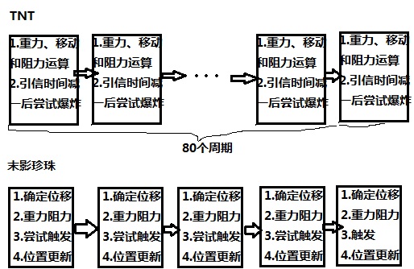

# 实体自由运动相关公式推导

## 符号定义及公式推导

首先，再次强调一下那个很让人迷惑的事实，Motion不是速度，至少不完全是。

同一维度中，对于任意有效实体，定义如下：

该实体的第*n* gt（下文未特殊说明时n为正整数）自该实体第*n*次更新开始时开始，第*n*+1次更新即将开始而未开始时（如果期间实体被移除，则为该实体被移除前开始的最后一次运算结束时）结束。

在该实体的第1 gt即将开始而未开始时，实体在x、y、z轴上的坐标分别为$x_{0}$、$y_{0}$、$z_{0}$，在x、y、z轴的上Motion分别为$v_{x0}$、$v_{y0}$、$v_{z0}$。一游戏刻长度

$$\begin{matrix}
t_{0} = 1gt
\tag{3.1.1}
\end{matrix}$$

在该实体的第n gt结束时，实体在x、y、z轴上的坐标与$x_{0}$、$y_{0}$、$z_{0}$的差分别为$x_{n}$、$y_{n}$、$z_{n}$，在x、y、z轴的上Motion分别为$v_{xn}$、$v_{yn}$、$v_{zn}$。

在该实体的的第*n* gt内，实体在x、y、z轴上的位移分别为

$$\begin{matrix}
\Delta x_{n} = x_{n} - x_{n - 1}
\tag{3.1.2}
\end{matrix}$$

$$\begin{matrix}
\Delta y_{n} = y_{n} - y_{n - 1}
\tag{3.1.3}
\end{matrix}$$

$$\begin{matrix}
\Delta z_{n} = z_{n} - z_{n - 1}
\tag{3.1.4}
\end{matrix}$$

其值与$t_{0}$的比值分别为该实体在其第*n* gt中在x、y、z轴上的平均速度。

该实体每gt会受到加速度及阻力作用，当各轴上加速度及阻力作用都视为每gt仅进行一次且加速度和阻力系数均不变时，实体在x、y、z轴上的Motion在加速度作用后的值与作用前的值的差值与$t_{0}$的比值（加速度）分别为$a_{x}$、$a_{y}$、$a_{z}$，实体在x、y、z轴上的的Motion在阻力作用后的值与作用前的值的比值（速度乘数）分别为$k_{x}$、$k_{y}$、$k_{z}$。

以上定义中各量在无需或无法指定具体坐标轴时用于指定坐标轴的角标可省略，位移符号中不是角标但用于指定坐标轴的字符的以d替换。即$x_{0}$、$y_{0}$、$z_{0}$统一记作$d_{0}$，$v_{x0}$、$v_{y0}$、$v_{z0}$统一记作$v_{0}$，$x_{n}$、$y_{n}$、$z_{n}$统一记作$d_{n}$，$\Delta x_{n}$、$\Delta y_{n}$、$\Delta z_{n}$统一记作$\Delta d_{n}$，$a_{x}$、$a_{y}$、$a_{z}$统一记作$a$，$k_{x}$、$k_{y}$、$k_{z}$统一记作$k$。

为实现速度乘数与**wiki**中阻力系数的转换，有

$$\begin{matrix}
k = 1 - ft_{0}
\tag{3.1.5}
\end{matrix}$$

无论何时。

以MDA型实体为例：

对任意自然数$n_{0}$，有

$$\begin{matrix}
v_{n_{0} + 1} = kv_{n_{0}} + at_{0}
\tag{3.1.6}
\end{matrix}$$

令$n_0=0$，则可以得出

$$\begin{matrix}
v_{1} = kv_{0} - gt_{0}
\tag{3.1.7}
\end{matrix}$$

$$\begin{matrix}
v_{2} = k^{2}v_{0} - gt_{0}k - gt_{0}
\tag{3.1.8}
\end{matrix}$$

$$\begin{matrix}
v_{3} = k^{3}v_{0} - gt_{0}k^{2} - gt_{0}k - gt_{0}
\tag{3.1.9}
\end{matrix}$$

$$\vdots$$

$$\begin{matrix}
v_{n} = k^{n}v_{0} - gt_{0}\sum_{i = 0}^{n - 1}k^{i}
\tag{3.1.10}
\end{matrix}$$

$$\begin{matrix}
\because(1 - k)\sum_{i = q}^{r}k^{i}
\tag{3.1.11}
\end{matrix}$$

$$= k^{q} + k^{q + 1} + \cdots + k^{r - 1} + k^{r} - k^{q + 1} - k^{q + 2} - \cdots - k^{r} - k^{r + 1}$$

$$= k^{q} - k^{r + 1}$$

$$\begin{matrix}
\therefore\sum_{i = q}^{r}k^{i} = \frac{k^{q} - k^{r + 1}}{1 - k}
\tag{3.1.12}
\end{matrix}$$

令式(3.1.12)中*q*=0，*r*=*n*-1，代入式(3.1.10)中，得

$$\begin{matrix}
v_{n} = k^{n}v_{0} + \frac{at_{0}\left( 1 - k^{n} \right)}{1 - k}
\tag{3.1.13}
\end{matrix}$$

由运算过程可知

$$\begin{matrix}
\Delta d_{n} = v_{n - 1}t_{0}
\tag{3.1.14}
\end{matrix}$$

将式(3.1.13)代入其中，有

$$\begin{matrix}
\Delta d_{n} = k^{n - 1}v_{0}t_{0} + \frac{a{t_{0}}^{2}\left( 1 - k^{n - 1} \right)}{1 - k}
\tag{3.1.15}
\end{matrix}$$

易知

$$\begin{matrix}
d_{n} = \sum_{i = 1}^{n}{\Delta d_{i}t_{0}}
\tag{3.1.16}
\end{matrix}$$

将式(3.1.15)带入其中，有

$$\begin{matrix}
d_{n} = v_{0}t_{0}\sum_{i = 1}^{n}k^{i - 1} + \frac{a{t_{0}}^{2}n}{1 - k} + \frac{a{t_{0}}^{2}}{1 - k}\sum_{i = 1}^{n}k^{i - 1}
\tag{3.1.17}
\end{matrix}$$

令式(3.1.12)中*q*=0，*r*=*n*-1，并将其代入式(3.1.17)中，有

$$\begin{matrix}
d_{n} = \frac{v_{0}t_{0}\left( 1 - k^{n} \right)}{1 - k} + \frac{a{t_{0}}^{2}\left\lbrack k^{n} + n(1 - k) - 1 \right\rbrack}{(1 - k)^{2}}
\tag{3.1.18}
\end{matrix}$$

解得

$$\begin{matrix}
v_{0} = \frac{d_{n}{t_{0}}^{- 1}(1 - k) - at_{0}n}{1 - k^{n}} + \frac{at_{0}}{1 - k}
\tag{3.1.19}
\end{matrix}$$

令式(3.1.15)中$\Delta d_{n} = 0$，解得

$$\begin{matrix}
n = 1 - \log_{k}\left\lbrack 1 - \frac{v_{0}(1 - k)}{at_{0}} \right\rbrack
\tag{3.1.20}
\end{matrix}$$

可以证明，将求得*n*向下取整\[4\]（取不大于*n*的最大整数），代入式(3.1.18)中，可求得运动折返点（若有）

令$n \rightarrow + \infty$，则有$k^{n} \rightarrow 0$（0\<*k*\<1）

则使$\Delta d_{n}$绝对值最大的

$$\begin{matrix}
\Delta d_{\max} = \frac{a{t_{0}}^{2}}{1 - k}
\tag{3.1.21}
\end{matrix}$$

若此时*a*=0，使$d_{n}$绝对值最大的

$$\begin{matrix}
d_{\max} = \frac{v_{0}t_{0}}{1 - k}
\tag{3.1.22}
\end{matrix}$$

若

$$\begin{matrix}
a_{x} = a_{z} = 0,a_{y} = - g
\tag{3.1.23}
\end{matrix}$$

$$\begin{matrix}
k = k_{x} = k_{y} = k_{z}
\tag{3.1.24}
\end{matrix}$$

则有

$$\begin{matrix}
\Delta x_{n} = k^{n - 1}v_{x0}t_{0}
\tag{3.1.25}
\end{matrix}$$

$$\begin{matrix}
\Delta y_{n} = k^{n - 1}v_{y0}t_{0} - \frac{g{t_{0}}^{2}\left( 1 - k^{n - 1} \right)}{1 - k}
\tag{3.1.26}
\end{matrix}$$

$$\begin{matrix}
\Delta z_{n} = k^{n - 1}v_{z0}t_{0}
\tag{3.1.27}
\end{matrix}$$

$$\begin{matrix}
x_{n} = \frac{v_{x0}t_{0}\left( 1 - k^{n} \right)}{1 - k}
\tag{3.1.28}
\end{matrix}$$

$$\begin{matrix}
y_{n} = \frac{v_{y0}t_{0}\left( 1 - k^{n} \right)}{1 - k} - \frac{g{t_{0}}^{2}\left\lbrack k^{n} + n(1 - k) - 1 \right\rbrack}{(1 - k)^{2}}
\tag{3.1.29}
\end{matrix}$$

$$\begin{matrix}
z_{n} = \frac{v_{z0}t_{0}\left( 1 - k^{n} \right)}{1 - k}
\tag{3.1.30}
\end{matrix}$$

易知实体第*n*gt中位移俯仰角正切值

$$\begin{matrix}
{tan\alpha}_{n} = - \frac{\Delta y_{n}}{\sqrt{\Delta{x_{n}}^{2} + \Delta{z_{n}}^{2}}}
\tag{3.1.31}
\end{matrix}$$

将式(3.1.25)、(3.1.26)、(3.1.27)代入式(3.1.31)，得

$$\begin{matrix}
{tan\alpha}_{n} = \frac{gt_{0}\left( k^{n - 1} - 1 \right)}{k^{n - 1}(1 - k)\sqrt{{v_{x0}}^{2} + {v_{z0}}^{2}}} - \frac{v_{y0}}{\sqrt{{v_{x0}}^{2} + {v_{z0}}^{2}}}
\tag{3.1.32}
\end{matrix}$$

由式(3.1.28)得

$$\begin{matrix}
\frac{v_{x0}t_{0}\left( 1 - k^{n} \right)}{1 - k} = x_{n}
\tag{3.1.33}
\end{matrix}$$

将式(3.1.33)与式(3.1.30)相乘，得

$$\begin{matrix}
zv_{x0} = xv_{z0}
\tag{3.1.34}
\end{matrix}$$

即运动轨迹始终在同一垂直xOz平面的一平面θ上；

由式(3.1.28)、(3.1.30)分别解得

$$\begin{matrix}
n = \log_{k}\left\lbrack 1 - \frac{x(1 - k)}{v_{x0}t_{0}} \right\rbrack
\tag{3.1.35}
\end{matrix}$$

$$\begin{matrix}
n = \log_{k}\left\lbrack 1 - \frac{z(1 - k)}{v_{z0}t_{0}} \right\rbrack
\tag{3.1.36}
\end{matrix}$$

分别代入式(3.1.29)中得

$$\begin{matrix}
y = \frac{v_{y0}(1 - k) + gt_{0}}{v_{x0}(1 - k)}x - \frac{g{t_{0}}^{2}}{1 - k}\log_{k}\left\lbrack 1 - \frac{x(1 - k)}{v_{x0}t_{0}} \right\rbrack
\tag{3.1.37}
\end{matrix}$$

$$\begin{matrix}
y = \frac{v_{y0}(1 - k) + gt_{0}}{v_{z0}(1 - k)}z - \frac{g{t_{0}}^{2}}{1 - k}\log_{k}\left\lbrack 1 - \frac{z(1 - k)}{v_{z0}t_{0}} \right\rbrack
\tag{3.1.38}
\end{matrix}$$

可以证明，式(3.1.37)对应曲面与平面θ的交线=式(3.1.38)对应曲面与平面θ的交线=式(3.1.37)对应曲面与式(3.1.38)对应曲面的交线，且运动轨迹点全部在该曲线上

设初速度仰俯仰角为α，偏航角为β，大小为$v_0$，则各轴分量

$$\begin{matrix}
v_{x0} = - v_{0}\cos\alpha\sin\beta
\tag{3.1.39}
\end{matrix}$$

$$\begin{matrix}
v_{y0} = - v_{0}\sin\alpha
\tag{3.1.40}
\end{matrix}$$

$$\begin{matrix}
v_{z0} = v_0\cos\alpha\cos\beta
\tag{3.1.41}
\end{matrix}$$

分别代入式(3.1.28)、(3.1.29)、(3.1.30)中，有

$$\begin{matrix}
x_{n} = - \frac{v_{0}\cos\alpha\sin\beta t_{0}\left( 1 - k^{n} \right)}{1 - k}
\tag{3.1.42}
\end{matrix}$$

$$\begin{matrix}
y_{n} = - \frac{v_{0}\sin\alpha t_{0}\left( 1 - k^{n} \right)}{1 - k} - \frac{g{t_{0}}^{2}\left\lbrack k^{n} + n(1 - k) - 1 \right\rbrack}{(1 - k)^{2}}
\tag{3.1.43}
\end{matrix}$$

$$\begin{matrix}
z_{n} = \frac{v_{0}\cos\alpha\cos\beta t_{0}\left( 1 - k^{n} \right)}{1 - k}
\tag{3.1.44}
\end{matrix}$$

下面认为

$$\begin{matrix}
v_{y0} = - a_{0}t_{0}\sin\alpha + v_{y0}^{'}
\tag{3.1.45}
\end{matrix}$$

其中$a_{0}$是合初始加速度（如爆炸推进加速度），$v_{y0}^{'}$是加速前的y轴Motion，由此可得

$$\begin{matrix}
y_{n} = - \frac{t_{0}\left( - a_{0}t_{0}\sin\alpha + v_{y0}^{'} \right)\left( 1 - k^{n} \right)}{1 - k} - \frac{g{t_{0}}^{2}\left\lbrack k^{n} + n(1 - k) - 1 \right\rbrack}{(1 - k)^{2}}
\tag{3.1.46}
\end{matrix}$$

可以证明

$$\begin{matrix}
a_{0}t_{0} = \frac{(1 - k)\sqrt{{x_{n}}^{2} + {z_{n}}^{2}}}{\cos\alpha t_{0}\left( 1 - k^{n} \right)}
\tag{3.1.47}
\end{matrix}$$

代入式(3.1.46)并解得

$$\begin{matrix}
\tan\alpha\sqrt{{x_{n}}^{2} + {z_{n}}^{2}} = \frac{g{t_{0}}^{2}\left( 1 - k^{n} \right)}{(1 - k)^{2}} - \frac{g{t_{0}}^{2}n - v_{y0}^{'}t_{0}\left( 1 - k^{n} \right)}{1 - k} - y_{n}
\tag{3.1.48}
\end{matrix}$$

对所有有效实体，式(3.1.12)、(3.1.16)、(3.1.31)通用；若式(3.1.23)和(3.1.24)成立 (3.1.34) 、(3.1.39) 、(3.1.40) 、(3.1.41)、(3.1.45)式也通用。

对于DA型实体，式(3.1.13)通用

对于DF型实体，有

$$\begin{matrix}
v_{n} = k^{n}v_{0} + \frac{at_{0}\left( k - k^{n + 1} \right)}{1 - k}
\tag{3.1.49}
\end{matrix}$$

对于M（速度不变，仅移动），N（无法移动）型实体，有

$$\begin{matrix}
v_{n} = v_{0}
\tag{3.1.50}
\end{matrix}$$

所有其它运动形式对应的公式可由式(3.1.13)，(3.1.49)或(3.1.50)与下表中各式结合推导出。

> 表2.1运动形式对应tick末位移与tick末Motion关系式

|  类别  |  公式 |  类别  |  公式 |
| ------------ | ------------------------------- |
|  MDA   | $\Delta d_{n} = V_{n - 1}t_{0}$  |  AMD   | $\Delta d_{n} = k^{- 1}v_{n}t_{0}$ |
|  DMA   | $\Delta d_{n} = kv_{n - 1}t_{0}$ |  ADM   | $\Delta d_{n} = v_{n}t_{0}$        |
|  DAM   | $\Delta d_{n} = v_{n}t_{0}$      |  M     | $\Delta d_{n} = v_{0}t_{0}$        |
|  MAD   | $\Delta d_{n} = v_{n - 1}t_{0}$  |  N     | $\Delta d_{n} = 0$                 |

个人认为，此处式(3.1.13)、式(3.1.16)的推导大概就是一个数列求和题，或者说就是初中的证明规律的那种题，后面的推导可以说很无脑，硬解就好了，有时候代入消元还是挺管用的。

当然也可以通过构造等比数列$\{a_n - \frac{at_0}{1-k}\}$推导(3.1.16)式，过程更清晰且严谨。

最后需要说明，完全准确的实体运动公式可不是这样就能推出来的，因为存在不可避免的浮点误差，但是这套公式已经足以在几乎所有情况下使用了。

## 公式的直接及拓展应用

在上一节给出关于MDA实体的31个等式中，只有9套是最常用的：

(3.1.13)在某一刻末Motion和加速度已知的情况下，求任意刻实体运算结束时的Motion。这在一些TNT炮设计中选择TNT数量的过程中是比较有用的，因为这个Motion直接参与了射出的初速的决定。

(3.1.15)在某一刻末Motion和加速度已知的情况下，求任意刻内的平均速度，比较重要。

(3.1.18)在某一刻末Motion和加速度已知的情况下，求任意刻末的位移，重要性可想而知。

(3.1.19)在某一刻末位移、加速度和运动时间已知的情况下求出初速度，重要性可想而知。

(3.1.20)在某一刻末Motion和加速度已知的情况下，求实体的折返时间，进而求出折返点（如最高点，向流体上游抛出的物品的折返点等）。

(3.1.21)在时间不受限的情况下求出实体的理论最大速度，可以用于稳定的或周期性的加速过程中（如重力，行走，划船等）实体最终速度的估计，非常重要。

(3.1.22)在时间不受限的情况下求出实体的理论最大位移。

(3.1.32)求出实体的合速度俯仰角，但实际应用不多，有时可用与碰撞判定相关计算

(3.1.34)、(3.1.37)、(3.1.38)给出了实体在空中平滑化的运动路径的解析式，可用于快速模拟实体运动轨迹，但实际应用不多，推这个主要就是想知道实体运动轨迹的解析式究竟是什么。图3.2.1中可以看出，运动轨迹在开始时接近为倾斜直线，而后发生较大转折，最后无限趋近于水平初速决定的一个竖直线。

> 图3.2.1 5m/gt初速37度斜向正东发射的TNT运动轨迹（平滑化）

(3.1.48)一个"万能方程"，可以快捷地求出某种瞬时加速装置（如TNT炮）的最远落地位移等数据。

直接应用别的估计都好说，这里就只谈一下*n*的确定。*n*说简单了就是从自己选定的一个时间点（多数为实体创建或开始自由运动时）以来经过的刻数，或者说就是实体开始的运算周期数。但是，因为实体的运算过程问题，在计算位移时有时*n*会有1的偏差。例如，TNT实体的爆炸是在位置更新（移动）后才进行的，TNT的初始引信时间为80gt，在引信时间为0时尝试爆炸会成功，从图中很容易想出它从创建到爆炸计算了80周期的运动，所以要想求出TNT的爆炸点可以选取*n*为80；但是，如果是想知道一个末影珍珠在某一时刻触发了哪个拌线钩则需要将经过的刻数减1作为*n*，因为它检查方块网格碰撞（触发绊线）是在位置更新前就进行了，此时它移动的次数会比它开始的运算周期数少1。这一类问题较复杂，对每种实体详细的说明在这里就显得太多余了，不过第七章中的介绍应该会解决多数常见的此类问题。

另外，如果可以保证实体的运动状态没有改变且实体一直存在，3.1节公式中n的值可以取任意整数，而不局限于正整数。非整数值的n一般是没有意义的。

> 图3.2.2 TNT和末影珍珠的运算流程简图

前面说的MDA、AMD等由三个步骤组成的运动只是理想情况，一般只适用于每gt只考虑至多一次加速、至多一次阻力作用和至多一次移动的情况（尽管已经满足大部分需求了），很多时候，特别是在计算玩家运算的时候经常会有实体在同一gt多次受到加速度、阻力甚至可能有多次移动的情况。一个典型的例子就是逆水行舟，根据源码，可以得到其在水中时水平方向上运动运算流程如下：

(1) 受到水流推动

(2) 受到大小为$0.1gt^{-1}$的流体阻力，即k值为0.9

(3) 受到沿视线的水平投影方向0.04或0.005m/$gt^{2}$的动力

(4) 移动

也就是说，在它的运算过程中出现了两次加速，不能直接套用公式。

若要解决这个问题，我们不妨暂时忽略移动这一步骤，先将其下一刻的水平某轴上Motion用一个式子表示出来，其中$a_{f}$为流体加速度在该轴上的分量，$a_{c}$为动力加速度在该轴上的分量，k为步骤三后与步骤三前该轴上Motion的比值，$v_{0}$、$v_{1}$分别为原Motion与下一刻该轴上的Motion：

$$\begin{matrix}
v_{1} = k\left( v_{0} + a_{f}t_{0} \right) + a_{c}t_{0} = kv_{0} + \left( a_{f}k + a_{c} \right)t_{0}
\tag{3.2.1}
\end{matrix}$$

现在下一刻的Motion已经被表示成一个关于$v_{0}$的一次代数式，可以发现这与前面公式推导时DA（先阻力后加速）型实体的相似。所以，我们将式$a_{f}k + a_{c}$作为a，k作为k带入DA型式的Motion公式，也就是式(3.1.13)中，有

$$\begin{matrix}
v_{n} = k^{n}v_{0} + \frac{t_{0}\left( a_{f}k + a_{c} \right)\left( 1 - k_{n} \right)}{1 - k}
\tag{3.2.2}
\end{matrix}$$

易知这里

$$\begin{matrix}
\Delta d_{n} = v_{n}t_{0}
\tag{3.2.3}
\end{matrix}$$

这与DAM和ADM型实体相同。因为上面的推导过程中我们假定$v_{1}$是由$v_{0}$先通过阻力作用，再经过加速得到的（也就是先乘以k，再加上$at_0$），所以这里我们选择DAM型实体，此后余下的公式也可以类似地代入使用。

有时候，多个加速度或阻力都是连在一起的（中间有移动过程时也认为它们是连在一起的），这时我们甚至可以不用求$v_{1}$的表达式，直接用加法合并加速度，用乘法合并阻力的k值就可以了。例如，某个实体每gt运算顺序是$MA_1A_2A_3D_1D_2D_3$，这时可以将$A_1A_2A_3$过程中的加速度相加，将$D_1D_2D_3$中速度乘数（k值）相乘分别得到a和k。可以发现这个实体的运动过程在化简后实际上就是MAD，将求得a和k带入对应公式中即可。

实体的移动过程可能在多个加速或阻力作用过程中间，可能不能直接带入任何与位移相关的现有公式，这时就需要对现有公式进行变形或直接推出一套新公式才能代入使用。再举一例，某实体的运动运算过程为$A_1D_1MA_2DA_3$，我们想要从某个初速度求得任意时刻的位移，也就是要推导出(3.1.18)式的对应版本。利用前面的方法我们可以很轻松的得到这种实体的加速度和阻力，以及

$$\begin{matrix}
\Delta d_{n} = v_{n - 1}t_{0}k_1 + a_{1}t_{0}^{2}k_1
\tag{3.2.4}
\end{matrix}$$

此时完全可以推导出对应公式。

有些时候阻力和加速度作用的周期并不一定是1gt，如计算玩家向正前方跑跳时的平均水平速度时周期是玩家从跳起到再次落地的时间，此时可以对n的取值除以周期并向上取整代入导出的公式以求得周期末的数据，借此求得具体时刻的数据。不过此时计算位移的意义已经不大，通常还是实验更有效。但如果是希望求解某个受到相对于时间有周期性的加速度和阻力系数影响的实体的最终速度（平均的或是稳定后周期内的具体变化情况），可以假设一个初始Motion为$v_{0}，$并求出一个周期后的Motion关于$v_{0}$的表达式$f\left( v_{0} \right)$，令$f\left( v_{0} \right) = v_{0}$，解得$v_{0}$即为运动稳定后的某个周期的初始Motion，进而可以求得运动稳定后的任意周期内的实体速度变化情况。

还是开头那个例子，先假设一个周期从玩家即将跳起时开始，到玩家第二次即将跳起时结束，长度为$n_{0}$。除$n_{0}$和初始水平Motion $v_{0}$外，还有下列几个量影响周期末水平Motion：

1. 玩家在空中的加速度$a_{a}$，玩家疾跑时为0.026$m/{gt}^{2}$与前向加速的系数（一般为0.98）的乘积
2. 玩家在地面的加速度$a_{g}$，玩家疾跑时数值为玩家的generic_movement_speed属性值与前向加速度系数的乘积加0.2$\ m/{gt}^{2}$
3. 玩家在空中的速度乘数$k_{a}$，固定为0.91
4. 玩家在地面的速度乘数$k_{g}$，等于判定所得滑度与0.91的乘积

易知周期内玩家在空中的运动时长为${(n}_{0} - 1)\ gt$，地面上移动时长为1gt，结合玩家的运动运算顺序可以导出周期末水平Motion：

$$v_{next} = (v_{0 +}{a_{g}t_{0})k_{g}k}_{a}^{n_{0} - 1} + \frac{a_{a}t_{0}\left( k_{a} - k_{0}^{n_{0}} \right)}{1 - k_{a}} + a_{g}t_{0}\tag{3.2.6}$$

令$v_{next} = v_{0}$，解得

$$v_{0} = \frac{a_{a}t_{0}\left( k_{a} - k_{a}^{n_{0}} \right)}{\left( 1 - k_{a} \right)(1 - k_{g}k_{a}^{n_{0} - 1})} + \frac{a_{g}t_{0}k_{g}k_{a}^{n_{0} - 1}}{1 - k_{g}k_{0}^{n_{0} - 1}}\tag{3.2.7}$$

接下来，可以得出玩家在周期内的水平Motion变化情况。

可以发现，$1-k^{n}$似乎是一个有特殊意义的值。实际上，在一些实体运动的过程中，*$1-k^{n}$*等于原来的一半的意义还是比较丰富的（不止这些）：

(1) 在加速度和阻力恒定的从无初速开始的加速运动中，这时Motion约是最大Motion的一半，合加速度约是最大合加速度的一半，由实际位移与相同时间以最大速度运动的位移之差是这个差值的最大值的一半。

(2) 在没有加速度但有初速且阻力固定的运动中，这时阻力加速度约是最大阻力加速度的一半，移动的位移约是最大位移的一半，Motion约是初始Motion的一半。

不敢说这个的实际用途有多大，但这确实有助于我们理解这些公式。