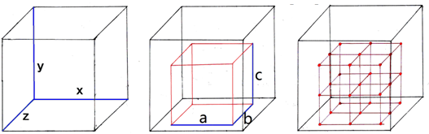

# 番外：《实体运动》一文是怎么来的

自从2021年7月23日发布初稿算起，至今已有四年有余，而且，至今想起当年的研究历程，仍颇有感慨，故为此篇，权当对那段最具技术热情的日子的一个纪念。

若有读者，阅读时不必刻意留意其中的数学公式、具体机制此类技术细节，说到底，那些内容在此应是“副产品”。

## 背景

让我们把时间拨回2019与2020交接的那段时间。

> 在不到一年前，也就是2019年的夏天，我才刚刚度过了近三年的挖不到钻石、打不过末影龙的试探，勉强跻身“正式”Minecraft玩家的行列。

那时，大概是出于尝试的想法吧，在网络没有如此触手可及的学生时期，我一半凭着想象，一半模仿着偶有网络时见到的图片，在各种平台上搭建了若干个所谓的“TNT大炮”：

> 以后附图

与此同时——或许更早——，也曾“拜读”过爆炸机制的源代码，尽管，在浅尝辄止的尝试中，自己从未读懂一字。

接着，中考前后又凭着想象搭建了几个射程更远，超过200m（当时而言，100m以上的射程已经感觉是很难取得的成绩了）的一次性TNT大炮，并进行了与炮弹轨迹相关的诸多试验。

但是，实体运动的具体机制一直都不明朗，更进一步的优化也无从谈起。

2020年九月，步入高中校园，军训的短暂适应后，迎接我的却是连续在校18天这一在当时看来漫长的煎熬。于是，为了在那种枯燥的日子里寻找一分趣味，我就在当时第一次对Minecraft开展了较为严肃的理论研究。9月到10月初，我凭印象，研究了生物的成群生成，推导出生物在一次游走中未移下矩形平台的概率$P=1-\frac{630x+630z-1225}{324xz}$，而后，又设计了一个效率约莫几十万的Y0猪人塔——不过在没有三向破基岩的当时却是一个近乎天方夜谭的想法。

但不论如何，9月开始的研究，为我接下来的经历奠定了基础。

## 起步

如果一定要溯源的话，实体运动研究的开端应是2020年10月18号，当天下午趁着自由活动的空档翻阅了Wiki页面上的实体运动数据，写在手心，以期在返校后发展与验证一套与之相适应的模型。

那时最关键的一步是“猜测”出“阻力”这一概念的具体含义。常数吗，还是与什么有什么样的关系呢？当时我也不好考证当时究竟进行过多少尝试了，只能隐约记起，自己是在10月18当晚，或是不久后的某一晚，在阻力系数的量纲或是其它某某线索的诱导下，考虑到了“阻力与速度成正比”这种可能。

怎么验证的呢？当时我有TNT的阻力系数、重力加速度和最终速度三个数值，于是就开始计算，依照猜测给出的最终速度，是否与Wiki页面中的速度相匹配。

计算还是最为简单且机械的迭代：
$$
v_{n+1}=at_0+(1-ft_0)v_n
$$

> 当然不是那时的原始计算式。

基本上是这样一个流程，随意找到一个初始值$v_0$，代入公式，一轮轮反复地运算——哦，那时其实已经忘记了怎样列出竖式，但用着自己（至今仍在使用）的“野路子”来算。

最理想地，当然是每游戏刻都进行一次递推，然而这样收敛毕竟慢到难以接受，所以就将“时间片”从1 gt，延长到了整整一秒。嗯，当时不知道这会对结果有何影响，也不了解更优，更直接的运算途径，不过好在，当38.4 m/s这个数据被步步逼近时，这种毫无技术含量的计算最终成功验证了当时的假设。

> 肯定的，还要有更为严谨的源码验证，但那就是11月初的事情了。

然后就是推导公式。印象中是先借助简单的迭代计算算出了前几gt的速度，然后寻找规律，得到了速度的一个带有求和符号的表达式。仿照着当时的风格，应该是下面的形式：
$$
v_{n} = k^{n}v_{0} - gt_{0}\sum_{i = 0}^{n - 1}(1-ft_0)^{i}
$$
紧接着我借此推导出诸多常用公式，不过，各式中的求和符号，却是用了一个周才最终拿掉。怎么拿的呢？初二那年，曾流行过化简$3^1+3^2+3^3+\cdots+3^n$的题目，也就是等比数列求和。但当时自己不知道这个概念嘛，也对初二的思路只剩了模糊的印象，最终还是断断续续摸索了数日才成功找回。

当时，用着基础的高中物理知识，曾推导出了忽略阻力时用目标位置计算出速度、抛射角等数据的方程组，因为可以在用板砖“以德服人”的时候做计算，所以戏称其为“板砖方程组”。这样，对Minecraft实体运动推导的公式，也顺理成章地成了“板砖方程组”的一个又一个改进版。

时间来到11月，为了简化方程，我才引入了$k$值这一概念：
$$
k=1-ft_0
$$
同时，也考虑了运算顺序的影响，并在月底推导出其它五类实体的运动公式。

那段时间，也曾用着刚刚开始系统学习的Java语言和Minecraft源码结构，修改1.12版本的源代码，制作喂给兔子烟花能让兔子飞上天，或是把底层基岩的生成延伸至海平面等等小特性且当练习。

根据2020年11月20日写下的一篇不到1000字段研究报告，大致可推知当时取得的进展如下：

- 实体运动描述的大致框架，但是没有做到区分速度与Motion
- 意识到了实体运动顺序，和时间离散性的影响
- TNT实体的确切运算顺序
- TNT的速度/位移公式和一些应用相关的公式：
  - 水平方向理论最大位移
  - 近似地求实体运动最高点
  - 由某时刻位置求初速度
  - 求某时刻瞬时合速度方向(可用于碰撞计算)
  - 由某时位置逆推合初速度大小及方向

与此同时，我也将原先“研究实体运动公式”这个目标进一步推展为如下的目录表：

- 前言：从箭矢开始谈起
- 实体运动基础理论及各量定义
- 实体运动相关核心代码初步分析
- 实体自由运动相关公式推导
- 两种重要的加速方式：活塞推动与爆炸
- 碰撞判定与实体移动过程
- 方块与流体对实体运动的影响
- 实体间交互对运动的影响
- AI主导运动的基本原理
- 状态效果与附魔对运动的影响
- 玩家运动原理及反作弊系统
- 应用一：建造一门可调落点的千格大炮
- 应用二：科学地使用弓箭与珍珠
- 应用三：高速交通设计

虽有诸多差异，但这确实也基本确定了现在文章的研究范围。不同的是，当时自己是有信心在春节之前，用两万余字的篇幅就将文章完成的，完全没有料想到本文后续庞大的工作量——甚至直到文章的字数真正逼近两万、最终超过五万之前，我都一直相信这些事情是用两万余字就能讲得清的。

另外，那时计算器常常是没有的——时好时坏，也常常忘带——所以数值计算时很多的还是依赖传统的笔算——也因此摸索出了一套快速计算“1 - 小于1的小数”的方法。2020年12月底，我曾打印了0到10000间整数的8位对数表，借助刚学不久的对数运算，把高次指数运算从天方夜谭变成了可行的操作。后来，在2021年6月也换用过0.98、0.99、0.95、0.91和0.5的幂次表，用细细的红线缝住一边，带到学校里，让日常的运算被更进一步地简化。

## 苦读

嗯，源码研究是少不了的，甚至，比起公式推导，源码研究要更居于主体。

高中嘛，只趁着两三周一次的周末研究源码显然不足够，所以就蹭着某处的打印机，打印好源码，带入学校阅读。报告初稿发布前大批打印的，应是有三批：

第一次是2020年11月21日前后，打印了Minecraft 1.16.1中与Entity、LivingEntity、TNTEntity、Explosion等十几个关键类（还有Biome等与实体运动无关的类），以及当时写出的简短研究报告，而后自己用牛皮纸将其装订成一个32开大小，两厘米厚的，封面写有“MCP Reborn 1.16.1”的小册子。用着打印的书籍学习Java的同时，我也反复翻阅这那本小册子，一行行地阅读与分析，几乎每页都曾留下过笔记。

第二批是2021年元旦，打印了1.16.4版本的数万行源码，总共250页有余，订成两册，也在一时间不停翻阅。

最后也是最多的一批是2021年3月打印的，仍是来自1.16.4，但是源码量有近20万行，8.27MB，除了整个entity包之外，还包括了渲染系统、网络系统、区块加载、方块等几乎所有确信能用到的部分3200余页PDF，连带着Carpet的源代码、JVM Specification等等，四页拼作一张，用恰好能看清的字体打印了上千面。总共装订了十几册，每册都有一公分的厚度，写有“MC Yarn 1.16.4 Vol.5”这样的标记。因为数量太多，印象中，自己不得不分两三次才得以带到学校中。

后来，这九册源代码就成为了事实上几乎唯一的研究中心，也不只是实体运动，也包括后续开发模组需要用到的接口和很多略有兴致的内容。当然，不论怎样翻阅，终究是很难翻完的，但要说翻阅了过半，确也几乎可以承认：按当时的表述，浏览过的源码有将近十万行，而仅仅是加以分析过的，也有近一万行之多。

那时是怎么阅读呢？除了可以以英语这一表象而可以使自己在阅读时不会成为同学眼中的“异端”的JVMS以外，真正带到课上读的内容的很少，通常不是逃课留在寝室来读，就是晚上溜到天台阅读。

很多个上午，和一些下午，装睡着等宿舍里走空后（嗯，也有很多真得一睡睡到上午十点甚至中午的情况），我就偷偷爬起来研读源码，中间或许会在早餐或跑操期间可能有人回寝时卧回床铺，假装自己从未醒来。高一下学期那会，我住在一间阳光昏暗的寝室，也常常会因此偷偷离开，前去厕所等采光较好的地方阅读。当时，周六周天自习的上午，自己是从来不去的，即使是上课期间，我也常常不回教室，以至于，有连续两周在上午只到过一次教室的经历。

更主要是凌晨。

2021年4月中旬前，厕所在12点左右会亮灯的日子里，自己常常会望着窗外，不时地盯着手表，等着12点到来时，携着书箱走到厕所，挑一个干净的位置，或是厕所隔断的矮墙上，或是水房水池中坐定，然后翻阅到深夜。甚至还专门为此总结了三楼的厕所的灯最亮，而四楼的水房更亮堂的规律。也有一次书本掉到厕所里的经历，为此无奈舍弃了2021年元旦的两册源码中的一卷。

> 文中这张图的主体，其实正是在某个凌晨时分的水房中，绘制在打印的Javadoc背面的。

21年4月某日开始，宿舍厕所凌晨不再亮灯（却也有理由提前出发了），于是自己便只能拿着手电，到天台上找个合适的地方，用废弃的油漆桶和配重砝码搭一套简单的桌椅继续翻阅。手电经常没有电，而学校里似乎又没有可以买到电池的地方，所以经常是，前几晚还能用上着明亮的手电，而后来，就多就是只有手电直射的不过10公分宽的区域可以看清。甚至有次或许是手电彻底没电时，还试图借着远处似乎明亮的工地的探照灯照明——当然徒劳。天台嘛，雨水（虽然有个不露天的小房间，但是也常有雨滴被吹入）、蚊虫自然是少不了的，但也只能强忍，至多，只是有那么一两次，找过一些东西希图从窗口挡住飘来的雨水。

看过学校东边道路上的路灯和周边建筑的灯光从亮转黑，也盯着校外的稀疏的车流和天上的明月与繁星出过神，更享受过，夏日里深夜的凉意。

经常，读着读着就到了早上五点，到那时，我才趁着其它同学起床之前，回到宿舍睡觉——嗯，晚一点的话也有恰好成为“逆行者”，或是随着大流回到教室然后睡觉的经历。

当时是这么一种工作模式，在寝室读源码，然后用着自己的风格抄下伪代码，将几十行冗长的代码浓缩为十几行清晰的流程，带回教室后做计算分析，建立理论。能找出的草稿纸，已有数十页，不慎遗失的亦难以估量。

当然，没有IDE的辅助，源码阅读的困难可想而知。虽然各册源码全部按照类名排好了序，而且长时间的阅读后，自己也渐渐摸清每个类的内容属于哪一卷源码，也记住的很多重要的类中的方法分布（比如Entity.move()大概在Entity类的第500行左右），但是要频繁地在某个大型的类中寻找一个特定的陌生方法，也颇费精力。分析复杂的算法、构建调用图，以及了解方法的覆写情况，更是成为了几乎不可能的任务。（注：即使在IDE上，自己也是直到2022年才开始学会使用调试器。）

期间也在写报告本身。2021年11月15号第一次写下理论框架和完整的公式推导开始，到2021年1月，我写了十几段未使用的简短机制讲解（也有部分与实体运动无关，如紫颂树生长等等），并一再优化实体运动的叙述框架。最终的报告本身是在2021年2月的寒假中开始撰写的，一个寒假断断续续地写了9000字左右，写到了第五章节——尽管所写的近一半内容都在后续的修改、增补与优化中被抛弃或埋没了。

顺带一提，实体运动框架在演进过程中，因为一些问题需要，曾在2021年4月有过一个更加一般化的模型，将运算周期从以往的1 gt推广到多gt的情形，但因为复杂性太高，不得不舍弃。

当时有过一个“难解问题专栏”来记录研究中遇到的很多难以解释的问题，从2021年3月高一下学期开学不久后开设，每个问题在笔记本中占一行，前面是日期和编号，紧接着是一句简单的描述，然后，写在缝隙中的是后续的灵感、答案或补充，每一条都标注了日期。如果问题被解决，还会在编号处标记一个Solved。研究最密集的高一下学期，记录过46条问题，诸如“部分实体着地时$v_y*=-0.05$的用意何在”等等。这些问题后来大部分有了答案，但也有许多广泛而复杂的问题，始终是未敢宣称完全解决。

“工欲善其事，必先利其器”，单凭原版Minecraft所能显示的信息，进行实体运动研究虽不至于全无可能，但也困难异常。比较显然地，获取实体的Motion等数据和准确的坐标需要使用/data指令，不停使用指令来获取很是困难，不如用一个文件记录下来，或者直接像F3调试界面一样显示在屏幕上。同时，大约是在1月到2月之间，我也发现，实体的实际位置与其在客户端显示的碰撞箱和图像并不匹配，若迷信之，必然会为研究带来诸多困扰。

然后辅助模组就被列上了日程。早在2020年11月，我就设想过将实体数据存储到一个文件当中，然后用一个专门的查看器来浏览、作图与分析。然后，在2021年1月连续近一个月的在校时间中，我阅读了Fabric的英文Wiki（当时中文翻译还十分不完善），也读了一遍Scarpet的原始文档，希望借此写出一些可以辅助研究的小工具（后来确实也写过用来快速进行/tick step和/tick freeze以及显示实体碰撞箱的小脚本）。

虽然2020年的最后一天就为辅助模组建立了仓库，但是到了2021年1月29，才正式写下MCWMEM的第一行代码——嗯，因为需求的轻重缓急有变，这也已不是最初所计划的模组了。

写下的第一个功能应该是一个实体信息显示HUD——这一功能也是我至今离不开这一模组的最重要原因之一——，然后好像还有/explode指令和爆炸射线可视化等等，不便一一列举了（在2021年夏更名为MessMod后，该模组的开发实际上延续到了今天）。印象最深刻的，是大年初一熬了一晚上来叠元宝，又在天未明时外出拜年后，回房写下获取实体字段的/entityfield指令的那个上午。

> MCWMEM的第一张运行截图

碰撞箱与HUD的色号是0x31F38B，2021年初定下以后一直沿用至今。嗯，20050827 = 0x131F38B，正是XYN的公历生日。

## 冲锋

文章的DDL改了几次，最终被确定在了2021年7月23日，很多地是因为，当时爱恋的XYN的农历生日是七月二十三。

因为最初的公式有过很多错误，所以从5月开始，我重新进行过多次推导与验证。也不算繁杂，36条主要公式，都是纯粹的计算，到熟练了，几乎45分钟的一节晚自习就能推导一遍。

研究愈演愈烈，在当年的高三离校后，我捡来被遗弃的讲义，趁着研究的闲暇读到哲学与自然科学研究的内容时，或许也是抱着将所读应用到当下的研究中的意图的缘故，看到真理的相对性、可知性、实在性等等，我竟对此有了一点微弱的共鸣。

暑假前最后一天，我一边求着导验证着所谓“万能方程”中射程与飞行时间之间看似反直觉的数量关系，一边将学校里发下的假期作业叠成一地元宝，等待着在暑假最后大干一场。

7月9号到7月12号，主要是完成了另一个辅助模组区块加载小地图（虽然只有500行代码）的编写，以及对MCWMEM图形渲染系统的重构，摸鱼的时间也不少，研究强度不算大，甚至还偶有时间打开单人生存存档游玩几小时，然后在失误后又回退到5月4日的备份。

但后来就不同了。

7月15到7月23，我几乎每天都要对照着先前的草稿纸和IDE上各个版本各个位置的源代码码上四五千字——嗯，其实常常是麻木地将源码中的流程转译成文字。与此同时，自己也要忙着在Minecraft中不断地做出各种实验与验证，并不时地使用Windows画图这一堪称原始的工具绘制插图，每天算下来，工作量都会有十几小时。到了最后，7月22到7月23下午，几乎一天一夜没敢睡，才在当日下午一点完成了报告，然后骑上锈迹斑斑的自行车，赶去县城的网吧，将文稿草草上传。

## 尾声

7月23报告初稿发布后，前几天是沉寂的，少有人前来阅读，大概是7月26，某位小有名气的Minecraft研究者转发了本文后，文章随即便在国内Minecraft技术圈子里大范围传播，并被数位知名UP转发，由此取得了可观的浏览量，并在一时间成为了实体运动应用的重要参考之一。

7月26到8月1号，在一位网友的帮助下，文章的结构被大幅优化，开始有了今天的样子。

8月，我搭建了几台珍珠炮，部分作为讲解的辅助资料，但更多地是出于验证自身能力的目的。至今怀念那时清晨外出摘黄花菜，傍晚听村后的喇叭广播“黄河之畔，尧舜之乡……”的日子。

## 反噬

中秋后的审稿中，我在文章中发现了难以计数的错误，于是，接下来就进入了类似2021年夏的状态，一边审查稿件，一边继续回扣源代码予以检验几乎每一条可疑的表述，甚至，有过之而无不及。一直持续到11月13号，我在文中发现了几百处typo和近一百处事实性错漏后，才敢暂时宣布定稿。（文章只有六万字左右，相当于，最多时文章每页都有好几处错误）

后来，2022年4月，将报告转为Markdown后，也在随后偶尔的审查中发现许多疏漏，直到近来，才很难找到明显的错误。

虽然无人对此指责，也没有过多影响这篇报告本身的评价，但是，这一黑历史却让我久久不能忘怀。

学业呢？高一时立体几何的几处定理，自己直到期末都记不全，生物遗传题和其它诸多题型也是在此时没有打好基础，而后来的审稿又让我在圆锥曲线模块落下了“病根”。诸此种种，直到高三才勉强得以自救（尽管遗传和圆曲直到最终自救效果也相当有限）。

高一的第二次月考，1050分的题目我曾拿到了733分，在班级里处于前列，而后来，我却因学业的不扎实和考试缺考/睡觉等原因稳居年级倒数第一接近一年，即使有两次考了全科，750的题目，也顶天只有440分，最低时，甚至预估只有400分不到的水平，这也成为了我在学业和自信上的“至暗期”。