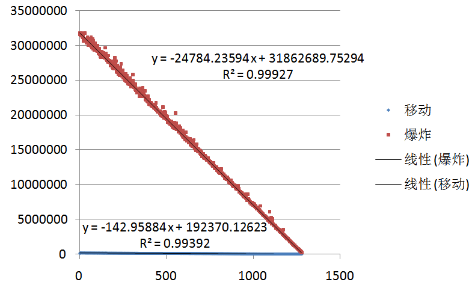
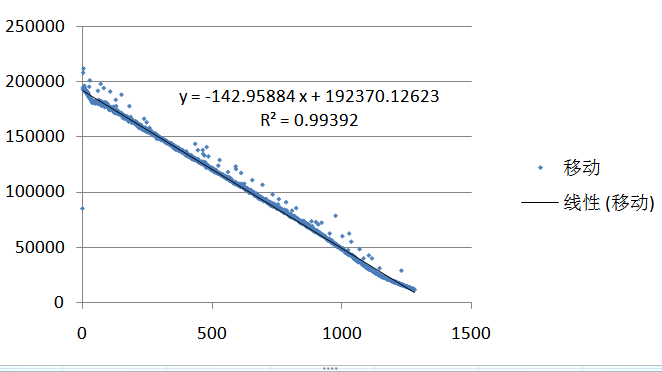
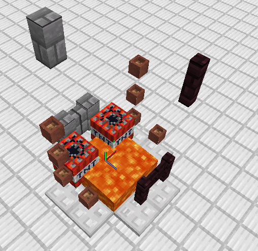
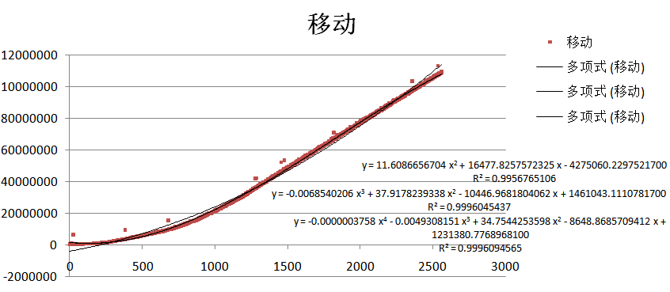
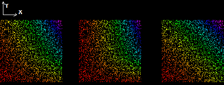
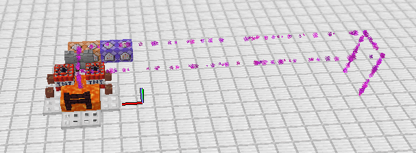

# TNT炮爆炸卡顿分析

## 前言

在较大型TNT炮的设计过程中，爆炸卡顿是一个不可忽视的重要事项，对其进行一定分析有助于评估一个设计的可行性，有时还可以作为爆炸卡顿优化的理论依据。

本次研究采用如下环境：

- Minecraft 1.16.5（MCP-Reborn-MOJO）
- Oracle JDK 8u221（单堆）或Oracle JDK 11.0.5（双堆）
- Windows 7旗舰版
- Intel Pentium G2030 @ 3000 MHz
- 4GB RAM, JVM堆空间分配2GB

## 前置知识：爆炸瞬间TNT运算流程

相对完整地说来，大概是这样的：

1. 重力加速度
2. 以当前Motion为位移趋势进行基于Entity.move()的移动
   1. 尝试应用蛛网和浆果丛对本次移动的减速作用
   2. 对方块，世界边界和固体实体的碰撞检查（`Entity.adjustMovementForCollisions(Vec3d)`）
      1. 如果位移不是绝对沿轴
         1. 获取以移动起点和目的地为两体对角顶点的长方体，获取长方体内部及表面附近**[1]**的方块并对其进行如下检查
            1. 假设TNT的运动轨迹为沿轴折线，之后的碰撞检查一次寻找这些轴上的的碰撞
            2. 如果区块未加载则跳过当前方块且不加载区块
            3. 如果方块没有碰撞箱或容错范围内判定碰撞在当前轴上已经发生则跳过当前方块，但会加载区块
            4. 将碰撞箱分割成尽可能少个体素（立体的像素），检查从起点到目的地每个体素（方块外部也被划分出体素）的碰撞
      2. 如果移动绝对沿轴
         1. 获取轨迹附近**[1]**的每个方块碰撞箱进行如下检查
            1. 如果方块没有碰撞箱或容错范围内判定碰撞已经发生则跳过当前方块，但会加载区块
            2. 将碰撞箱分割成尽可能少个体素，检查从起点到目的地每个体素（方块外部也被划分出体素）的碰撞
            3. 如果碰撞将TNT的位移大小限制到了$10^{-7}m$以下，结束检查
   3. 如果剩余的位移趋势大于$10^{-7}$m，移动碰撞箱和坐标
   4. 一些其他开销几乎可以忽略的后续运算
3. 阻力
4. 将引信时间减一
5. 将自身标记为已移除
6. 在坐标上方0.06125m处产生一个4级爆炸（`ServerWorld.createExplosion()`）
   1. 在1356条轨迹上进行检查以获取被破坏的方块列表
   2. 对距离TNT坐标点8m内的未移除实体进行如下运算
      1. 计算爆炸接触率
      2. 加速并伤害实体
   3. 破坏方块
   4. 掉落被破坏方块的掉落物
   5. 产生火焰
   6. 向客户端发送爆炸数据包
7. 流体推动相关更新

**[1]**用于保证碰撞箱超出所在方块网格的方块的碰撞检查正常进行，通常延伸的曼哈顿距离不超过实体大小 + 2

不过，一般情况下开销较大的只有碰撞检查、获取被破坏的方块列表以及接触率运算开销较大。

## 单堆TNT爆炸卡顿

此处单堆TNT为若干个被岩浆防爆处理、坐标完全重合、静止且着地的TNT。

### 理论分析

容易得知，单堆TNT移动过程中无水平位移趋势，即水平趋势绝对沿Y轴，同时由于下方存在方块阻挡，碰撞检查被立即终止，开销基本可以忽略。

爆炸接触率运算过程固定，预计每次的开销基本一致，进而，理论上单个TNT对其他TNT实体的爆炸接触率运算耗时与剩余TNT个数成正比关系，总耗时与总TNT个数的平方接近成正比关系。

防爆处理下其他阶段的运算开销几乎不受内外环境影响，可认为耗时大致相同。

若设TNT个数为N，则预计可以用以下模型拟合TNT爆炸总耗时：

$$t=T_0N^2+T_1N$$

### 统计数据

横轴为一次堆叠TNT爆炸中某个TNT爆炸的序数，编号从0到1279，共1280次爆炸，纵轴为单个主要运算阶段的平均耗时，单位为纳秒。可以看出，爆炸耗时与剩余TNT个数（1280 - 序数）成极强的线性关系，移动耗时极低，几乎可以忽略不计。

但移动耗时也不是一点没有：

移动耗时与剩余TNT个数也是成线性关系，但两端有微小的向下偏移且第一个TNT耗时明显偏低，其中线性关系的出现可能与检查固体实体碰撞时需要筛选的TNT个数较多有关。

## 双堆TNT爆炸卡顿

但是，双堆TNT爆炸要比TNT数量加倍复杂得多，因为此时TNT会有水平动量，进而产生了影响明显且难以分析的移动卡顿问题。

此处双堆TNT以一种典型的珍珠炮TNT炮膛环境为例，地面Y=16。

### 统计数据

先放几张图来分析分析

横轴为一次堆叠TNT爆炸中某个TNT爆炸的序数，编号从0开始，共2560次爆炸，纵轴为单个主要运算阶段的**平均**耗时，单位为纳秒。可以看出，爆炸耗时与剩余TNT个数（1280 - 序数）成仍有较强的线性关系，但移动耗时不再小得可以忽略。

另外爆炸数据中的较高的散点（应是GC活动的结果）相对移动数据中这样的散点数量较多，可以推测整体而言爆炸运算过程中产生新对象实例较多，内存开销较大，而且这一开销随剩余TNT数量递增。

移动的平均卡顿大小会随TNT总数先加速上升然后接近线性增加，整体不好用多项式合理地拟合。

一轮较为典型的爆炸的耗时数据如下：

第一堆TNT爆炸时，移动的耗时极低，与单堆TNT爆炸类似，然后，移动耗时开始突增并继续增加，最终趋近于线性增长。

图中每一个点对于一轮两堆TNT数量均为随机0-640个的双堆TNT爆炸，从红到紫耗时依次增大（三张图中尺度不同），从左到右分别为总耗时，移动耗时和爆炸耗时，X，Y轴分别为后爆炸的和先爆炸的TNT数量。

其中，仅有爆炸耗时的图像中任意直线x+y=k（k为常数）上耗时大致相同，即爆炸总耗时仅与TNT总数有关。移动耗时不仅与TNT总数有关，还与两组TNT的数目比有关，而且先爆炸的TNT似乎比后爆炸的TNT对移动总耗时的贡献更大。

也可以做得更直观一些。固定总TNT个数为1280，可以绘制出各阶段的平均耗时如图，其中红、黄、绿色散点分别对应总耗时，爆炸耗时和移动耗时，横轴为后引爆的TNT个数：

容易得出，爆炸耗时受TNT数目影响不大，只是中间（两堆TNT数目接近时）的耗时略高。

但是移动总耗时受数目比例影响极大，总体趋势为先引爆的TNT占到总TNT个数的约1/5时耗时最多，其他情况下耗时略少，由此现象应该可以设计出一种能自动减小爆炸卡顿的珍珠炮配置系统。根据仅有的几组数据，这一峰值出现时两堆TNT的数目比在TNT总数不同时似乎也不同，似乎呈现出一种先减后增的趋势，在1280TNT处会取到一个较小值。

### 理论解释

目前进行的分析尚不能对所有实验现象作出合理解释，在此仅能推测部分简单现象的成因。

#### 1. 移动卡顿大小远大于单堆TNT

双堆TNT中先爆炸的一堆TNT给另一堆TNT一个较大的水平动量，后爆炸的一堆TNT移动的绝对沿轴状态被破坏，进而导致一个较大区域中的方块（可能有数万个，有些时候甚至可能包含所有已加载方块）全部参与碰撞检查，而且一些有结构精细的方块在Bugjump的奇葩代码下被检查的效率奇低，每检查一个这样的方块就有可能会检查数万个体素的潜在碰撞。由此，双堆TNT爆炸的移动卡顿大小远大于单堆TNT爆炸。

#### 2. 移动卡顿总时长与TNT数量和比例的关系

举一个例子，假设左边的一堆TNT先运算，则右边的TNT在移动时差不多会检查图中紫色方框中的所有方块的碰撞（此处仅做演示），且随着自身动量的增加，检查范围还会继续向右或向下延伸，直到延伸到未加载区块。在未加载区块被覆盖前，右边第一个TNT检查的方块的数量与TNT动量大小的平方大致成正比，也就是与左侧TNT的个数的平方大致成正比；在范围延伸到未加载区块后，右边第一个TNT检查的方块数量不再受左边TNT数量的影响。同时，检查单个方块时检查的体素数量与实体各轴动量和成正比，另外，在获取方块和进行一些初步排除检查时也会牵扯到一些与方块数量成正比的卡顿，所以，那个TNT总共检查的体素个数在检查范围延伸到未加载区块前与左边一堆TNT数量近似成三次关系（还应有二次项和一次项，下面类似），在检查范围延伸到未加载区块后开始线性增长。

到这还没完，类似地，右边的TNT自己爆炸时也会给同一堆余下的TNT以Y轴上的冲量（加速），使检查方块数量在检查范围延伸到世界底层前随爆炸序数（第几个爆炸）线性增加，在范围延伸到世界底层后不再增加。同时，检查一个方块的复杂度也跟着检查的体素数量随爆炸序数线性增加，最终右边的TNT除左边的TNT造成的卡顿突增外，还会继续附加一个随爆炸序数先二次增长再线性增长的卡顿。

总的来说，TNT移动卡顿大小与TNT数目的关系式应该可以以一种不超过三次的多元分段多项式函数的形式写出，但意义不是很大。

至于比例，两堆TNT的爆炸的卡顿主要由后一堆提供，除前一堆TNT爆炸提供的动量外，卡顿大小还取决于后一堆TNT的数量和其内部加速提供的动量，这两者的相互作用存在一个平衡点，即峰值卡顿出现的情形，如果比例有所改变，总共的卡顿大小就会下降。

在这些结论下，前面猜测的峰值卡顿出现时的TNT比例随TNT总数的变化规律或许也能说的通了。

#### 3. 爆炸卡顿在两组TNT数目相近时略高

同一堆内TNT计算接触率时进行的Raycast较短，而两组堆NT间接触率的计算就会用到相对较长的Raycast，根据数学关系很容易得到，若TNT总量确定，理论上两堆TNT数量相同时进行的组间Raycast最多，进而卡顿就会略微地增大。

## 轻松的实践篇：爆炸推进弱加载的实体

假设某弱加载区域有一个实体需用TNT推进将水平速度加速到$v$，且每个TNT提供的冲量固定为$\Delta v$，使所有TNT以每堆数量相同的单堆堆叠形式爆炸，配合使用`/tick warp`以保证服务器线程不间断运行，问若要确定加速所需的最短时间及此时的加速方案，需测定哪些数据，并用测得数据的表示所需结果。

显然，这种条件下需要的TNT数量是确定的，可以设为$N=\frac{v}{\Delta v}$。

在测定了运行环境下单堆TNT爆炸总卡顿与TNT数目的关系式系数$T_0$、$T_1$，`/tick warp`条件下以及归中阵列的运行周期$T$，再设每一堆TNT数目为$N_0$，则很容易写出总用时

$$t=\frac{N}{N_0}(T_0N_0^2+T_1N_0+T)=T_0N_0N+\frac{NT}{N_0}+NT_1$$

由基本不等式很容易得出用时的最大值为$NT_1+N\sqrt{TT_0}$，在$N_0=\sqrt{\frac{T}{T_0}}$时取到。

## TODOs

研究做到一半电脑就几乎撑不住了，经常自己断电，很可能是硬件问题，不得已将下面的几个研究项目暂时搁置，等换了电脑再继续完成。

- Java版本的影响
- Minecraft版本的影响
- 爆炸点相对区块位置的影响
- 爆炸卡顿对其他服务端运算阶段耗时的影响
- 双堆TNT爆炸卡顿与爆炸时序关系的进一步探究。