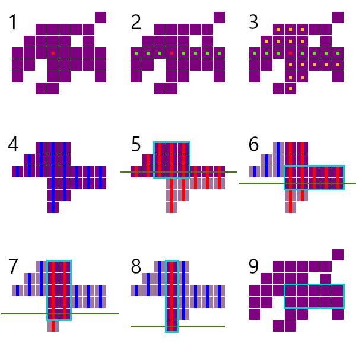

# 下界传送门机制详解

## 目录

1. 下界传送门传送发生时机
2. 可以穿过下界传送门的实体类型
   1. 概述
   2. 源码分析
3. 传送发生条件
4. 传送耗时的计算
5. 传送门的查找与创建
6. 传送前的最后调整
7. 维度切换及其影响
8. 下界传送门造成的区块加载
9. 参考资料

## 下界传送门传送发生时机

下界传送门机制的主要运算（包括传送）发生在被传送实体的运算流程中，这意味着只有当实体被强加载时才可以被传送。

实体运算过程中下界传送门的运算发生得比较早，均在实体因自身速度而发生移动之前进行，因此不能利用实体进入弱加载区块前最后1gt的位移让实体移进传送门并被传送。

## 可以穿过下界传送门的实体类型

### 概述

MCJE 1.16.4中：

> 在服务端，除TNT、下落的方块、末影龙、凋灵、鱼竿浮标、画、物品展示框、末影水晶、闪电束、区域效果云和拴绳结外，大部分与其它实体没有骑乘关系的实体都能通过下界传送门进入另一维度。
>
> ——《Minecraft实体运动研究与应用》第5.18节

### 源码分析


实体基类`Entity`中定义了`tickNetherPortal()`这一方法用于进行下界传送门相关的运算，只有在运算过程中会调用该方法的实体才能被传送。从上面的调用图可以看出，有机会调用该方法的实体有：

- LivingEntity，包含玩家、生物和盔甲架
- 区域效果云
- 经验球
- 末影之眼
- 物品
- 闪电束
- 幻魔者尖牙
- 弹射物
- 船
- 各种矿车

相对于全部实体，这一列表中缺少了TNT、下落的方块、画、物品展示框、末影水晶和拴绳结。

`Entity.tickNetherPortal()`方法没有被任何子类重写，唯一实现如下：

```java
   protected void tickNetherPortal() {
      if (this.world instanceof ServerWorld) {
         int i = this.getMaxNetherPortalTime();
         ServerWorld serverWorld = (ServerWorld)this.world;
         if (this.inNetherPortal) {
            MinecraftServer minecraftServer = serverWorld.getServer();
            RegistryKey<World> registryKey = this.world.getRegistryKey() == World.NETHER ? World.OVERWORLD : World.NETHER;
            ServerWorld serverWorld2 = minecraftServer.getWorld(registryKey);
            if (serverWorld2 != null && minecraftServer.isNetherAllowed() && !this.hasVehicle() && this.netherPortalTime++ >= i) {
               this.world.getProfiler().push("portal");
               this.netherPortalTime = i;
               this.resetNetherPortalCooldown();
               this.moveToWorld(serverWorld2);
               this.world.getProfiler().pop();
            }

            this.inNetherPortal = false;
         } else {
            if (this.netherPortalTime > 0) {
               this.netherPortalTime -= 4;
            }

            if (this.netherPortalTime < 0) {
               this.netherPortalTime = 0;
            }
         }

         this.tickNetherPortalCooldown();
      }
   }
```

除去一些与实体类型无关的限制条件外，可以注意到，只有字段`inNetherPortal`为`true`的实体可以被传送。由Ecilpse给出该字段的调用图如下：


首先需要说明的是，图中最后两种途径不会把`inNetherPortal`更改为`true`，且倒数第三、四项的路径因为下界传送门方块没有碰撞箱而实际上不能工作。所以，只有会检查方块网格碰撞（即会调用`checkBlockCollision()`）的实体才可能更新`inNetherPortal`字段进而有机会被传送。同时，会检查方块网格碰撞的操作主要有：

- 赤足兽的着陆。

- 基于`Entity.move()`方法的实体移动。采用这种移动方式的实体有玩家、生物、盔甲架、交通工具、TNT、物品、落沙、烟花火箭、鱼竿浮标和被活塞及潜影盒推动时的各种实体等。

  值得一提的是，除恼鬼外，大部分`noClip`字段为`true`的实体会跳过方块碰撞箱的检查。根据在1.16.4上的研究：

  > 该字段为true的实体有末影龙的整体轮廓、运算中的恼鬼、客户端上存在的其他玩家、NoGravity或Marker标签为true的盔甲架、旁观者玩家、潜影贝导弹、因忠诚附魔返回中的三叉戟、区域效果云和卡在方块中的物品。

- 赤足兽、火球类实体（也包含凋零头颅）、箭矢、三叉戟、潜影贝导弹、投掷物、各种矿车以及船的运算。

此处可以排除区域效果云、闪电束两种实体，也排除了未被活塞推动的幻魔者尖牙。

另外，`NetherPortalBlock.onEntityCollision()`方法也对`inNetherPortal`的更新进行了限制：

```java
   public void onEntityCollision(BlockState state, World world, BlockPos pos, Entity entity) {
      if (!entity.hasVehicle() && !entity.hasPassengers() && entity.canUsePortals()) {
         entity.setInNetherPortal(pos);
      }
   }
```

其中，只有`Entity.canUsePortals()`这一判断只与实体类型有关。该方法被末影龙、凋零和鱼竿浮漂重写，重写的版本总是返回`false`，而默认版本总是返回`true`。

至此可以总结出上文中的结论。

## 传送发生条件

大概说来就三条：

- 实体没有下界传送门冷却
- 实体与其他实体没有骑乘关系，即没有骑乘其它实体也没有被其它实体骑乘
- 实体在传送门中，即碰撞箱与传送门所在的方块网格相交，且进入方块网格的深度不小于0.001m

在实体被传送时，其下界传送门冷却会被重置为300gt（非玩家），或10gt（玩家）。在这一冷却结束前，若实体未接触下界传送门，冷却时间会逐gt渐少；如果实体接触到下界传送门，冷却时间会在接触后第一次运算下界传送门机制时立即被重置为刚传送后的数值。折跃门的传送也会导致下界传送门冷却被重置为和经下界传送门传送后一致的数值。当冷却时间归零后，实体可以再次通过下界传送门。最开始时，实体的冷却时间为0。

## 传送耗时的计算

如果期间实体一直在传送门中且满足上方的其他条件，则实体会在接触传送门后第1次（非玩家或创造模式玩家）或第80次（非创造模式玩家）运算下界传送门机制时被传送。如果实体与传送门停止结束，则倒计时会以4倍的速度倒退。

举个例子，直接生成在传送门中的生物会在生成后的第2gt被传送，共占用2gt的刷怪上限，时序如下：

1. 第1gt
   1. 刷怪阶段生物M生成，同时在接下来的运算中影响刷怪上限
   2. 实体运算阶段
      1. M在运算下界传送门机制时因为状态未更新认为自己不在传送门中，未传送
      2. M的运算进行到移动阶段，检查了方块网格碰撞，发现自己在传送门中
2. 第2gt
   1. 刷怪阶段M继续占据刷怪上限
   2. 实体运算阶段
      1. M运算在发现自己接触传送门后首次运算下界传送门机制，被传送
3. 第3gt
   1. 刷怪阶段M不再占据刷怪上限

## 传送门的查找与创建

### 初始位置的获取

实体在检查方块网格碰撞时会依次检查每个与其碰撞箱向内缩0.001m后得到的区域相交的方块网格中的各个方块，顺序满足如下规则（`Entity.checkBlockCollision()`）：

- 任意两个方块中，X坐标较小的会被先检查
- X坐标相等的两个方块中，Y坐标较小的会被先检查
- X、Y坐标均相等的方块中，Z坐标较小的会被先检查

这样的结果就是，位于检查区域的西北偏下一角的方块总是最后被检查。

在检查每个下界传送门方块时，该实体都会将其位置记录为它所对应的下界传送门位置，这一操作会将上次的记录覆盖，进而，可以得出，**在检查范围中只有偏西、偏北且偏下的一个下界传送门的坐标会被记录为实体对应的下界传送门坐标**。

### 坐标转换

在正式的传送发生时，游戏会先计算出该实体在目标维度的对应坐标，计算的过程如下：

1. 获取X、Z坐标绝对值均小于29999872的区域与世界边界从四周各向内缩16m后得到的区域相交的区域
2. 将实体的X、Z坐标乘以8（下界到主世界）或$\frac18$（主世界到下界），Y坐标保持一致，初步计算出实体在另一维度对应的坐标
3. 对上一步得到的坐标限制在第1步中得到的范围内
   1. 如果坐标只在一个水平轴上超出范围，则那个轴上的坐标会被就近限制到范围边界处，另一轴不变
   2. 如果坐标在X、Z轴上都超出了限制，则坐标会被就近限制到范围的一个边角处
4. 将各个轴上的坐标向下取整，使对应坐标始终落在方块网格的一个顶点上

也就是说，假定实体的坐标为$(x,y,z)$，实体从下界传送到主世界及从主世界传送到下界时，实体在目标维度相应的坐标分别为：

$$
(\lfloor clamp(8x, x_{min},x_{max})\rfloor,\lfloor y\rfloor,\lfloor clamp(8z, z_{min},z_{max})\rfloor)
$$

$$
(\lfloor clamp(\frac18x, x_{min},x_{max})\rfloor,\lfloor y\rfloor,\lfloor clamp(\frac18z, z_{min},z_{max})\rfloor)
$$

式中，$\lfloor t\rfloor$表示对$t$向下取整，$clamp(t,a,b)$意为将$t$限制在$a$，$b$之间，如果$t$超出了范围，则结果将会是$a$、$b$中比较靠近$t$的一个。

### 查找既有传送门

接着，游戏在以目标坐标对应的方块网格为中心，水平方向上大小为33×33（主世界到下界）或257×257（下界到主世界），竖直方向上包含整个建筑高度范围的长方体区域内的查找所有下界传送门方块，并按以下顺序取其中一个传送门方块（确切来讲是对应的POI）作为**目标传送门方块**：

- 取所在方块网格中心到实体在目标维度相应的坐标最近的传送门方块；
- 在距离最近的传送门方块中，选取位置最低的；
- 在上述条件选出的传送门中，选取所处区块的Z坐标最小的；
- 在上述条件选出的传送门中，选取所处区块的X坐标最小的；
- 所在区块与Y轴坐标均相同且到目标位置的距离均最小的方块中，具体哪一个方块被选中与那些方块的具体位置有关，但详细规则实际上并未被明确地规定，可能随所用的Java版本而变化。

相关实现如下（`PortalForcer.method_30483()`）：

```java
Optional<PointOfInterest> optional = pointOfInterestStorage
    .getInSquare(pointOfInterestType -> pointOfInterestType == PointOfInterestType.NETHER_PORTAL, blockPos, i, PointOfInterestStorage.OccupationStatus.ANY)
    .sorted(Comparator.comparingDouble(pointOfInterest -> pointOfInterest.getPos().getSquaredDistance(blockPos))
            .thenComparingInt(pointOfInterest -> pointOfInterest.getPos().getY()))
    .filter(pointOfInterest -> this.world.getBlockState(pointOfInterest.getPos()).contains(Properties.HORIZONTAL_AXIS))
    .findFirst();
```

> 需要格外注意的是，`BlockPos.getSquaredDistance()`方法不是直接计算的两个方块坐标之间的距离，而是计算的作为`this`的一方对应的方块网格中心到另一方对应的方块网格的西北偏下顶点之间的距离。

然后，游戏会将目标传送门方块作为起点，寻找一个矩形区域，即**目标传送门区域**。

```java
public static class_5460 method_30574(BlockPos blockPos, Direction.Axis axis, int i, Direction.Axis axis2, int j, Predicate<BlockPos> predicate) {
    IntBounds intBounds;
    int o;
    BlockPos.Mutable mutable = blockPos.mutableCopy();
    Direction hNeg = Direction.get(Direction.AxisDirection.NEGATIVE, axis);
    Direction hPos = hPos.getOpposite();
    Direction vNeg = Direction.get(Direction.AxisDirection.NEGATIVE, axis2);
    Direction vPos = vNeg.getOpposite();
    int k = class_5459.method_30575(predicate, mutable.set(blockPos), hNeg, i);
    int l = class_5459.method_30575(predicate, mutable.set(blockPos), hPos, i);
    int m = k;
    IntBounds[] intBoundss = new IntBounds[m + 1 + l];
    intBoundss[m] = new IntBounds(class_5459.method_30575(predicate, mutable.set(blockPos), vNeg, j), class_5459.method_30575(predicate, mutable.set(blockPos), vPos, j));
    int n = intBoundss[m].min;
    for (o = 1; o <= k; ++o) {
        intBounds = intBoundss[m - (o - 1)];
        intBoundss[m - o] = new IntBounds(class_5459.method_30575(predicate, mutable.set(blockPos).move(hNeg, o), vNeg, intBounds.min), class_5459.method_30575(predicate, mutable.set(blockPos).move(hNeg, o), vPos, intBounds.max));
    }
    for (o = 1; o <= l; ++o) {
        intBounds = intBoundss[m + o - 1];
        intBoundss[m + o] = new IntBounds(class_5459.method_30575(predicate, mutable.set(blockPos).move(hPos, o), vNeg, intBounds.min), class_5459.method_30575(predicate, mutable.set(blockPos).move(hPos, o), vPos, intBounds.max));
    }
    o = 0;
    int p = 0;
    int q = 0;
    int r = 0;
    int[] is = new int[intBoundss.length];
    for (int s = n; s >= 0; --s) {
        int v;
        int u;
        IntBounds intBounds2;
        for (int t = 0; t < intBoundss.length; ++t) {
            intBounds2 = intBoundss[t];
            u = n - intBounds2.min;
            v = n + intBounds2.max;
            is[t] = s >= u && s <= v ? v + 1 - s : 0;
        }
        Pair<IntBounds, Integer> pair = class_5459.method_30576(is);
        intBounds2 = pair.getFirst();
        u = 1 + intBounds2.max - intBounds2.min;
        v = pair.getSecond();
        if (u * v <= q * r) continue;
        o = intBounds2.min;
        p = s;
        q = u;
        r = v;
    }
    return new class_5460(blockPos.offset(axis, o - m).offset(axis2, p - n), q, r);
}

private static int method_30575(Predicate<BlockPos> predicate, BlockPos.Mutable mutable, Direction direction, int i) {
    int j;
    for (j = 0; j < i && predicate.test(mutable.move(direction)); ++j);
    return j;
}

static Pair<IntBounds, Integer> findLargestRectangle(int[] heights) {
    int i = 0;
    int j = 0;
    int k = 0;
    IntArrayList intStack = new IntArrayList();	// Stores position
    intStack.push(0);
    for (int l = 1; l <= heights.length; ++l) {
        int m;
        int n = m = l == heights.length ? 0 : heights[l];
        while (!intStack.isEmpty()) {
            int n2 = heights[intStack.topInt()];
            if (m >= n2) {
                intStack.push(l);
                break;
            }
            intStack.popInt();
            int o = intStack.isEmpty() ? 0 : intStack.topInt() + 1;
            if (n2 * (l - o) <= k * (j - i)) continue;
            j = l;
            i = o;
            k = n2;
        }
        if (!intStack.isEmpty()) continue;
         intStack.push(l);
    }
    return new Pair<IntBounds, Integer>(new IntBounds(i, j - 1), k);
}
```

（或许这么一大段没有被完全反混淆的代码乍看起来会有些让人不知从何下手。）

大体来说，这段代码中，游戏做了以下操作。

首先，沿起点处与传送门方块平行的水平方向上，分别沿坐标轴正、负两个方向检查，标记出一个最长的、端点距离中心不超过21格且内部全为朝向与目标传送门方块一致的传送门方块的长条状区域。

然后，在两个循环当中，以长条状区域中的每个位置作为起点在竖直方向上做与上面相似的检查，得到一系列最长、端点到水平长条区域的距离随对应起点到目标传送门方块的距离的增大只减不增且最大不超过21，内部全为与目标传送门朝向相同的传送门方块的长条状区域。

接着，游戏会进行几轮扫描，以寻找面积最大的矩形传送门区域。这时，游戏会给出一个假想的水平面，让该水平面从目标传送门所在的高度开始一格一格地向上移动。在那一水平面位于某一位置时，游戏会选中与水平面相交的竖直长条状区域，并将它们从水平面所在的方块底部截断，取截得区域的上半截得到一系列新的长条状区域，并在那一系列长条状区域组成的区域中勾勒一个最大的矩形区域。如此，游戏会得到一系列矩形区域，最终，最大且较先产生的那一个会被选中作为目标传送门区域。

好吧，这样讲或许还是有些让人发晕，那让我们来看一个具体的例子：



假设我们有一系列同朝向的传送门方块，其中目标传送门方块的位置由红色正方体标出（如图1）。

首先，游戏会标记出与其水平相连的各个传送门（图2中使用绿色标记）组成一横行。

然后，游戏会在标记的各个传送门的竖直方向上标记出与它们相连的传送门方块。我们注意到，为了保证这些竖列“端点到水平长条区域的距离随对应起点到目标传送门方块的距离的增大只减不增”，角落处一些与最初的横行相连的传送门方块没有被标记（如图3），这样我们标记所有传送门始终组成一个以目标传送门方块为中心的“四向阶梯形”（如图4）。此后，其它传送门方块不再参与运算。

接下来，游戏会从最初选出的一横行开始到最底部的各个高度标记出一系列假想的水平面（图5至8中用绿色直线标出），找到与相应水平面相交的所有竖列，截取这些竖列在相应水平面高度及以上的部分（无关部分在图6至11中颜色做淡化处理），然后在分别在每次截取的部分中找到一个最大的矩形区域。


### 尝试创建新的传送门


## 参考资料

1. Minecraft Java Edition 1.19.2源代码，yarn反混淆（主要用于熟悉代码结构）
2. Minecraft Java Edition 1.16.4源代码，yarn反混淆（主要用于确定具体机制）
3. Minecraft Wikipedia: Nether Portal（英文页，2023年6月15日访问）