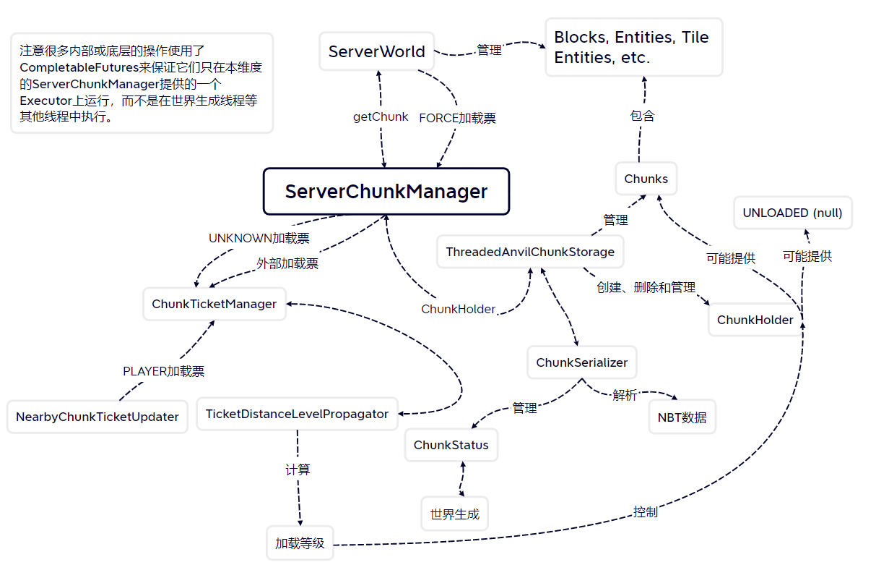
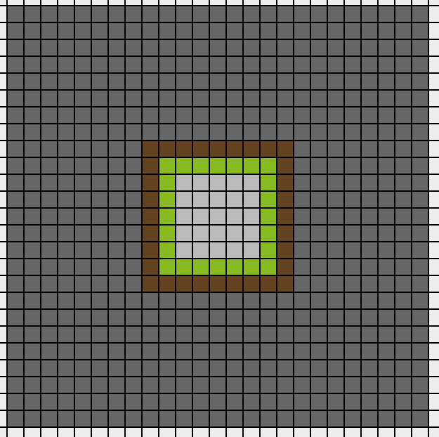

# 区块管理系统的基本架构

## 概述

可以使用一张图片简单地描述区块管理系统的主要结构：



> 图3.1.1 区块管理系统架构简图

其中几个比较关键的模块大概就是：

- `ServerChunkManager`处于区块管理系统的核心位置，将其下方复杂的底层操作抽象为获取区块、使用加载票加载区块等更易于理解的高级操作。
- `ThreadedAnvilChunkStorage`在相对底层的位置负责区块存储、世界生成等多个子系统间的协调工作，本身也处理了区块加载和区块加载状态管理等多项任务。
- `ChuntTicketManager`主要负责区块加载票的管理，其两个内部类也分别负责了玩家的区块加载的处理和区块加载等级的计算。
- `ChunkHolder`是区块管理系统底层中区块的容器，存储了区块本身、区块加载等级、区块生成状态和区块的允许用途（如是否允许在正常的运算逻辑中被访问）。

下面，我们主要围绕着一个基本结构展开叙述。

## `ServerChunkManager`

`ServerChunkManager`是区块管理系统中与外界的接口，是底层结构与高层结构间的一个桥梁，也正如其名，是**一个维度中**区块加载系统的核心模块。它主要处理的工作主要有：

- **向外部提供获取区块的方法；**
- **向外部提供添加和删除外部加载票以实现区块的加载和卸载的方法；**
- **定义区块状态的更新的大致逻辑；**
  - 由无参数的`tick()`方法实现。
- **缓存最近获取的至多4个区块；**
  - 因为经常被重置，所以说“最多”。
  - 一个对象的运算中通常只涉及其所在的与相邻的区块，一般至多有4个，所以单个对象的运算过程中用到的区块通常都会被缓存，获取一次后就无需再次获取。
- 向外部提供询问区块的加载状态的方法；
- 向外部提供通知内部进行光照更新、方块变更和区块保存的方法；
- 判断区块刻和刷怪是否能执行并起始这些运算；
- 计算`InhabitTime`；
- **内部类`MainThreadExecutor`负责管理区块管理系统的异步任务；**
- ...

`ServerChunkManager`定义了两个名为“tick”的方法，分别是：

```java
public void tick(BooleanSupplier shouldKeepTicking)
```

```java
private boolean tick()
```

第一个方法是真正意义上的“tick”方法，每gt中只在相应维度的区块运算阶段被调用一次，依次完成了以下任务：

1. 移除过期的加载票并更新加载等级
2. 执行第二个也就是无参数的`tick()`方法
3. 向客户端发送弱加载和强加载区块内的方块变更
4. 更新可进行区块刻的区块的`InhabitedTime`
5. 普通刷怪循环
6. 区块刻运算
7. 特殊刷怪运算（如猫、幻翼、流浪商人与掠夺者小队的生成）
8. 实体状态跟踪器中玩家名单的更新

第二个“tick”方法与其他名为“tick”的方法不同，它在每gt中通常会被调用多次，而且调用发生的位置不唯一，可能有：

- 通过`ServerChunkManager.getChunk()`获取未经`ServerChunkManager`缓存的区块，具体位置见第四章
- 尝试执行单个异步任务前
- 各种自动保存与服务端关闭造成的区块保存发生前
- 调用第一个`tick()`方法时

当第二个`tick()`方法被调用时，以下任务会被依次执行：

## `ThreadedAnvilChunkStorage`

首先，我们来理解一下这个模块名称的含义，因为这一名称不只是来自yarn的反混淆表，在Bugjump的源码中也有所体现：

- Threaded，线程化的，说明此处用到了一定的多线程技术；
- Anvil，铁砧，此处指现代Minecraft中的区块存储格式；
- ChunkStorage，区块存储，不言自明。

连起来就是“线程化Anvil区块存储”，尽管此处多线程的使用非常有限，似乎是只用于世界生成和NBT的存取，甚至后者还不是在这个模块中被管理的。

言归正传，该模块主要起到一下作用：

- 管理`ChunkHolder`形式的区块；
  - 包括`ChunkHolder`的创建与卸载、共同管理其加载等级和状态等任务。
- 定义并计划区块加载、区块生成和光照更新等任务；
- 定义向玩家发送区块数据的逻辑；
- 管理实体的数据跟踪；
  - 与客户端的数据同步。
- ...

总的来说，因为处理的任务相对多而杂，这个模块和其他的多个模块都有较为密切的关系，可以说是在整个区块管理系统的底层中起到了一个沟通协调的作用。

## `ChunkTaskPrioritySystem`

（TODO：概述）

每一个维度拥有两个相应的`ChunkTaskPrioritySystem`实例：

- 由`ThreadedAnvilChunkStorage`创建，保存在`ThreadedAnvilChunkStorage.chunkTaskPrioritySystem`字段的`ChunkTaskPrioritySystem`；
- 由`ChunkTicketManager`创建，保存于`ChunkTicketManager.levelUpdateListener`字段的`ChunkTaskPrioritySystem`。


## `ChunkTicketManager`

顾名思义，该模块主要负责管理区块加载票，主要包含以下方面：

- 向外界提供增加或删除加载票的方法；
- 管理区块加载票的生命周期；
- 负责`PLAYER`加载票的增加与删除；
- 按照计算出的加载等级通知`ChunkHolder`发生相应变化，进而促使区块加载等过程的发生。

其`tick(ThreadedAnvilChunkStorage)`方法与`ServerChunkManager`的第二个（无参数的）`tick()`方法类似，在同一gt中可以被调用多次，而且调用的位置不确定。在该方法中，以下任务会被依次执行：

1. 更新各区块到玩家的位置记录
2. 按更新后的玩家距离更新`PLAYER`区块加载票
3. 更新区块加载等级
4. 调用加载等级发生变化而未被卸载的区块对应的`ChunkHolder`的`tick(ThreadedAnvilChunkStorage)`方法
5. 调用上一次调用该方法至今被添加过`PLAYER`加载票且当前仍拥有`PLAYER`加载票的区块

## `ChunkHolder`

确切来说，这并不是一个模块，而是区块在区块管理系统中的容器，或者说内部表示。之所以需要用到这么一个`Holder`来表示区块，个人认为这主要是因为：

- 加载范围边界的区块在一定的时间内不一定存在，但是仍有必要存储其加载等级等数据；
- 区块的加载等级和生成状态等信息在内部管理中是必要的，但是在外部通常是不需要，甚至不应该可见的，需要将其与一般的区块数据分别存储；
- 使用`Holder`可以更方便地管理需求的状态（如至少为弱加载区块）下的区块是否可见，同时也更大程度地保证了世界生成过程中用到的区块在正常的运算逻辑中不可见；
- 便于对单个区块内部进行设定加载等级并完成相应更新等基本操作。

同时，`ChunkHolder`主要负责了以下任务：

- 作为存储单位与其他模块进行交互；
- 与`ThreadedAnvilChunkStorage`协作，通过`CompletableFuture`来管理各种状态（视图）下的区块的可用性；
  - 同时也可能间接地引发区块的生成、加载和卸载。
- 存储区块的加载等级；

- 以`CompletableFuture`的形式存储某状态下，或可以用于某个用途的区块；
  - 同时也在某种意义上存储了区块的加载和生成状态（尽管区块本身也有存储）。
- 存储区块中发生变更的方块位置；
- 在对应区块区块刻运算前将发生变更的方块和光照信息发送到客户端；
  - 由`flushUpdates()`方法实现。

## `ChunkStatus`与世界生成

`ChunkStatus`对应了区块生成中的一个阶段，1.16.4中有：

- `empty`：空区块的创建；
- `structure_starts`：获取区块中可能起始生成器结构；
- `structure_references`：结构参照？，用于世界生成；
- `biome`：确定生物群系；
- `noise`：生成地形的大致轮廓与基岩层；
- `surface`：替换地表附近的方块（如替换为泥土、草方块）；
- `carvers`：生成一般的洞穴和峡谷；
- `liquid_carvers`
- `features`：生成海底洞穴和峡谷；
- `light`：光照相关（虽说也不知道到底做了些啥）；
- `spawn`：生成初始生物（如野生动物）；
- `heightmaps`：其实什么也没有做；

- `full`：将用于世界生成的区块（`ProtoChunk`）转换为一般的区块（`WorldChunk`）；`

曾经编了一个顺口溜助记：

> 一空（empty）二始（structure_starts）三参考（structure_references），
>
> 群系（biome）噪声（noise）再地表（surface）。
>
> 气流雕刻（carvers、liquid_carvers）又结构（features），
>
> 光（light）生（spawn）高度（heightmaps）便终了（full，“了”建议读liao）。

同时有几个`ChunkStatus`有对应的加载等级，距离可访问区块距离一定的区块的生成至少要进行到这些阶段才算完成。同时，加载过程中的以及存储于磁盘中的区块只能拥有这些`ChunkStatus`。

- `full`：33或更低，对应可访问区块
- `features`：34
- `liquid_carvers`：35
- `structure_starts`：36～43
- `empty`：44

可能是因为要与世界生成系统相兼容，不可访问区块的`ChunkStatus`可能与磁盘中真正存储的值不同，而是与到最近的可访问区块距离相同的生成中的区块最终的（生成可以暂停时的）`ChunkStatus`相同。具体来说，一个强加载区块周围区块的`ChunkStatus`如下图所示，其中由内到外分别为`full`，`features`，`liquid_carvers`和`structure_starts`，最中间的一个区块为强加载区块：



> 图3.6.1 单个强加载区块附近的`ChunkStatus`

1.20中Bugjump对`ChunkStatus`进行了一些调整：

- 移除了单独的`liquid_carvers`；
- 移除了未使用的`heightmaps`;
- 在`light`前增加了`initialize_light`阶段。

顺口溜自己就先不编了，还请大家自行发挥吧。

在此之外对世界生成详细讲解超出了本文的范围，此处不再赘述。

## NBT存储与区块序列化子系统

相对其他的模块来说，这一部分的独立程度相对较高，在区块管理系统中基本上只与`ThreadedAnvilChunkStorage`有联系。主要负责的任务有：

- 区域文件的存储；
- NBT格式的解析；
- 与`DataFixer`配合，升级可能存在的旧版本区块；
- NBT标签与区块的互转。

这么一个子系统又可以分为以下几个模块：

- `ChunkSerializer`：实现已解析NBT标签与区块的互转；
- `StorageIoWorker`：主要负责在IO Worker线程上分派NBT数据的存取任务；
- `NbtIO`：具体执行NBT格式的解析；
- `RegionFile`：负责解析.mca格式的区域文件。

## 区块管理系统中的线程安排

区块管理系统是Minecraft服务端逻辑中为数不多用到多线程机制的系统之一，除了服务端主线程外，还用到了以下线程：

- 区块生成线程，用于执行区块生成任务，名称满足格式“Worker-Main-数字ID”。
- IO Worker线程，用于NBT数据的存取，名称一般为“IOWorker-chunk”

其他操作，包括区块的日常管理、区块的加载与卸载中不涉及NBT存取与文件操作的部分以及与世界生成无关的大部分异步任务都是在主线程上被执行的。

## `Either`实例与占位符`ChunkHolder.Unloaded`

`ChunkHolder.Unloaded`的实例表示一个区块的不可用视图，即如果区块的生成尚未完全完成，尝试获取该区块的可访问或更高级的视图就会得到这么一个占位符。与一般的`null`不同，这个占位符还会包含区块坐标等附加信息。

`Either`实例通常以`Either<Chunk, ChunkHolder.Unloaded>`的形式出现，顾名思义，这个实例只能提供`Chunk`或`ChunkHolder.Unloaded`二者之一。一般情况下，我们可以认为这就是换了一种说法的`Optional<Chunk>`。

## `CompletableFuture`在区块管理中的作用

根据Java的官方文档，我们大致可以这样认为`CompletableFuture`表示一个可以被显式地完成的，最终会给出一个结果的异步运算。

区块管理系统中，一个`CompletableFuture`对应一个的基本任务，如更新玩家加载票、加载一个区块或完成一个区块的一个生成阶段。

在区块管理系统内部，几乎各种操作都不是直接被运行的，而是作为一个`CompletableFuture`被计划，然后在之后的某处运算中才被执行（可能紧随计划发生后，也可能在数个gt以后）。下一章中，我们将详细地探讨这一过程的细节。

与此同时，在`ChunkHolder`中，区块的不同视图（不同生成或加载状态下的区块）的可用性也由`CompletableFuture`的存在性或有效性给出。举个例子来大致说明一下这种工作流程，假设有一个区块的加载等级已经足以支撑其作为一个强加载区块，相应的`ChunkHolder`中的`entityTickingFuture`字段就会被设为一个有效的值，同时将需要的任务计划异步任务队列当中，当那些任务完成后，该区块就正式地成为强加载区块；否则，`entityTickingFuture`字段就会被设为`ChunkHolder.UNLOADED_CHUNK_FUTURE`，此时无法获取区块的强加载视图，因此区块不可以是弱加载区块。

之所以用到这种方案，主要是因为世界生成是在独立于服务端主线程的另外一个线程上被执行的，如果这两个线程同时对一个区块进行操作，就有可能导致不可预料的错误。

## 特殊对象的存储与管理

除了实体，方块实体等一般的区块数据以外，Minecraft中还有一些依赖于位置存储的特殊数据，如POI与实体（1.17新增）。它们的存储与一般的区块数据相分离，而且管理也相对独立。