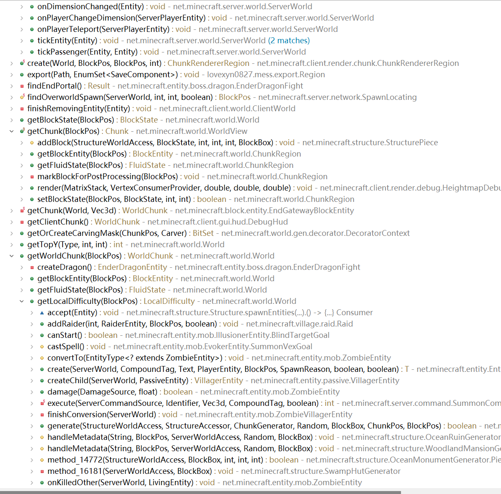

# 主线程异步任务及其执行时机

首先，说实话，主线程异步任务应该是区块管理系统中最复杂的部分，因为这个部分的源码真的写的非常奥利给，与之相关的运算不像一般的实体运算那样发生在运算逻辑中的都个特定位置，而是在几乎任何一个不起眼位置都有可能进行，很少有规律可循。因此，对这一部分进行全面的分析几乎是不可能的，这里所能做到的只是对其中一些基础且通用的机制进行简单地分析，具体的问题还需要结合更具体的源码来解决。

主线程异步任务主要由`ServerChunkManager.MainThreadExecutor`来管理。大概来说，它是一个适用于一个维度的，满足先入先出规则，且保证所有任务均在服务端主线程运行的任务队列。

一般来说，一个主线程异步任务对应一个类似于更新玩家的区块加载票、加载一个区块这样的基本操作。在某处运算需要用到或需要计划这些操作时，相应的异步任务会被加入到队列当中。然后，在某处运算中（可能紧邻任务的添加，也可能在几个gt以后），这件操作才会被真正执行。

可能引起异步任务的执行的位置有：

- 由暂停、退出、自动保存、`/save-all`指令引起的区块保存中保存单个区块时
- 通过`ServerChunkManager.getChunk()`获取未经`ServerChunkManager`缓存的区块，可能的位置有：
  - 玩家重生时获取玩家所在区块
  - 玩家进入当前维度时获取玩家所在区块
  - 玩家加入当前维度时获取玩家所在区块
  - 调用`WorldView.getChunk(int, int)`或`WorldView.getChunk(int, int，ChunkStatus)`时
    - 使用`World.getBlockState()`方法获取世界建筑高度范围内的方块时获取对应区块
    - 使用`World.setBlockState()`方法更改世界建筑高度范围内的方块时获取对应区块
    - 使用`World.getBlockEntity()`方法获取方块实体时获取对应区块
    - 使用`World.setBlockEntity()`方法更改方块实体时获取对应区块
    - 使用`World.getFluid()`方法获取流体状态时获取对应区块
    - 获取区域难度时获取相应的区块
    - 折跃门传送实体时获取目标位置的区块
    - ...（略略略）
- 服务端一个游戏刻运算末尾处的异步任务运算阶段。

第二大类涉及的运算位置至少有数百个，完全列举是不现实的，在此只能说明，获取一个区域内的实体的操作（一般？）不会引起相关区块的加载。

> 图4.1 `WorldView.getChunk(int, int，ChunkStatus)`调用树的一部分

前两大类情况下，在执行异步任务前会有一件相应位置用到的异步任务（记为T）被添加到队列当中，然后队列中的任务会被依次执行，直到T执行完成。注意此处有两个要点，一是在T执行完成前，异步任务的执行不会停止，这意味着同一维度在T之前被添加的任务都会被执行；二是在T完成后，任务的执行会立即结束，同一维度中其余的任务都不会在此处被执行。

其中，第一大类情况下，添加的T为获取区块已经区块保存任务，不必多说。第二大类情况下，添加的T为获取区块的任务为获取目标区块的任务，但是因为T被添加前还要调用一次`ServerChunkManager.tick()`，也有可能导致一些并不相关的任务在此期间被计划，进而被执行。

第三类情况下，如果可以保证执行一件任务前服务端没有掉刻（当前游戏刻运行超过50ms），异步任务的执行可以一直进行到所有维度中的任务列表被清空，否则，任务的执行也会随即终止。同时，如果此时的异步任务的执行又导致了新的任务的创建，那么创建的任务在不掉刻的前提下也会在最后被依次执行。任务执行的顺序为：

1. 服务端本身的异步任务（如处理来自客户端的玩家操作）
2. 主世界`ServerChunkManager`的异步任务
3. 其它维度中`ServerChunkManager`的异步任务（原版应该是下界先于末地）

目的的话，可以这样理解，前两类情况是为了完成一个必须立刻完成的（阻塞性）任务所需的操作而运行异步任务，而后一种情况是一种兜底的机制，保证**正常情况下**某一游戏刻中产生的异步任务都能在当前游戏刻中被执行。

但是这样的结果...不予置评了。

