# 低区块生成量边境炮研究报告

本文的Github仓库地址：[https://github.com/lovexyn0827/Discovering-Minecraft](https://github.com/lovexyn0827/Discovering-Minecraft)

## 摘要

自JE 1.14版本中珍珠超传被修复以来，前往世界边境对普通玩家来说都是一个相当困难的任务，即使是在物资储备及其完备的情况下也几乎不可能在24小时内完成。而且，前往边境的过程中沿途区块的生成也会导致存档极度臃肿，为后续的备份、升级等维护工作带来了较大的困难。

2020年前后，弱加载珍珠炮技术开始流行，为自动化前往世界边境提供了一个基本思路。但是，由于末影珍珠本身特性的限制，这类珍珠炮仍需要玩家先到达世界边境建立区块加载器，而且并未完美地解决沿途区块生成等问题。

为了为普通玩家提供一个经济可行的前方世界边境的方案，本文给出了几种不生成沿途区块的边境炮设计。这些边境炮主要利用了弱加载技术以实现高速推进，同时结合了Minecraft中多种不能加载沿途区块的实体移动方式以减少存档体积增量与卡顿时长。尽管在目前的思路下斜向的长距离移动仍因原版优化欠佳而极度卡慢，但文中给出的设计仍有希望为百万米级的超远程交通提供明显的便利。

## Abstract

Since the exponential teleportation using ender pearls was fixed in Minecraft JE 1.14, it has been an extremely hard task for ordinary players to reach the world border, which is nearly impossible to be done within 24 hours even if all items are sufficient. Moreover, the generation of chunks along the way makes the  save unbelieveably large, leading to great difficulties in subsequent backuping and upgrading tasks.

Around 2020, lazy loading pearl cannons became popular, which provides us a  basic idea on the automaticalization of world border travels. However, due to the limitation of the ender pearl itself, these cannons still require players to get to the border to build chunk loaders at first, and problems like redunant chunk generation are not resolved perfectly.

Aiming at offering oridinary players an economical and practical solution to reach the world border, several designs of world border cannon are included in this essay. In these cannons, lazy loading technologies are used to realize quick acceleration, while various methods are employed to move entities without loading chunks to reduce the increase in the size of saves and the length of lags. Although long-distance diagonal movements cause major lags as a result of the poor optimization of vanilla Minecraft, these designs may  hopefully make millions-blocks-long traveling significantly more convenient.

## 目录

1. 绪论
      1. 设计目标
      2. 研究的大致历程
      3. 研究环境与辅助工具
      4. 文章的主要结构
2. 太长不看
3. 前置基础知识
4. 设计边境炮的主要理论基础
        1. 爆炸推进 OR 实体挤压？
        2. getBlockState() 方法与区块加载
        3. 基于 Entity.move() 的实体移动机制回顾
        4. 玩家加载区块过程
        5. 反作弊系统
        6. 伤害冷却时间
        7. TNT爆炸卡顿
        8. 生物骑乘机制
5. 机器设计
        1. 设计方向
        2. 原理概述
        3. 实体位置矫正
        4. 实体挤压炮膛
        5. 计时装置
        6. 卡服机
        7. 珍珠滞留装置
        8. 保险线路
        9. 控制面板（UI）
        10. 爆炸推进式可骑乘实体炮（真猪炮）
        11. 边境珍珠炮
6. 性能测试
7. 实装指导
        1. 位置与旋转
        2. 堆叠船的制作与运输
        3. 矢量炮配置的计算
        4. 矢量羊驼炮
        5. 矢量真猪炮
        6. 简易边境炮
        7. 边境珍珠炮
        8. 可微调部分
8. 前景与当前设计的改进余地
        1. 单个装置覆盖范围有限
        2. 斜向远距离移动时卡顿较大
        3. 基于实体挤压的推进装置静态卡顿较大
        4. 使用羊驼的设计有约1/50的概率出发失败
        5. 使用TNT的设计推进速度较慢
        6. 矢量羊驼炮配置加载时间过长
        7. 配置不可复用
9. 参考资料

## 绪论

### 设计目标

先前的边境交通方案主要可以分为人工前往与弱加载珍珠炮两大派系，理论上虽然可行，但却都有着明显的缺陷：

- 会生成大量的沿途区块，导致存档体积过大，在弱加载珍珠炮中也引起了极大的瞬时卡顿。
- 过程耗时极长，普遍在24小时以上，即使使用了弱加载炮，蓄力时间也会因卡顿很难压缩到10小时以内。

所以，此处我们可以给出如下设计目标：

- 不生成不必要的沿途区块；
- 减短耗时至一个可以接受的范围；
- 大部分过程不需要玩家直接操作。

### 研究的大致历程

- 2021年春，开始有研究边境交通的打算
- 2021年10月31日，正式将涉及边境交通列上日程，但很长时间内都没有找到合适的思路
- 2022年6月中旬，开始考虑使用可骑乘实体设计边境炮，并开始准备编写本文
- 2022年6月末至7月初，设计出第一个单向边境炮并测试成功
- 2022年7月中旬，计算出更佳的阵列规模，重新组装边境炮
- 2022年7月下旬，受[BV1MV4y1J7DD](https://www.bilibili.com/video/BV1MV4y1J7DD)的启发，开始研究使用实体挤压推进的边境炮，但很少有实际进展
- 2022年8月下旬，制作出第一台使用爆炸推进的矢量边境炮
- 2023年1月下旬，设计出可用的实体挤压炮膛及相应的边境炮
- 2023年2月至6月，断断续续地记录了一堆废案，提出了多项灵感与设想
- 2023年3月4日，在与B站用户@_Ztalin的交谈中找到了实现边境珍珠炮的思路
- 2023年4月至今，进一步研究区块管理系统
- 2023年6月13日，搭建出边境珍珠炮的样机
- 2023年7月下旬，设计出精度较高且推进时长较短的矢量羊驼炮，随后修复了一些Bug
- 2023年8月22日，边境炮在生存模式下测试成功
- 2023年9月，将矢量羊驼炮适配到1.18+，并设计出更简易的实体挤压边境炮

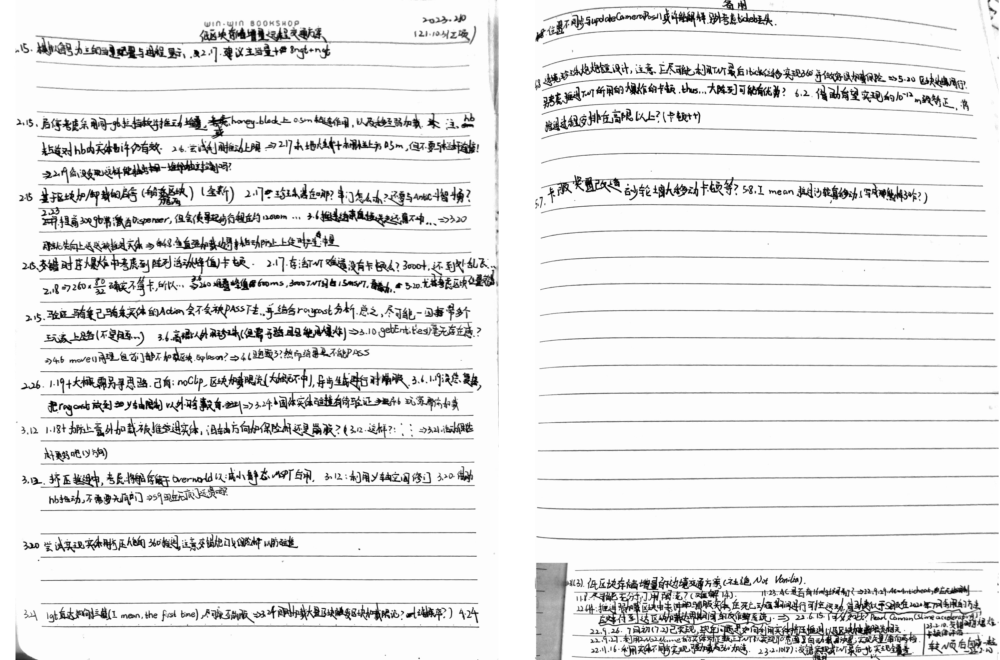

### 研究环境与辅助工具

该研究主要在Minecraft Java Edition 1.16.4与1.20.1下进行，并主要用到了以下几个辅助Mod：

- fabric-carpet 1.4.44+v210714
- TIS Carpet Addition v1.50.1
- MiniHUD 0.19.0-dev.20210917.191825
- Tweakroo 0.10.0-dev.20210917.191839
- Litematica 0.0.0-dev.20210917.192300
- Malilib 0.10.0-dev.21+arne.8
- MessMod 0.6.1+v20230907-BETA
- ChunkMap v20230404

所需源代码使用了以下混淆映射表：

- yarn 1.16.4+build.1
- yarn 1.20.1+build.1

无特殊说明时，以yarn 1.16.4+build.1中名称为准。

### 文章的主要结构

第二章以尽可能短的篇幅给出了边境炮的设计原理，是本文的一个简要而相对通俗的概括。

第三章给出了阅读下文所需的基础知识清单，并顺带给出了实体运动理论中的一些最基础的内容。

第四章以相对脱离于边境炮设计这一具体话题的方式讲解了下文中会比较频繁地用到的理论知识。

第五章展开叙述了几类边境炮及其各个组件的设计思路，是本文的核心内容。

第六章根据已有的测试给出了此处设计的几种边境炮的卡顿情况。

第七章讲解了几款边境炮在建造、配置与使用当中的注意事项。

第八章评价了这一研究的实际意义，以及当前的具体设计的缺陷和相应的解决建议。

## 太长不看

全文字数接近2.5万字，完全看懂需要相对比较长的时间，故此处以较短的篇幅相对独立地给出一些最基本的设计原理，以便感兴趣的读者对这些原理形成一个大致的了解。如还对其它问题有兴趣，或者是打算设计或实装边境炮，也可以选择进一步阅读其他章节。

### 实体是如何被加速的

我们知道，在玩家加载的区块的边界，有一圈弱加载区块，其中的实体的自身运算会被暂停，也就是说，它们即使被赋予了速度仍不会移动，就好像它们的时间被静止了一样。所以，我们可以通过爆炸、实体挤压等方式持续地赋予弱加载区块当中的实体速度。

### 怎样避免加载沿途区块

先此处放出两条结论：

- 使用弹射物的方式移动的实体只会加载运动路径在世界高度上限以内的部分经过的区块。

- 1.18前，生物进行非沿轴移动或远离建筑高度范围的绝对沿轴移动不会加载区块；1.18后，生物在建筑高度范围以外移动不会加载区块。

为什么呢？

Bugjump将实体的移动过程分为两类，一类是大部分实体采用的基于Entity.move()方法的实体移动，另一类是大部分弹射物采用的使用raycast（依次检查路径上经过的所有方块的一个过程）的实体移动。为了降低高速移动的性能开销，Bugjump在第一类实体移动采取了跳过未加载区块这一措施。但是，Bugjump忘记了对第二类移动方式进行优化，作为弹射物的末影珍珠在高速飞行时会将途径的区块全部加载，这一卡顿是不可接受的。

所以，自己在1.16中的第一台边境炮就是利用基于Entity.move()方法的实体移动不加载沿途区块这一思路来设计的。

不过，1.18版本中，Bugjump在基于Entity.move()方法的实体移动当中也加入了一个raycast，这使其原来做出的优化几乎作废，而且，原先的边境炮设计也不再可以避免加载沿途的区块。

但是，我们注意到，因为世界高度上限以外的所有方块被规定为虚空空气，所以要得知那些位置的方块是什么，显然是不需要加载该处的区块的，实际上，Bugjump也真的没有选择加载那些区块。这样，如果我们让raycast全部位于世界高度上限以外，就可以避免区块的加载。

所以，最终，我们采取这样的方案

- 1.18及之后的版本或珍珠炮中，使实体始终在世界高度上限以外运动。
- 其他情况下，使用基于Entity.move()方法不加载沿途区块的特性。

（估计要听得云里雾里的，right？）

## 前置基础知识

本文假定读者已对以下基础知识有所了解：

- Minecraft中的基础机制与概念
- 高中必修阶段的数学与物理知识

为方便下文的叙述，此处再给出一些实体运动理论的基础内容：

类似于国际单位制，我们可以取长度与时间作为实体运动的两个基本量，其基本单位分别为**m**（1m为一个完整方块的棱长）与**gt**（也称游戏刻，1gt对应一个运算周期，或无卡顿的50ms）。在这一基本框架下，我们可以构建速度的单位**m/gt**，换算上满足1m/gt=20m/s。必要时，可以用“1”来替换这些单位，即可以省略这些单位，以便进行叙述。

为避免混淆，此处不再对**Motion**与**速度**加以区分，两者都对应参与决定实体在一段时间内位移的一个状态量，是一个三维向量。当某一时刻实体未被活塞推动且被强加载时，可以认为实体的速度与传统意义上的瞬时速度类似；但是，若实体被弱加载，因为实体的运算被暂停，实体的速度无法使其产生移动，此处可以认为，Minecraft中时间可以被局部地暂停。

然后，为了描述实体速度的变化，仿照中学物理，我们定义**冲量**为一个过程中实体速度的变化量，也是一个三维向量。

## 设计边境炮的主要理论基础

### 爆炸推进 OR 实体挤压？

不考虑爆炸保护附魔的影响时，被TNT爆炸推进的非TNT实体受到的冲量与从爆炸中心指向被影响实体的眼部坐标，以m/gt为单位的大小满足以下公式：

$$\begin{matrix}
冲量大小 =(1- \frac{实体坐标与爆炸中心间距离}{8m} )\cdot 爆炸接触率
\end{matrix}$$

其中爆炸接触率在爆炸中心到实体碰撞箱之间没有方块阻挡时为1。

实体挤压机制可以直接引用《Minecraft实体运动研究与应用》中的叙述：

> 对于LivingEntity和船，游戏会取得两个实体在X、Z轴上坐标差的绝对值中较大值作为一个另类的"距离"（其实就是水平方向上的切比雪夫距离），以m为单位时数值记作d，实体坐标间距离为r，那么这次挤压对双方造成的Motion改变量（冲量）以m/gt为单位的数值$a_{XZ}$满足：
>
> $$
> \begin{matrix}
> a_{XZ} = \left\{ \begin{matrix}
> 0,d \leq 0.01 \\
> \frac{0.05r}{\sqrt{d}},0.01 < d \leq 1 \\
> \frac{0.05r}{d},d > 1 \\
> \end{matrix} \right.
> \tag{5.10.1}
> \end{matrix}
> $$
>
> 也就是说，在两个实体间距离过近（没有一轴大于0.01m）时这两个实体不相互挤压，然后在0.01≤d≤1时，加速度随距离递增，最大能达到$0.05\sqrt{2}\ m/{gt}^{2}$，再然后d\>1时加速度在实体坐标间连线方向不变时不变，具体大小与连线方向有关，沿轴方向时最小，对角线方向最大。注意要保证两碰撞箱相交（船和矿车有0.2m的范围延伸）。
>
> 实体挤压造成的加速度的方向只与实体坐标间连线的水平投影方向有关，或者说只与实体间的相对位置有关，总是沿该连线水平投影向两端加速，与实体速度，朝向等因素是无直接关系的。实体挤压不影响Y轴Motion，也就是说从实体上面踩下去不会受到实体挤压的阻挡。

同时，相较于爆炸推进，实体挤压发生的条件比较复杂：

> (1) 一方的检测范围与另一方的碰撞箱相交；
>
> (2) 两方都不为盔甲架、蝙蝠或旁观者玩家；
>
> (3) 两方的noClip都不为true；
>
> (4) 两方没有直接或间接地骑乘同一实体；
>
> (5) 被推动的一方未睡眠；
>
> (6) 被推动一方都没有死亡；
>
> (7) 被推动一方坐标所在方块坐标处方块不为可攀登方块；
>
> (8) 队伍设置允许碰撞（原版生存可忽略）；
>
> (9) 被推动实体没有骑乘冷却；
>
> (10) 船的上表面中心下方$\frac{1}{9}$m处没有浸没于水中；
>
> (11) 如果被挤压实体为船且主动挤压实体不为LivingEntity，则船的下表面应低于船的上表面（不含接触），否则，船的下表面应不低于实体的下表面。

### `getBlockState()`方法与区块加载

这是1.16.4中`getBlockState()`方法的实现：

```java
public BlockState getBlockState(BlockPos pos) {
	if (isHeightInvalid(pos)) {
		return Blocks.VOID_AIR.getDefaultState();
	} else {
		WorldChunk worldChunk = this.getChunk(pos.getX() >> 4, pos.getZ() >> 4);
		return worldChunk.getBlockState(pos);
	}
}
```

可以注意到这里调用了一个`isHeightInvalid()`方法来判定给定坐标是否位于世界高度上限以外。

如果该方法返回`true`，即给出的坐标位于世界高度上限以外，则根据设定，相应位置处的方块一定为虚空空气，所在的区块不需要也不会被加载。

否则，游戏会尝试获取方块所在的区块，且所用到的`getChunk()`方法会尝试将需要的区块加载至边界加载等级以使其中的内容可以在正常运算逻辑中被访问。与此同时，所需要的区块周围至少23×23的区块也会被加载到内存中以进行可能需要的世界生成过程，其中，有5x5的区块中的主体方块会被生成。

简而言之，**访问世界高度限制以外的方块不会加载其所在的区块**。

### 基于`Entity.move()`的实体移动机制回顾

#### 何为“一次移动”

一般来说，此处我们关心的“一次移动”主要是：

- 实体因其拥有速度（动量、Motion）而在1 gt内产生的移动，
- 单个36号方块、单个潜影盒或单个潜影贝在1 gt内产生的推动效果，
- 接受到的来自客户端的玩家移动数据包中指定的一次移动。

#### 碰撞检查

继续直接引用《Minecraft实体运动研究与应用》中的表述：

> 游戏首先会生成一个可能的碰撞范围，包括路径附近的方块、世界边界（仅在实体于边境内时）和固体实体（仅包含不直接或间接共同骑乘统一实体的实体）。然后，游戏会尝试进行一次初步的碰撞检查，即检查实体在按沿各轴方向运动时有没有发生碰撞。实体碰撞箱相交的物体会被排除，这意味着实体在卡到方块和固体实体内部时可以轻松地出来，但不能重新进入。检查一个轴的过程大概可以理解为为：从某一起点A（原坐标或上一个轴的终点）在对应轴上将坐标加上输入位移趋势在该轴上分量的数值得到另一点B，检查实体碰撞箱从A到B运动过程中有无碰撞，若有，将碰撞点作为该轴的终点和下个轴检查的起点，否则将B作为该轴的终点和下个轴检查的起点。
>
> 在1.14及以后，沿轴检查时，Y轴总是被最先检查，然后是XZ轴中实际位移趋势绝对较大的轴（若相等，则是X轴），最后是余下的一个轴；1.14之前则总是按YXZ的顺序进行。这一改动会使一些本来具有方向性的设备不再依赖朝向或者直接失效。例如，假设存在一款想沿轴方向发射TNT的TNT炮，但由于只进行了在两侧用几个方块阻挡炮弹点燃时的随机运动的矫正所以推进方向会略微偏离预计的沿轴方向。那么在1.14前，这一推进速度偏差在预计的方向所在轴为Z轴时会因为炮弹首先尝试沿X轴检查碰撞并撞到方块被消除，但所在轴方向为X轴时这一推进速度偏差则一般不会被消除。在1.14之后，由于游戏可以判断出发射方向并先沿这个方向进行碰撞检查，所以这一推进速度偏差无论目标方向在哪个轴上都不会被消除。
>
> 
>
> > 图4.1.2实体沿轴碰撞检测路径
>
> 可以这样理解，虽然一次移动从坐标变化的角度看来是瞬时的，但是这种移动从碰撞判定的角度却完全可以分成三次独立的**沿轴移动**。也就是说，如图4.1.1所示，这种实体移动过程中可以认为实体是沿白线而非蓝色直线运动的，假如选取大小合适的实体，再赋予合适的速度，实体可以在图4.1.2中管道内部（金块标注的部分，实际上应为空气）由下向上穿过管道。
>

#### 区块加载

同样，之前在《Minecraft实体运动研究与应用》中曾讲到`Entity.move()`方法有这样一种特点：

> `Entity.move()`不能检查到未加载区块中的碰撞，除非某次移动绝对沿轴

这是因为，用于为非沿轴移动的碰撞检查提供方块碰撞箱的`BlockCollisionSpliterator`类会刻意地跳过尚未被加载的区块；而用于检查沿轴运动碰撞的`VoxelShapes.calculatePushVelocity()`会调用`getBlockState()`方法来获取所需位置的方块状态，且这一方法通常会将方块所在的区块临时加载到边界加载这一等级来保证方块状态的获取始终可以成功。

从源代码可以看出，使用`VoxelShapes.calculatePushVelocity()`的碰撞检查中与将实体碰撞箱向各个方向扩大（含义在实体运动研究1.5节处有所说明）$10^{-7}m$后得到的区域相交的所有方块网格以及与这些方块网格有公共的棱和顶点的方块网格中的方块都会被获取，进而，如果这些方块在世界高度上限以内，实体的碰撞箱的棱长至少有一个不小于$10^{-6}$，且实体可以移动，包含这些方块的区块都会被加载。

从1.18-pre6开始，实体单次移动是否绝对沿轴不再影响沿途区块的加载，此后绝对沿轴的实体移动不一定会加载沿途区块。

同时，1.18以后，Bugjump在`Entity.move()`方法中（碰撞检查完成后）引入了一个raycast操作来更好地处理流体减伤，这使得实际移动起止点（碰撞检查限制后）连线经过世界高度上限内部区域时`Entity.move()`方法也会加载其直线路径上的区块。

所以，综上，原版主流版本中基于`Entity.move()`的实体移动加载沿途区块的充要条件可以表示为：

- 实体拥有碰撞箱，

- 对于1.17.1及以下的正式版本，还应满足以下条件：
  - 实体单次位移绝对沿轴；
  - 经碰撞检查实体可以移动；
  - 实体碰撞箱能到达的最低点低于257.0000001（双精度浮点数，下同）或能到达的最高点不低于-1.0000001。
- 对于1.18.2及更高的正式版本，连接实体起始坐标和经碰撞检查限制后的最终坐标的直线还满足以下条件之一：

  - 在水平面$y=y_0$内，且$y_0$在世界高度上限（不含）和下限（含）之间；
  - 不与水平面平行，且线上最高和最低的坐标$y_1$与$y_0$满足$y_0-10^{-7}|y_1-y_0|$与$y_1+10^{-7}|y_1-y_0|$至少有一个在世界高度上限（不含）和下限（含）之间（涉及常数均为双精度浮点数，涉及运算均为双精度浮点数的运算）。

说人话，差不多就是，不考虑无碰撞箱的实体时，**1.18前，使用`Entity.move()`进行非沿轴移动或远离建筑高度范围的绝对沿轴移动不会加载区块；1.18后，使用`Entity.move()`进行移动前后位置均到建筑高度范围至少有微量距离的移动不会加载区块**。

### 玩家加载区块过程

因为Bugjump的代码太过奥利给，这一过程实际上十分复杂，对其进行分析需要大量的预备知识储备，这远远超出了本文的范围，所以此处仅给出结论，对过程的分析以及对整个区块管理系统的讲解将在单独的文章中发布。

简单来讲，一直在一个区块中运动的珍珠传送的玩家加载区块的过程分为以下几个步骤：

1. 珍珠撞击到方块，玩家被传送
2. 检测到玩家位置发生变更并计划第3步的进行
3. 在`ServerChunkManager`中添加创建`PLAYER`加载票的计划任务
4. 游戏刻结束位置或添加`PLAYER`加载票并更新区块加载等级
5. 生成或加载相关区块

其中，前两步可能会处于同一gt的两个阶段，第2与第3步间隔了1gt，其他步骤的进行几乎连续。也就是说，**区块强加载状态的变更发生在珍珠撞击方块1gt后**。

另给出使用MessMod中`/logchunkbehavior`记录的相关区块事件以供参考：

| Event                | Pos      | GameTime | RealTime      | Thread         | Addition |
| -------------------- | -------- | -------- | ------------- | -------------- | -------- |
| PLAYER_TICKER_UPDATE | [-17, 5] | 172077   | 2150100322800 | Server thread  | F->T     |
| ASYNC_TASK_ADDITION  | [NULL]   | 172077   | 2150100491100 | Worker-Main-30 | 3784     |
| ASYNC_TASK_SINGLE    | [NULL]   | 172078   | 2151265160300 | Server thread  | 3784     |
| ASYNC_TASK_ADDITION  | [NULL]   | 172078   | 2151265228599 | Server thread  | 3788     |
| ASYNC_TASK_SINGLE    | [NULL]   | 172078   | 2151267385799 | Server thread  | 3788     |
| TICKET_ADDITION      | [-17, 5] | 172078   | 2151267471700 | Server thread  | player   |
| CTM_TICK             | [NULL]   | 172078   | 2151267530799 | Server thread  | [NULL]   |
| ASYNC_TASK_ADDITION  | [NULL]   | 172078   | 2151268263000 | Server thread  | 3799     |
| ASYNC_TASK_SINGLE    | [NULL]   | 172078   | 2151272179200 | Server thread  | 3799     |

 ### 反作弊系统

类似地，对整个反作弊系统进行讲解超出了本文的范围，此处仅给出几处与此相关的限制：

- 运动数据包数量不大于5时，1gt内玩家移动距离的平方与服务端实体的Motion大小的平方的差值（均以m、gt及其合成的单位计，不取绝对值，下同）小于这一gt内服务端接收到的运动数据包数量的100倍。
- 运动数据包数量大于5时，1gt内玩家移动距离的平方与服务端实体的Motion大小的平方的差值小于100。
- 玩家骑乘羊驼或在未手持胡萝卜钓竿骑乘猪时的运动在服务端运算，不受反作弊系统检查。
- 服务端上玩家与实体坐标的距离小于6m时，玩家才能与实体交互。

### 伤害冷却时间

生物受到伤害时会开始一个10gt的计时，该时间段内生物受到的总伤害等于生物在期间受到的最大的单次伤害，且每次受到伤害后及时会继续被延长到10gt后，且实体被弱加载时该计时会暂停。在此处，由于实体在装置运行期间主要保持弱加载状态，**实体只会受到装置工作期间该实体本应受到的最大的一次伤害**。

### TNT爆炸卡顿

之前在《堆叠TNT爆炸卡顿分析》中曾提到，对于单堆TNT：

> 若设TNT个数为N，则预计可以用以下模型拟合TNT爆炸总耗时：
>
> $$
> t=T_0N^2+T_1N
> $$

在Minecraft 1.20.1上运行的实验中测得，t单位为ms且TNT在水平防爆地面上爆炸时，该公式可以表示为：

$$
t=0.0035123N^2 + 0.017624N
$$

在N较大时，二次项的影响远大于一次项的影响，此时**可近似认为t与N的平方成正比**。

单堆堆叠TNT爆炸的运算中对耗时贡献最大的爆炸接触率的计算过程如下：

1. 选取每个被爆炸影响到的TNT碰撞箱中的27个检查点
2. 对于每个检查点，选取从爆炸中心指向TNT检查的有向线段，进行一轮raycast
   1. 对于选段经过的各个方块网格中的方块，进行如下检查
      1. 如果爆炸中心附近的一个点在方块碰撞箱中，结束这一轮raycast
      2. 将方块碰撞箱分割为若干个长方体区域，并检查这些长方体区域是否被线段穿过
3. 将未被方块阻挡的线段的数量与检查点总数的比值

可见这一过程与被检查方块碰撞箱的复杂度有关。

### 生物骑乘机制

通常来说，骑乘者骑乘被骑乘者的每gt中，如果被骑乘实体被强加载，则骑乘者的运算会发生在被骑乘实体运算后，且这两者间骑乘者会被传送到被骑乘实体上，且骑乘者的Motion会被归零。同时骑乘者的运算依赖于被骑乘实体的运算。

特殊地，当玩家尝试骑乘生物时，需要满足以下条件：

- 被骑乘生物未死亡
- 玩家没有处于潜行状态

当被骑乘实体为马类（马、驴、骡子或羊驼类）时，玩家骑乘这些实体的每游戏刻这些实体会有2%的概率进行一轮特殊运算。在这一轮运算中，玩家要么被从实体上甩下，要么成功驯服被骑乘实体。这两者发生的概率取决于实体的`Temper`标签值，公式如下：

$$驯服成功概率=\frac{Temper}{Temper最大值}$$

式中，羊驼类实体和其它马类的`Temper`的最大值为30和100。

初始时`Temper`的值为0，当玩家每次被甩下或实体被给予食物时，`Temper`的值会增大。

由于同一gt中这一特殊运算发生在运动运算前，玩家被甩下的位置在被骑乘实体发生移动前的位置附近。

如果玩家在实体运算阶段中被运算时处于潜行状态，即上一gt中服务端接受到玩家最后给出的潜行状态为潜行，或者说玩家在上一gt结束时仍在按住潜行键，玩家将从载具上脱离。

 ## 机器设计

### 设计方向

按照前文提供的设计目标，边境炮设计中的三大要点是推进过程可以持续且高效地进行，被推进的实体可以将玩家携带至目标位置，以及被推进的实体的运动不应加载沿途区块。

其中，推进部分我们主要采用可控度较高的爆炸推进和实体挤压推进，而实体的移动方式又有基于`Entity.move()`的实体移动和建筑高度范围外的弹射物移动两种方案。

同时，为了实现玩家的移动，我们又有使用可骑乘实体、使用末影珍珠以及直接推进玩家三种方案可选。但是，直接推进玩家时玩家附近的区块被会被强加载（弱加载玩家的技术可能可行但尚不成熟），推进只能进行1gt，无论使用爆炸推进还是实体挤压推进，用于边境交通时的瞬时卡顿都是难以接受的，且反作弊系统也可能在这一过程中产生干扰，此后不再讨论。

这样，我们有了三种主要的设计思路：

- 爆炸推进可骑乘实体
- 实体挤压推进可骑乘实体
- 使弱加载珍珠炮中末影珍珠在世界高度上限以外的位置移动

另外，考虑到受众的不同，我们也会有几乎不考虑耗材与对耗材数量及易获取性进行严格限制两条路线可以走。

这里我们会涉及以下几种边境炮设计：

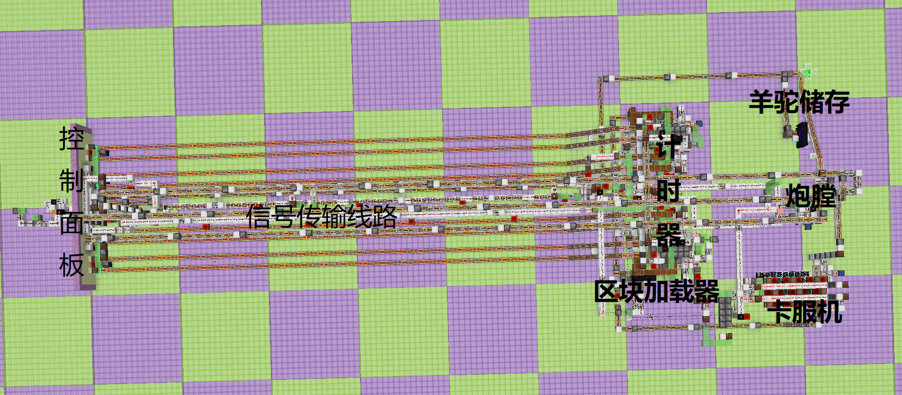

> 矢量羊驼炮

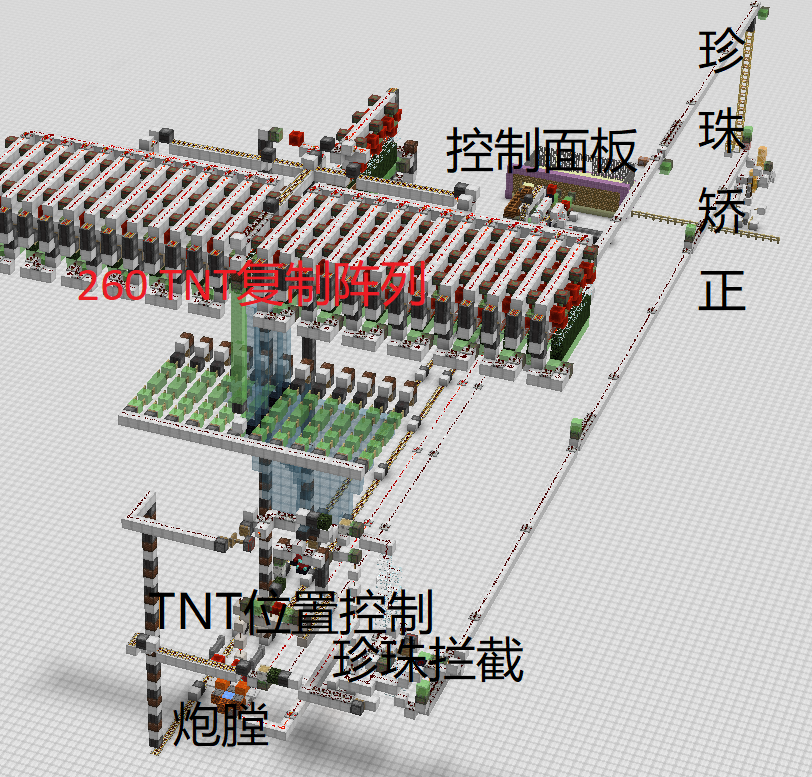

> 矢量真猪炮

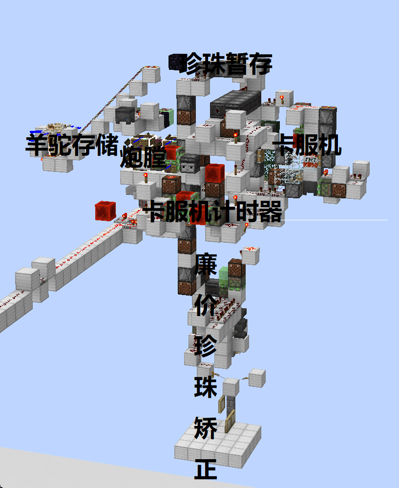

> 简易单向边境炮

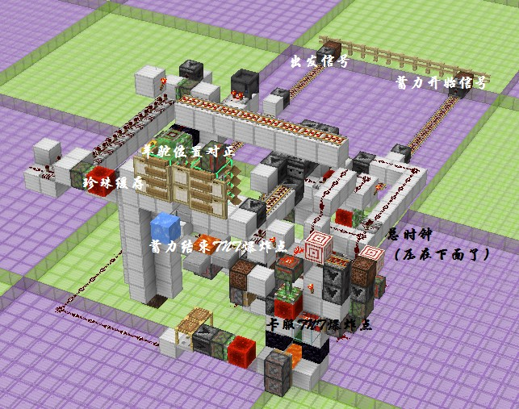

> 可调时长简易单向边境炮（不适用于下界）

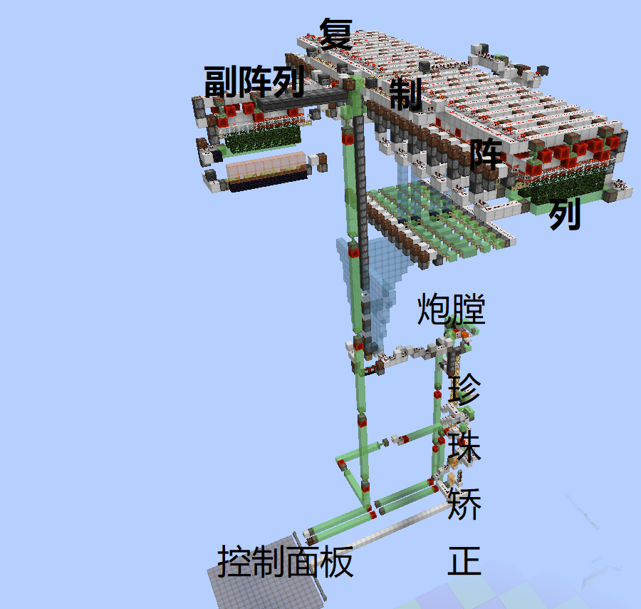

> 边境珍珠炮

此处我们主要根据第一种设计展开讲解，其他设计仅作简单提及。

### 原理概述

通常而言，使用可骑乘实体的边境炮工作流程大致如下：

1. 将被推进实体移至合适的位置
2. 借助一定的方法推进被弱加载的实体
3. 使玩家移动到被推进实体附近
4. 在被推进实体发生运动前产生较长时间的卡顿
5. 玩家在卡顿期间尝试骑乘被推进实体
6. 卡顿结束后的NU阶段玩家骑上实体
7. 被推进实体被强加载并发生移动
8. 玩家被被推进实体移至目的地

显然地，这种流程下的边境炮至少要有推进装置与在合适的时间产生卡顿的装置两部分组成。由于反作弊系统的限制，第3步中移动玩家通常使用珍珠传送，此时还需要有珍珠滞留装置的参与。

使用末影珍珠的边境炮除了珍珠被弱加载且需要在推进完成后被推到建筑高度范围之外以外与一般的珍珠炮类似，此处不再赘述。

### 实体位置矫正

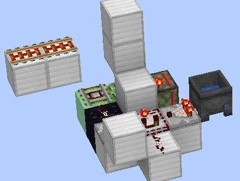

一个前置知识，在矿车在直铁轨上时，矿车的坐标始终在铁轨中间的直线上，且速度始终与铁轨同向（除非为0）。

在这样的一个装置中，矿车从上方动力铁轨向右驶来时，矿车在垂直动力铁轨的方向上在方块网格中间的位置移动，然后，当矿车下落至探测铁轨上时，矿车在平行动力铁轨的方向上的坐标也被矫正至方块中间的位置。最后，矿车的坐标被矫正至方块网格中心所在的竖直线上，即水平坐标的小数部分都被矫正为0.5。

### 实体挤压炮膛

#### 动力源与被推进实体的选择

在设计实体挤压炮膛前，我们首先要搞清楚我们需要使用什么实体来推进，以及被推进的实体是什么。

在Minecraft中，只有三类实体会参与实体挤压：矿车，船和大部分LivingEntity（包括玩家和大部分生物，但不包括盔甲架）。具体到使用什么来作为实体挤压的动力源这一问题上，我们可以得出这样几点基本的要求：

- 由于数量较多，所用到的实体本身造成的卡顿应尽可能小。
- 显然，这里用到的实体不能是玩家
- 可以被容易地堆叠在较小的区域内
- 堆叠的实体不会自发地散开

如此看来，使用生物进行推进并不可取，一方面是因为生物运算极其复杂，引起的卡顿远高于一般实体；另一方面，生物AI引起的自主移动可使堆叠的实体散开，而且在目前版本中的仅有极少数难以大量获取的生物可以完美地卡在由方块组成的缝隙中。

接下来考虑矿车与船。通过对比，应该是因为矿车的体积较小，800个堆叠矿车的卡顿只有800只船的卡顿的60%。然而矿车挤压实体时给予实体的冲量仅有船给予的冲量的$\frac14$，为了使矿车也能提供与800只船相同的冲量，此处我们实际上需要3200个矿车，这时矿车造成的卡顿实际上是远高于船的。另外，相较于矿车，船的耗材也更为廉价，即使是在生存前期也很容易在一小时的时间内获取到用于合成800只船的原材料。还有一方面就是，船的碰撞箱恰好能卡在由完整方块和栅栏围成的，宽度为22像素（1.375m）的缝隙中，这可以防止玩家或其他实体意外撞到堆叠船导致其散开，但是矿车的宽度为0.98m，不能被卡在方块围成的缝隙中。

所以，至少在此处，船是比较理想的动力源。

接下来考虑被推进实体的选取。显然，此处只有几种可由玩家骑乘的实体可选，即矿车、船、马、驴、骡子、羊驼、行商羊驼、猪和赤足兽。其中，矿车的单轴实际速度会有一个0.4m/gt（合8m/s）的上限，此处不再考虑。

早在2022年6月的测试中就发现，当被推进实体为马时，沿途的区块会因为某些未知的原因被加载，这使得1.16版本中相对简易的设计不再可用，而且，由于马的碰撞箱宽度较大，会给装置的设计带来不必要的麻烦，故此处没有选取其作为载具。

此外，考虑到实体挤压运算中，船会对与其相交的其他也船有交互，可以推出单个船的MSPT开销与周围船的数量成一次关系，进而可得单堆堆叠船的MSPT占用与堆内船的数量成二次关系，即设堆内船的数量为N时，MSPT增量满足：

$$
\Delta(MSPT)=aN^2+bN+c
$$

式中a、b、c为常数。

因此，我们会希望将推进所用的船分为较多堆。不考虑堆叠间的相互影响，当N（取值较大）只船被等分为n堆后的MSPT占用会与原来的MSPT占用之比约为：

$$
\frac{n[a(\frac Nn)^2+b(\frac Nn)+c]}{aN^2+bN+c}\approx\frac{n\cdot a(\frac Nn)^2}{aN^2}=\frac1n
$$

根据测试，以4堆竖直堆叠的、每堆包含100只船的堆叠船（即上图中炮膛的一侧）为例，当两组这样的船分别被重合放置、放置到同一子区段或放置于距离较远的两个区块时，MSPT增量比值接近10:6:5。

为了将船在竖直方向上分割为尽可能多的堆叠，一方面，我们需要使用高度尽可能低的动力源实体，这也是这里使用船来推进的另一个原因；另一方面，我们还需要使被推进实体的高度足够高，可以列出各实体的大小如下表：

| 实体种类       | 成体宽度/m | 成体高度/m |
| -------------- | ---------- | ---------- |
| 船             | 1.375      | 0.5625     |
| 马和骡子       | 1.3964844  | 1.6        |
| 驴             | 1.3964844  | 1.5        |
| 羊驼和行商羊驼 | 0.9        | 1.9        |
| 猪             | 0.9        | 0.9        |
| 赤足兽         | 0.9        | 1.7        |

故此处我们选取羊驼为载具。

#### 羊驼自动骑乘船的解决方案

同时，为了防止羊驼自动骑乘堆叠船导致无法蓄力，此处羊驼应骑乘于矿车上。顺便给出几种看似可行，实则无法实现目标的方案：

- 弱加载羊驼：羊驼自动骑乘船是由船的运算造成的，弱加载羊驼无法解决问题。

- 使船浸于水中：因为一个漏洞（报告为[MC-259315](https://bugs.mojang.com/browse/MC-259315)），浸于水中的船不能推进其他实体

   ````java
    List<Entity> list = this.world.getOtherEntities(this, this.getBoundingBox().expand(0.2f, -0.01f, 0.2f), EntityPredicates.canBePushedBy(this));
    if (!list.isEmpty()) {
    	boolean bl = !this.world.isClient 
            	&& !(this.getPrimaryPassenger() instanceof PlayerEntity);
    	for (int j = 0; j < list.size(); ++j) {
    		Entity entity = list.get(j);
    		if (entity.hasPassenger(this)) continue;
    		if (bl && this.getPassengerList().size() < this.getMaxPassengers() 
                	&& !entity.hasVehicle() 
                	&& entity.getWidth() < this.getWidth() 
                	&& entity instanceof LivingEntity 
                	&& !(entity instanceof WaterCreatureEntity) 
                	&& !(entity instanceof PlayerEntity)) {
    			entity.startRiding(this);
    			continue;
    		}
    
    		this.pushAwayFrom(entity);
    	}
    }
   ````

   由源码可知大致的原因为，Bugjump错误地在此处的检查中遗漏了一些实体是否可以骑乘船的检查（包括但不一定限于船的某个高度处不能被水浸没，以及实体没有骑乘冷却时间），所以，当此处原版的检查通过后，船不再会尝试挤压实体，而是只尝试使实体骑乘船，但是，这一动作在接下来的检查中被阻止，最终实体既没有被推动，也没有骑乘船，与一般的认知不符。

- 给予羊驼骑乘延迟并将其置于弱加载区块中冻结该延迟的运算：原因同上。

#### 炮膛基本结构与堆叠船的位置

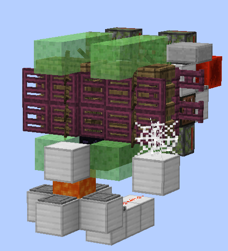

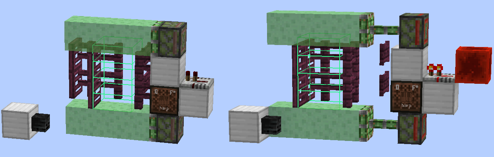

下文以矢量羊驼炮中的炮膛作为示例。这类炮膛中羊驼骑乘在被放置于凋零骷髅头颅上的矿车上，8堆堆叠船被卡在活板门，栅栏与栅栏门组成的一个与其大小相当的区域中，并且可以被粘液块粘连的活板门与栅栏推动。

当船被推到靠近羊驼的位置时，羊驼的碰撞箱与船的检测范围（船的碰撞箱周围0.2m）相交，此时羊驼已经骑乘在了矿车上，不会再去骑乘船，所以会被船挤压。

按照前面提到机制，这一过程中羊驼每gt受到的来自某一只船的冲量（速度改变量）与两者坐标连线的水平投影共线，以m/gt为单位的大小数值$I_{XZ}$满足：

$$
\begin{matrix}
I_{XZ} = \left\{ \begin{matrix}
0,d \leq 0.01 \\
\frac{0.05r}{\sqrt{d}},0.01 < d \leq 1 \\
\frac{0.05r}{d},d > 1 \\
\end{matrix} \right.
\end{matrix}
$$

其中$r$为两者在水平方向上直线距离，$d$为两者在水平方向上的切比雪夫距离，即：

$$
r=\sqrt{(x_1-x_2)^2+(z_1-z_2)^2}
$$

$$
d=max\{|x_1-x_2|, |z_1-z_2|\}
$$

式中船与羊驼的坐标分别为$(x_1,z_1)$，$(x_2,z_2)$。

注意到船与羊驼的宽度之和大于2m，不使用相对难以实现的特殊方法使羊驼进入船的碰撞箱内部的前提下，两者的切比雪夫距离必然大于1m，因此我们不再需要考虑前两种情况。

在此前提下，经分析可知，在船到羊驼的水平切比雪夫距离不变的前提下（即羊驼的水平坐标始终位于以船为中心的一个同一个水平正方形框上下移动形成的四个面上时），船在某水平沿轴方向上受到的冲量只与该轴上两者的坐标差值相关。放在这种炮膛中就是，只要船还能挤压到羊驼，在垂直活塞伸缩方向的方向上移动堆叠船不会影响到船在活塞伸缩的方向上受到的冲量大小。所以，与爆炸推进不同，使羊驼被推进的方向与目的地方向共线不会提高推进的效率。

此外，在此前提下，调整船到羊驼的切比雪夫距离也不能影响蓄力的速度，证明如下：

假定炮膛中活塞朝向X轴正方向，则活塞朝向的方向看时左边的每只船每gt给羊驼的冲量$I$满足以下公式：

$$
I_x=\frac{0.05|x_1-x_2|}{max\{|x_1-x_2|, |z_1-z_2|\}}m/gt
$$

$$
I_z=\frac{0.05|z_1-z_2|}{max\{|x_1-x_2|, |z_1-z_2|\}}m/gt
$$

由于船到羊驼的切比雪夫距离（式中分母）必然等于两者X轴坐标差值的绝对值与Z轴坐标差值绝对值之一，则必有一个与船与羊驼坐标差值较大的轴A（A为X、Z两者之一）上有：

$$
I_A=0.05m/gt
$$

假设船与羊驼坐标连线的水平投影与A轴夹角为$\theta$，另一轴A'上的冲量大小为：

$$
I_{A'}=0.05\tan{\theta} m/gt
$$

此处可以注意到，两轴上羊驼所受到的冲量与切比雪夫距离的具体取值无关，至此证明完毕。

此外易知，要使A轴上船与羊驼坐标差值较大，则

$$
0\le\theta\le\frac{\pi}{4}
$$

进而

$$
0\le\tan\theta\le1
$$

而且总冲量大小

$$
I=\sqrt{a_A^2+a_{A'}^2}=0.05(1+tan^2\theta)m/gt=0.05sec^2\theta m/gt
$$

这意味着，当$\theta=\frac{\pi}{4}$时，即羊驼与船连线处于一个对角线方向上时，羊驼受到的总冲量最大，且此时两个轴上每只船每gt给予的冲量大小均为最大值$0.05m/gt$。示例中堆叠船放置的位置的正是这一种情形。

#### 推进的启停控制

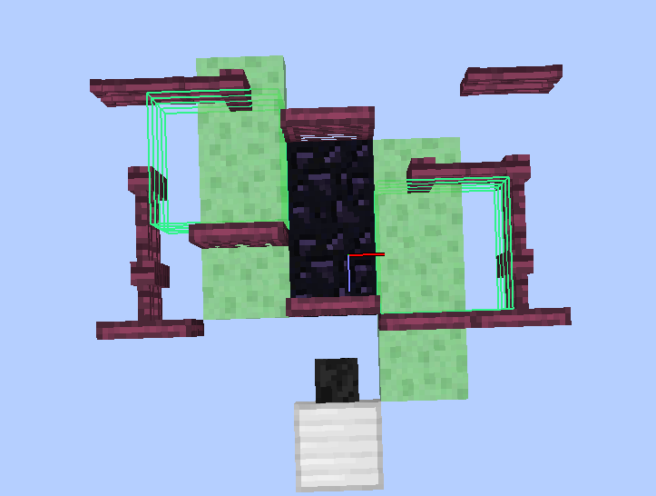

一个比较显然的解决方案是用被活塞移动的方块推动堆叠船使其靠近或远离羊驼来实现推进的启停控制。

但是，此处不得不考虑到这样一条机制：

> 在实体被活塞直接移动期间，如果B36的移动方向和实体移动方向一致且progress不为1（第2次运算完毕前），B36的碰撞箱会被忽略，除非它是伸出的活塞头的B36，这时它自带的无头活塞碰撞箱会被保留，活塞头本身对应碰撞箱会被忽略。

当船在活塞的移动下远离羊驼时，因为在移动的方向上，活板门比较靠后，根据活塞更新顺序，活板门对应的36号方块的运算晚于栅栏对应的36号方块的运算。当船在被活板门移动时，因为活塞推动会有0.01m的附加位移，船会进入被推动的栅栏0.01m。同时，因为实体挤压的运算在实体自身的运动运算后，船与羊驼相互作用而产生的速度在船被推动前来不及通过碰撞来被归零，所以，船在栅栏运算结束后的实体运算阶段中会进一步进入栅栏中，并与其他船发生挤压，导致其获得更大的速度。导致堆叠船中部分船被向与活塞推动方向相同的方向挤出。

大概比较难懂，但是结论是，在这里，有必要借助36号方块以外的方块（此处使用栅栏门）限制船的位移。

这里再给出之前的一个废案以备不时之需。

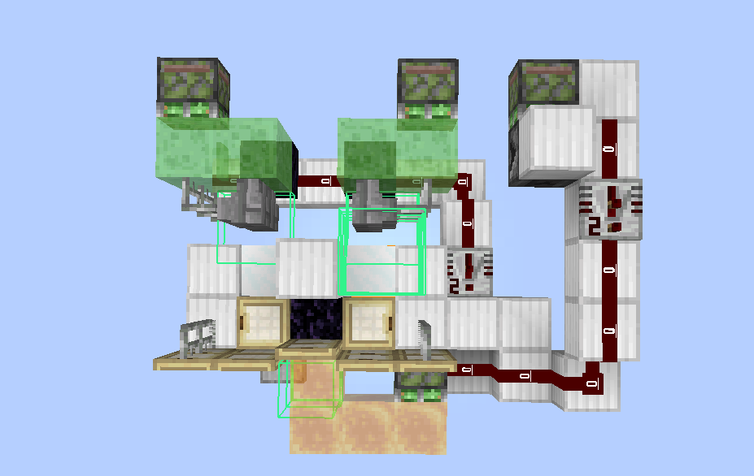

这个炮膛中船与周围方块围成的缝隙大小并不严格相当，此处需要更难理解的装置来实现启停，而且这样的设计在建造中玩家很可能会碰到堆叠船导致其散开，同时，这一结构也使边境炮其他部分的实现变得更加复杂，所以，在最终的设计中没有采用这种设计。然而，这一装置也涉及了一些可能会比较有价值的思路。

此处给出一条比较重要的活塞推动机制：

> 任何有效moving_piston方块实体在每gt都会尝试将**与其目前的碰撞箱分割出的各个长方体区域在运算结束时即将新扫过的范围相交**（不计边缘）的实体沿移动方向移动至距其新的位置前方0.01m处，但**总位移大小不会超过0.51m**。

由此很容易得出，当实体在某轴上卡在方块内部超过0.01m时，该方块在该轴上对实体造成的推动（若有）一定为0.51m。所以，图中的装置使用了卡在船当中的石砖墙来移动堆叠船。但是，我们注意到，圆石墙只有一部分与船相交，那我们该如何保证船被分割出的长方体区域新扫过的范围中至少有一个与船相交呢？这时又该请出一条比较重要的机制了：

> 方块碰撞箱的分割，情形比较复杂，而且会有方向性。大致的流程是，将方块分割为尽可能较少的多个正方体体素（立体像素），然后从碰撞箱中坐标值最小（按X、Y、Z的顺序比较）的一个体素开始，合并Z轴正方向上与该体素相邻而连续的若干个体素得到一个最长的条状区域，接着在X轴两个方向上延伸该条状区域得到一个最大的面状区域，最后在Y轴的两个方向上延伸得到的面状区域，得到一个被分割出的轴对齐边界箱并在碰撞箱中去除该区域后开始下一轮。一个结论是，长方形的方块碰撞箱只能分割出一个与原碰撞箱相同的边界箱。

估计相当难懂。这里我们用到的结论是，如图，至少是只与一个或两个方块连接的墙类方块中，只有西边有方块链接且有“突起”的墙突起的部分会被分割出一个专门的立方体区域。

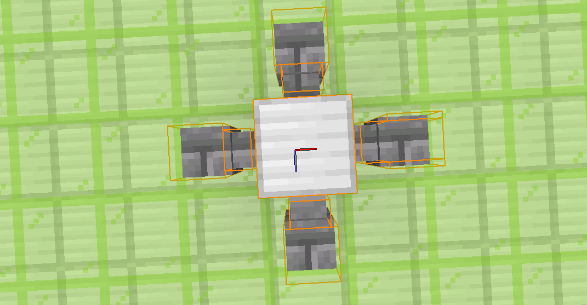

这也就是装置中间铁块的用途，显然，这是有方向性的，而且这里不能保证这在每个方向上都是可能实现的。

此外，为了防止推进结束时堆叠船因为船拥有残留速度而散开，羊驼在那时需要被推开一瞬间。这里使用了蜜块的粘动。

#### 推进速度与落点的计算

可以计算出，当每堆堆叠船中有N个船时，两侧的堆叠船均可以在每个坐标轴的方向上给予羊驼大小为0.2N m/gt的冲量。在N=100时，羊驼在两个轴上每gt受到一侧的堆叠船的冲量大小为20m/gt，此时设南北两侧堆叠船的推进时长分别为m、n，则活塞指向X轴正方向的炮膛上羊驼最终受到的冲量为：

$$
I_x=(20m+20n)m/gt
$$

$$
I_z=(20n-20m)m/gt
$$

1gt直达时，羊驼的最终位移数值上近似等于上述公式中的冲量。在已知目标位置与起始位置时，我们可以求得所需的位移与冲量，进而求解推进时长m、n。因为m、n均为非负整数，我们可以确定，该炮膛推进的羊驼的落点为以羊驼初始位置为定点，以活塞朝向为角平分线方向的一个直角中的一系列离散的点。

应该是因为在推进结束时堆叠船会散开一瞬间，实体实际上会在最后1gt少受到1gt应受到冲量的3/4，尽管这在动辄数百万米的尺度上几乎是可以忽略不计的，我们在安排拦截装置时仍有必要考虑到这一点。

在蓄力完成后，为了使羊驼从矿车中脱离出来，我们可以使用爆炸来破坏矿车。在破坏矿车的同时，羊驼也被赋予了一个较小的速度，此时其速度不再绝对沿轴，也这样保证了沿途的区块不会被羊驼加载到。

#### 适配1.18+

Minecraft 1.18及更高的版本中，由于基于`Entity.move()`方法的实体移动中的区块加载条件发生了变化，即若仍旧使用原来的设计，当实体发生移动时，实体移动前后的坐标连线上的区块会因为附加的raycast操作被加载。但是，因为获取方块状态这一运算过程本身的特性，当上述连线完全位于世界高度上限以外时，也可以实现不加载沿途区块这一目标。因此，在针对1.18+的设计中，我们需要将羊驼运送至世界高度上限处，同时使用赋予羊驼一个向上的Motion防止其在出发后至少2gt的运算中再次进入建筑高度范围以内。其中，前者可以很容易地借助飞行器来实现，而后者在保证破坏矿车的爆炸对羊驼造成足够影响的条件下实际上已经被实现。

#### 凋零骷髅头的用途

这里使用凋零骷髅头颅是出于以下原因：

- 船不会挤压到坐标高度高于自身的实体，而骑乘于矿车上的羊驼的坐标比矿车高0.14m，需要使矿车比最下方的船下方0.14m~0.3225m处（对应于原版下方块的3～5个像素）
- 凋零骷髅头不会完全阻挡TNT的爆炸射线，可以允许矿车与羊驼被TNT影响。

当然，如果存档中不方便获取凋零骷髅头，也可以改用可可豆或潮涌核心，或是改用铁栏杆并相应地垫高堆叠船。

### 计时装置

为了控制矢量边境炮在两个方向上的推进时长，进而控制落点的位置，矢量边境炮中还需要两个独立运行计时器。另外，鉴于使用环境的特殊性，此处的计时器的计时时长还需要是可配置的，且精度应尽可能高（最好为1gt）。

设计中的计时器结构如图：

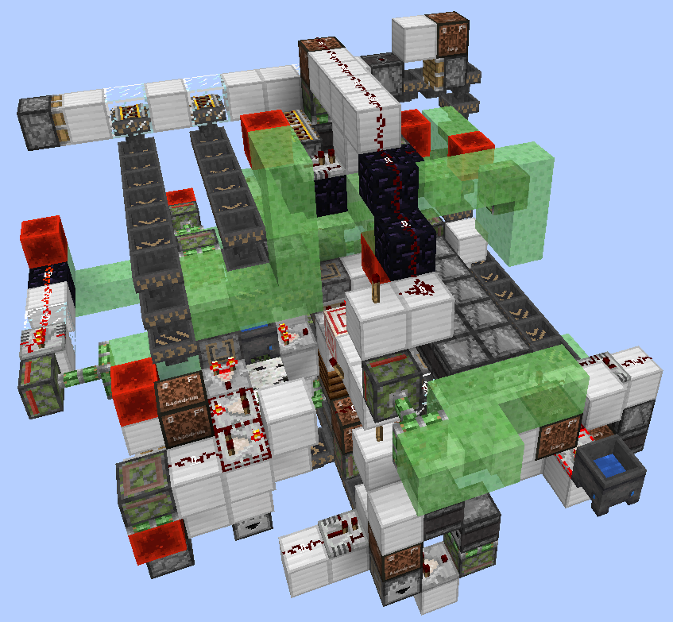

可见，该计时器结构相对复杂，此处不再对其结构进行具体分析，但可以大概地给出一个工作流程以便参考。

这一计时器有以下几个工作模式：

- 静置状态，在没有任何活动
- 加载配置，从漏斗输入物品调整控制计时时长
- 计时状态，输出配置决定的一定时长的连续红石信号
- 复位状态，计时结束后将计时器恢复至可重新开始计时的状态
- 卸载配置，清除先前加载的配置

按照精度，计时的进行主要包括四个部分：

- 以592gt为单位的计时，使用投掷器中物品数目存储配置
- 以16gt为单位的计时，使用投掷器中物品数目存储配置
- 以4gt为单位的计时，使用投掷器中物品相应的信号等级存储配置
- 以1gt为单位的计时，使用对准树叶且能传出信号的侦测器到作为信号源的原木的距离存储配置

前两个部分本质上就是投掷器倍乘计数器与16gt侦测器时钟，而第三个部分本质上只是一个递减式比较器时钟，在其他装置中也经常会出现，此处不再详述，只对1gt级计时部分进行简要讲解：

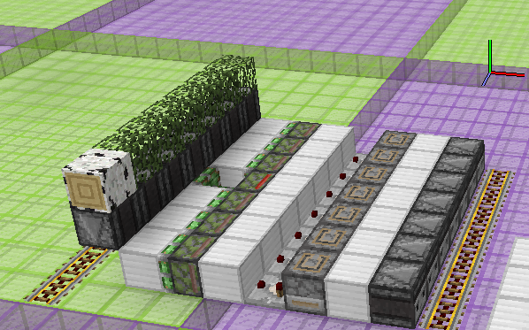

这里给出一条前置知识，树叶有一个`level`状态，描述了树叶到最近的原木的距离，当原木开始或停止接触树叶时，这一状态的更新会从原木开始，以每1gt传播1格的速度传播到附近的所有树叶上，而侦测器可以侦测到这一状态的变化。

当图中原木与侦测器一起被推动，原木开始接触那一列树叶最左边的树叶方块后，原木和树叶下方的侦测器会受到一系列间隔1gt的方块更新，并以1gt为间隔自左向右依次被激活，当下方为固体方块的侦测器被激活时，左边的一列铁轨被激活，实现以1gt为精度的信号延迟。

树叶所在位置的右边为配置电路，投掷器链中只有一个物品。当右边的铁轨被从下面激活时，由于铁轨是由距信号源较远的位置开始产生更新的，投掷器中会在逆着投掷方向的方向上依次被激活，最终物品被向上移动一个投掷器，延时增大1gt。当右边的铁轨被从上面激活时，投掷器中会在顺着投掷方向的方向上依次被激活，最终物品被投出投掷器链，配置被卸载。

从加载配置开始，可以这样给出这样一个典型的工作流程：

1. 物品流入投掷器
2. 1gt级计时部分中的投掷器中物品被投出，每投出一个物品延迟增大1gt
3. 火把塔下方的方块被激活，侦测器时钟开始工作，稍后开始输出红石信号
4. 侦测器时钟每输出37次信号，592gt级计时部分中投掷器投掷一个物品到对面的投掷器，直到物品用尽
5. 计时器切换状态
6. 侦测器时钟每输出1次信号，16gt级计时部分中投掷器投掷一个物品到对面的投掷器，直到物品用尽
7. 4gt级计时部分开始工作
8. 1gt级计时部分中的原木与其下方的侦测器被推出，延时结束后计时器的红石信号输出终止
9. 计时器开始复位，即592gt级与16gt级计时部分中的物品被投掷回原来的投掷器中。
10. 复位完成后可以开始下一次计时
11. 收到卸载配置信号
12. 1gt级计时部分中投掷器链中物品被投出，最终回流到最靠后的投掷器中
13. 592gt级、16gt级与4gt级计时部分中投掷器下方漏斗和漏斗矿车不再被锁定，物品最终被丢弃

另外两个需要说明的问题是，这里为什么选择了这样分有四个等级的配置方式，以及每个等级的配置精度又是怎样确定的。

要回答这两个问题，我们首先需要确定计时器精度和范围，这也决定了计时器总共可能用到的配置种数。显然，我们应该会希望使用Minecraft中存在的最小时间单位1 gt来作为计时器的精度，而且计时器计时的最长时长应该大于1 gt直达世界边境所需的蓄力时长$t_M$，最小计时时长则应该尽可能接近0。

根据前面的计算，我们知道，若沿用每一侧使用400堆叠船的设计，则每侧堆叠船在一个坐标轴上每gt给被推进实体施加的冲量大小为$I=20m/gt$，进而不难算出，在边境炮可以支持将被推进实体从原点推向同一维度的世界边界的边角处时，蓄力时长为
$$
t_M=\frac{3750000}{20}gt=187500gt
$$
进而，我们应希望计时器可以支持0～187500gt的计时，这需要计时器支持187501种不同的配置。在尝试了二进制计时器无果后，这里还是选择了基于投掷器互投计数的设计思路。

明显地，仅用一般的红石电路，我们无法实现1红石刻（2 gt）以下的配置精度，所以，这里首先有必要将1 gt精度的计时部分作为一个相对独立的部分。这里我们选择了结构与原理均较为简单的树电作为1 gt延迟的发生源。

为了使投掷器可以有规律地互投物品，我们还需要制作一个具有确定工作周期的时钟电路，这里我们用到的是结构简单的侦测器高频。最初，我们考虑使用周期为8 gt的侦测器高频，这时，我们可以算出，若侦测器的一个周期对应投掷器当中的一个物品，那么总共需要的物品数为$\frac{187500}{8}\approx23438$，而一个投掷器只能装下576个物品，所以我们需要使用更多的互投投掷器，以实现投掷器部分运行周期的倍乘。注意到$576^2=262144>23438$，所以我们只用两对互投的投掷器即可。

在这一思路下进行进一步设计的过程当中，我们发现，因为设计本身的原因，侦测器高频的工作周期小于16 gt时互投投掷器会无法正常工作，所以我们对装置又进行了微调。自然地，侦测器高频的周期长对应了配置精度较高的互投投掷器工作的周期长与配置精度。

但是，这时我们留意到，我们使用树电产生的1 gt级精度的延迟时长不能长于6 gt，在仅与配置精度为16 gt的投掷器部分配合时可以得到的计时范围是“不连续”的，时长在一系列范围（$16k+6<T<16k+16,k\in\N$）内的信号时长是无法通过配置得到的。因此，这里又引入了一套精度为4 gt的计时模块。

最后，因为要实现蓄力进度的显示，我们需要使较高一级（对应精度最低，计时时长最长）的一对投掷器可以被尽可能地装满，以增大它们对应的比较器输出在整个计时过程中的变化。因为配置所需的物品需要使用漏斗矿车运输，较高一级投掷器当中的物品数量最大只能为320个。如果这时恰好对应1 gt直达世界边界的边角处的蓄力时长，下一级的周期长应为$\frac{1}{320}\cdot187500=585.9375$。考虑到那一级的周期长应为侦测器高频的工作周期长（即16 gt）的整倍数，我们最终选定592 gt作为其工作周期与配置精度。

至此，我们便确定了计时器的合理配置方式。

最后顺带给出计时器的配置方式。可以看到，计时器上有4个由单个充能铁轨覆盖的漏斗，依次为精度为1gt、592gt、16gt和4gt的计时部分的配置输入，其中前三个输入中物品的数量$n_1$、$n_2$、$n_3$决定最终的配置，最后一个输入中的最终配置由输入物品在投掷器中时对应的红石信号等级$l$确定，这些配置下的计时器输出的连续红石信号时长为
$$
T=(n_1+592n_2+16n_3+4\lceil \frac{15}{l}\rceil+14)gt
$$

### 卡服机

为了给玩家争取时间骑上实体，装置中需要一个能产生较长时间瞬时卡顿的卡服机，同时，为减少卡服机对正常蓄力时长及其他活动的影响，这一卡服机在产生卡顿的前后应有足够低的持续卡顿，且产生卡顿的准备时长应尽可能短。

显然，堆叠TNT爆炸在此处是比较理想的一个设计：

- 当卡服所用的TNT被放置于弱加载区块时，其本身几乎不会产生任何卡顿
- 即使是很小的TNT复制机阵列也可以在几分钟的时间内产生成百上千个TNT
- 堆叠TNT的爆炸卡顿时长与TNT数目的平方近似成正比，卡顿时长可以被很快地地提高至数秒至几十秒
- 相对于使用红石粉或漏斗的卡服机，这类卡服机结构比较简单
- 如果能保证TNT爆炸时间完全一致，这类卡服机在主要的一次卡顿后几乎不再产生其他的额外卡顿

如前文中所说，单堆堆叠TNT爆炸卡顿时长与被检查的方块的碰撞箱复杂度有关，为了增加卡顿时长，我们可以将碰撞箱最复杂的炼药锅推到堆叠TNT的碰撞箱中。此时，爆炸卡顿时长会比在空地上爆炸时长8倍左右。

另外，允许TNT在复杂方块组成的的地面上水平移动时也可以明显地增大卡顿，在某些情形下这比上一种方案的效果更加明显，比较理想的情况下仅用2560个TNT就可以使服务器卡顿数十分钟。但是，由于这种卡顿似乎已被Lithium优化，且其具体成因尚不完全明了，本文中没有采用这一原理。

通常而言，为保证玩家有足够的时间进行操作，卡顿时长需要在10s左右，在使用中档设备且配合炼药锅的情况下，这需要堆叠约800个TNT。

需要说明的是，弱加载的TNT实体本身虽然不会造成明显的MSPT占用，但是，因为船在运算过程中会遍历其检测范围周围2m的区段（子区块）中所有的实体，将TNT和船置于同一个区段中仍会引起十分可观且难以被模组优化的卡顿。（详见[https://t.bilibili.com/758888242864979985](https://t.bilibili.com/758888242864979985)）同时，我们还需要使TNT爆炸中心应船保持8m以上的距离以保证TNT的爆炸不会破坏堆叠船。

在TNT堆叠完成后，我们需要强加载TNT以使其爆炸。此时，我们有强加载TNT所在的区块和强TNT推到既有的强加载区块两种选择。因为从下界传送门区块加载器收到信号到对面维度中区块被强加载加载的延迟似乎无法确定，这里我们不会选取前一种思路。此外，为使卡顿恰好在玩家被传送后发生，还需要严格地确定卡服机的触发延迟。

### 珍珠滞留装置

现在网络上有两类珍珠滞留装置，一类设计使用气泡柱给予珍珠向上的加速度来防止珍珠落地并将其位置确定在水面附近的一个较小的区域中，同时由珍珠本身的空气阻力来清除其水平速度；另一类使用了传统的珍珠矫正来完全消除珍珠速度与位置的随机性，随后不断地向上弹射珍珠或将珍珠暂存于弱加载区块中。与第二类相比，前一类珍珠矫正的结构特别简单，但是因为需要用到水而不能用于下界。

这里，我们主要选取第二类珍珠矫正。

为了防止反作弊系统阻止玩家与距离过远的实体交互，同时为玩家的操作提供便利，这里的珍珠滞留装置中珍珠的落点到羊驼的直线距离应在6m以内。

同样，为与卡服机的工作时间相匹配，这里也需要对触发延迟进行严格的调整。

### 保险线路

为保证装置的可靠性，矢量羊驼炮的设计中引入了用于实现以下限制的保险装置：

- 蓄力过程中蓄力装置的区块不能被卸载
  - 因为当实体在某轴上的速度大于10m/gt时，该轴上的速度在区块被卸载后就会丢失，这会导致蓄力进度被清零，进而使最终的落点与配置的落点间有严重偏差。
- 计时器复位期间蓄力装置的区块不能被卸载
  - 降低下一次使用边境炮的玩家在计时器复位未完成时就开始蓄力的可能性。
- 蓄力结束到最终出发的时间段内，蓄力装置的区块不能被卸载
  - 同第一项。
- 卡服TNT堆叠期间蓄力装置区块不能卸载
  - 防止卡服机损坏甚至炸膛
- 1.18+的设计中，将珍珠和羊驼运送到世界高度上限的过程中蓄力装置区块不能被卸载
  - 防止羊驼速度丢失，同时也防止飞行器在空中因区块卸载而停止运行。
- 在蓄力完成，卡服机TNT堆叠完毕，珍珠与羊驼到位前不允许提前出发
  - 防止误触出发键导致落点与配置不符。
- 1.18+的设计中，将羊驼向上运输时若羊驼被强加载需进行拦截
  - 防止羊驼在建筑高度范围内移动加载沿途区块

其它设计中几乎没有引入专门的保险装置。

### 控制面板（UI）

矢量羊驼炮装置控制面板中需要支持以下几种操作：

- 准备载具：将载具移动至某个指定的位置
- 开始蓄力：计时器、卡服机等部件开始工作，羊驼开始被加速
- 配置蓄力时长：调整装置的蓄力时长
- 出发：将出发信号传递到珍珠滞留装置与卡服机
- 卸载配置：清除先前的配置信息以便再次开始配置

同时也应有以下几种运行状态显示：

- 蓄力进度：大致的剩余蓄力时间
- 是否仍在蓄力：羊驼是否仍在被赋予动量

因为这些部分不会经常处于活动状态，所以几乎无需对其卡顿进行优化，只需考虑其简洁性与易用性。

在其它的设计中，因为功能与工作方式的不同，这里所支持的一些操作没有被用在其他的设计当中，或者是被与其它操作合并。一个比较极端的例子是，在最简单的设计当中，只有开始蓄力与出发两个操作被显式地体现在了“操作面板（仅一个拉杆）”中，拉杆的开关恰好分别对应了这两个操作，配置则由这两个操作的时间间隔隐含地决定。

### 爆炸推进式可骑乘实体炮（真猪炮）


该类设计中，因为不需要再像实体挤压炮膛那样需要使实体的高度足够高，这里使用较容易获取的猪作为载具已经可以满足需求。推进时，猪被放置在蓝冰上表面的中心，并且被弱加载处理。

炮膛以矢量真猪炮为例，这种炮膛结构比较简单，但是也涉及了以下数条设计目标：

- 不会炸膛（费话）
- 为使玩家骑乘被推进的载具，载具不可以被爆炸炸死
- 爆炸中心与被推进实体的眼部高度足够接近，并且要高于实体的眼部高度
- 爆炸中心与猪的距离尽可能接近
- 爆炸中心与猪的坐标连线的水平投影应成90度以上的夹角，但夹角也不能太大，以实现效率可以接受的矢量推进。
- 尽可能降低猪自行走动导致推进失败

图中发射器中被放置了足够的增强型神龟药水，这防止了猪被炸死。但是，由于猪的生命值实在太低，这里爆炸中心到猪的距离也应该保持在1.8m以上。

还有一个问题就是，与堆叠船的卡顿类似，堆叠TNT的爆炸卡顿与TNT的数目也是成二次关系，同样，我们还是希望将推进用的爆炸分为多批来进行。但是，与那不同的是，这里每多分出一批爆炸就会多出一定时长的由TNT复制阵列的工作延时造成的固定耗时。这样，就有可能存在一个平衡点，一批爆炸中的爆炸数量为某一个值时推进过程的总卡顿最小。之前在《堆叠TNT爆炸卡顿分析》中曾这样求解这一平衡点：

> 假设某弱加载区域有一个实体需用TNT推进将水平速度加速到$v$，且每个TNT提供的冲量固定为$\Delta v$，使所有TNT以每堆数量相同的单堆堆叠形式爆炸，配合使用`/tick warp`以保证服务器线程不间断运行，问若要确定加速所需的最短时间及此时的加速方案，需测定哪些数据，并用测得数据的表示所需结果。
>
> 显然，这种条件下需要的TNT数量是确定的，可以设为$N=\frac{v}{\Delta v}$。
>
> 在测定了运行环境下单堆TNT爆炸总卡顿与TNT数目的关系式系数$T_0$、$T_1$，`/tick warp`条件下以及归中阵列的运行周期$T$，再设每一堆TNT数目为$N_0$后，很容易写出总用时
>
> $$
> t=\frac{N}{N_0}(T_0N_0^2+T_1N_0+T)=T_0N_0N+\frac{NT}{N_0}+NT_1
> $$
>
> 由基本不等式很容易得出用时的最大值为$NT_1+N\sqrt{TT_0}$，在$N_0=\sqrt{\frac{T}{T_0}}$时取到。

实际上，上面的条件与在原版生存中使用这类边境炮时的条件是可以等价的。

前面提到，MC1.20.1中TNT爆炸的卡顿时长t与数量N的关系可以表示为

$$
t=0.0035123N^2 + 0.017624N
$$

此处的固定工作周期为36gt，约为1.8s。

将$T_0=0.0035123ms$，$T=1800ms$代入公式中，可以解得此时一批爆炸点最佳的爆炸数目约为716，相应最近的阵列规模为720。

按照之前测定的数据，在MC1.16.5中，最佳的阵列规模为380，但可能是因为计算错误，当时实际使用的阵列为260阵列。

为了防止猪自己走动，猪所在的方块的周围被用岩浆块围住。

另外，也可以注意到此处的猪被放置在了蓝冰上，这是为了让猪在运动的第2gt之后的速度衰减程度尽可能小，以增加移动位移。如果只打算1gt直达，这块蓝冰也可以被替换为其他完整方块。

### 边境珍珠炮

边境珍珠炮的设计思路与其他炮有极大的不同，更接近是传统的弱加载珍珠炮的一个改良。

传统的弱加载珍珠炮设计中，末影珍珠通常在世界高度上限以内开始飞行，但是，用于弹射物碰撞检查的raycast这一过程会检查珍珠路径经过的所有方块，并加载包含那些方块的所有区块。这在珍珠的速度只有几千m/gt时不会造成太严重的问题，但是，如果珍珠的速度有几百万m/gt，这一问题将会是致命的。这种情况下，在珍珠进行碰撞检查的过程中，最多会有上百万个区块被加载，这会造成服务端被卡死甚至因卡顿时间过长或内存溢出崩溃，与此同时，存档体积也会出现难以接受（数十GB）的增长。

此处的边境珍珠炮在推进完成后增加了一个将末影珍珠推到建筑高度范围以上的步骤，使珍珠在出发后的运动轨迹位于世界高度上限以外。因为获取建筑高度范围以外方块的运算不会加载相应的区块，这样，珍珠在移动时就不会再加载沿途区块。

因为珍珠位于建筑高度范围以外，这里不能用方块（包括栅栏等高度大于1m的方块）来拦截珍珠，但仍可以用实体来拦截：

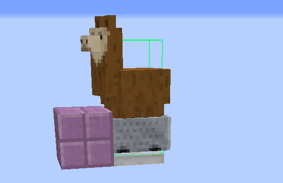

因为珍珠在某gt内撞击方块后会将玩家传送至珍珠在碰撞检查前的坐标处而不是碰撞点处，珍珠在出发后还需要移动2gt才能将玩家传送到其移动1gt后的位置实现1gt直达。而且，由于珍珠始终在世界的建筑上限以外，各种运算都不能使珍珠加载羊驼所在的区块，珍珠实际上无法被拦截。所以，我们仍需要在珍珠移动1gt后所在的位置处修建一个区块加载器。

另外，为了使珍珠被推进的效率尽可能高，同时使珍珠的竖直速度不至于太大，我们会希望珍珠与爆炸中心的高度差尽可能小。同时，我们还希望珍珠拥有一个向上的Motion来保证珍珠始终在高度上限以外运动，但是为了保证珍珠可以被轻易地拦截这一Motion又不能太大。假设珍珠1gt直达，拦截装置与上图相同，我们可得珍珠在出发后第1gt的Y轴位置$y_1$与第2gt的Y轴位置$y_2$应满足：

$$
256<y_1<255+0.1875+0.14+1.9+0.3=257.2575
$$

$$
y_2>256
$$

假设珍珠在出发前瞬间的Y轴坐标$y_0=256.01$，Y轴速度为$v_0$，由实体运动公式可得

$$
y_1-y_0=v_0
$$

$$
y_2-y_1=0.99v_0-0.03
$$

连立解得

$$
\frac{2}{199}m/gt<v_0<1.2475m/gt
$$

相对于珍珠巨大的水平速度，这一范围是相当小的。可以这样给出一个概念，为保证我们能使珍珠获得合适的速度，假定我们需要控制珍珠在水平速度达到3750000m/gt的同时竖直速度变化量不大于0.375m/gt，这意味着，珍珠眼部高度与爆炸中心的连线俯仰角的正切绝对值不大于$10^{-7}$，在珍珠距离TNT的距离为0.5m时，珍珠的坐标应该被控制在长度仅有$10^{-7}m$的一个区间内。不过，值得庆幸的是，设计这种珍珠矫正的过程可以借助程序搜索来简化。

由于被粘液块主动弹射的实体在相应轴上的速度会被重置为1m/gt，使用粘液块弹射也可以实现珍珠竖直速度的控制。（那上边算的那些不成废话了么？）

## 性能测试

测试环境：

- 处理器：Intel Core i5-1340P
- 内存分配：5120MB
- Java 11.0.20

在虚空群系超平坦世界的测试中，服务端的MSPT如下表：

| 环境/状态               | 空白对照 | 静态 | 卡服机工作 | 卡服机静止 |
| ----------------------- | -------- | ---- | ---------- | ---------- |
| 1.16.4                  | 1        | 32   | 72         | 62         |
| 1.16.4 + Lithium 0.6.6  | 1        | 14   | 20         | 16         |
| 1.20.1 + Lithium 0.11.2 | 1        | 18   | 21         | 20         |
| 1.20.1                  | 1        | 53   | 68         | 67         |

另外，在有1.20.1中也对出发瞬间羊驼移动的卡顿时长进行了测试，在某轴位移固定为3750000m，另一轴位移不同时，测得数据如下：

| 环境/侧向位移  | 0.01m | 1000m | 10000m |
| -------------- | ----- | ----- | ------ |
| Lithium 0.11.2 | 0.12s | 0.44s | 3.88s  |
| 无Lithium      | 0.9s  | 21s   | 未测试 |

结合理论分析（详见“前景与缺陷”一节）和进一步测试，固定某方向的位移为较大值时，卡顿时长与侧向位移近似成一次关系。

## 实装指导

### 位置与旋转

由于此处的边境炮全部依赖弱加载机制运作，而且因为在使用实体挤压的设计中卡服机与船需要与分处两个字区块，如非必要此处的设计在实装后相对于区块的位置应该与存档中一致，而且在不对原设计进行调整的前提下渲染距离应与下表相符：

| 设计       | 1.17-客户端 | 1.17-服务端 | 1.18+客户端    | 可以直接修改线路长度适配 |
| ---------- | ----------- | ----------- | -------------- | ------------------------ |
| 矢量羊驼炮 | 10          | 9           | 8              | 否                       |
| 边境珍珠炮 | 2           | 未测试      | 需延长信号线路 | 是                       |
| 矢量真猪炮 | 10          | 9           | 不支持         | 否                       |
| 简易边境炮 | 10          | 9           | 8              | 是                       |

因为适用于1.18+的设计与边境珍珠炮使用了建筑高度范围上限的一些特性，它们相对于世界高度上限的位置原则上应与存档中一致。

除了简易边境炮外，其它带有珍珠矫正的设计被旋转或镜像一般不能正常工作。

### 堆叠船的制作与运输

使用发射器向水中发射船时，船会在发射器所对准的水方块上方一定距离处生成，如果同时用方块接住生成的船，就可以实现堆叠船的制作。

水平运输堆叠船时，我们基本上只能用使用活塞推动和蜜块粘动来进行，粘液块弹射、挤压、驾驶等会使船产生水平速度的移动方法都会使堆叠船炸开。

竖直运输的自由度较大，但为了防止堆叠船发生分裂，我们还需要保证船的速度在数值上不大于船的高度，放到自由落体的情形下就是，我们需要将船单次无初速自由落体的竖直位移限制在4.7625m以下。

跨纬度运输实际上是几乎不受限制的，但也需要注意一点，如果堆叠船进入下界传送门的位置高于传送门底部，那么同一堆堆叠船应同时进入传送门，而不应逐个地被发射到传送门当中。

最后也是最重要的一点，不要让玩家、生物、矿车与其他船靠近堆叠船，否则堆叠船会炸开，处理起来很麻烦。

### 矢量炮配置的计算

#### 矢量炮的基本原理

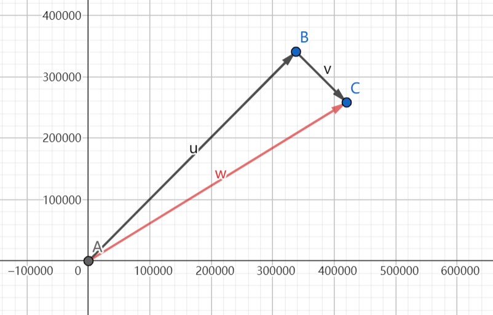

由平面向量基本定理，我们可以将一个大小、方向均任意的向量$\vec{w}$表示为为两个方向在事先确定而且不共线的向量$\vec{u}$、$\vec{v}$的和。放在这里，我们也可以将一个大小、方向均任意的速度（或者说位移、冲量）分解到两个事先确定的方向上，这样我们就可以实现仅使用两种推进方向不同的动力源来进行任意方向的推进。

但是，受限于配置的离散性，分解出的两个向量分别必须为某一向量的整倍数，比如，在珍珠炮中，当量的配置一般只规定了TNT的数量，所以在两组TNT的推进方向上珍珠被受到的冲量必须为单次爆炸赋予的冲量的整数倍。这样我们可以设两个方向上实体受到的冲量分别为$(X_1,Z_1)$、$(X_2,Z_2)$的整倍数。

#### 1gt直达

假设我们需要被推进实体在出发后1gt内从$(x_1,z_1)$移动到$(x_2,z_2)$，因为这里用到的可骑乘生物与末影珍珠的移动运算都是早于阻力运算的，我们可以认为实体受到的冲量，也可以说是实体的速度在数值上等于实体的位移，即：

$$
(x_2,z_2)-(x_1,z_1)=M(X_1,Z_1)+N(X_2,Z_2)
$$

即

$$
\begin{cases}
x_2-x_1=MX_1+NX_2\\
z_1-z_2=MZ_1+NZ_2
\end{cases}
$$

其中M、N均为自然数，对应实际配置中的蓄力时长或阵列工作周期数。这是关于M、N的一个二元一次方程组，我们可以很容易地求得

$$
\begin{cases}
M=\frac{Z_2(x_2-x_1)-X_2(z_2-z_1)}{x_1z_2-x_2z_1}\\
N=\frac{X_1(z_2-z_1)-Z_1(x_2-x_1)}{x_1z_2-x_2z_1}
\end{cases}
$$

#### 多gt运动

根据先前推导的实体运动公式，可以求得，为使末影珍珠（MDA型实体）在运动n gt后位移为$d_n$，实体的初速度应为

$$
v_{0} = \frac{d_{n}{t_{0}}^{- 1}(1 - k) }{1 - k^{n}}
$$

其中$t_0=1gt$，$k=0.9900000095367431640625$。

同样，也可以求出，为使可骑乘生物（MAD型实体）在运动n gt后位移为$d_n$，实体的初速度应为

$$
v_{0} = \frac{d_{n}{t_{0}}^{- 1}(1 - k)}{1 - k^{n}}
$$

其中$t_0=1gt$，$k=0.910000026226043701171875$。

这样就可以根据1gt直达时的方法计算实际配置。

不过，这里并不推荐这样做，原因如下：

- 高速运动中，玩家加载区块的效果似乎不稳定，使用可骑乘实体炮时玩家连同载具可能会在运动数gt后被卡住
- 不设拦截的情况下需要人工对飞行时长计数，可能会发生错误导致落点不正确
- 区块生成数量较多

### 矢量羊驼炮

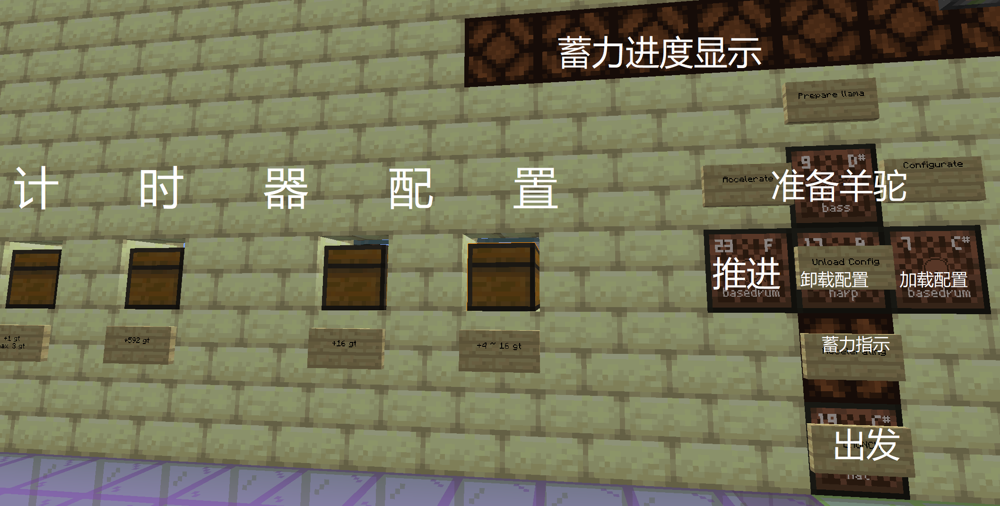

#### 计算与加载配置

根据前文的数据，我们可以计算出，若每堆堆叠船均包含100只船，整个边境炮共使用800只船，则每gt一侧的堆叠船在X、Z轴上给予羊驼的冲量大小均为20m/gt。以炮口朝向X轴正方向的设计为例，假设我们需要被推进实体在出发后1gt内从$(x_1,z_1)$移动到$(x_2,z_2)$，根据上一小节的公式可以求出，南北两侧的推进时间分别为

$$
M=\frac{(x_2-x_1)-(z_2-z_1)}{40}
$$

$$
N=\frac{(z_2-z_1)+(x_2-x_1)}{40}
$$

需要注意的是，由于在某一侧蓄力结束时堆叠船会散开一瞬间，羊驼会相当于在两侧各少受到0.75gt的挤压，或者说，相当于在炮口朝向的轴上的冲量减少了30m/gt。

前面已经对计时器的配置方式进行了这样的说明：

> 可以看到，计时器上有4个由单个充能铁轨覆盖的漏斗，依次为精度为1gt、592gt、16gt和4gt的计时部分的配置输入，其中前三个输入中物品的数量$n_1$、$n_2$、$n_3$决定最终的配置，最后一个输入中的最终配置由输入物品在投掷器中时对应的红石信号等级$l$确定，这些配置对应的红石信号时长为
>
> $$
> T=(n_1+592n_2+16n_3+4\lceil \frac{15}{l}\rceil+14)gt
> $$

在这里$n_1$、$n_2$、$n_3$分别对应从面板两侧到中间的三对箱子中物品的数量，$l$对应最中间一对箱子中的物品在投掷器中相应的信号等级。

这样，最终的等效蓄力时间为

$$
T=(n_1+592n_2+16n_3+4\lceil \frac{15}{l}\rceil+13.25)gt
$$

为方便参考，此处给出$4\lceil \frac{15}{l}\rceil$项的几组不同取值对应的物品示例

| 取值 | 红石信号等级 | 物品               |
| ---- | ------------ | ------------------ |
| 8    | 8～14        | 5个石铲            |
| 12   | 5～7         | 3～4个石铲         |
| 16   | 5～6         | 2个石铲            |
| 20   | 3～4         | 1个石铲 + 10个雪球 |

两侧的箱子分别对应同一侧堆叠船推进时长的配置。

在配置准备完毕后，右键“加载配置”音符盒，等待5～6分钟左右即可。如果先前已经加载了配置，则需要先右键“卸载配置”音符盒才可以开始加载配置。

#### 使用流程

##### 1gt直达

1. 确保羊驼储存当中有成年羊驼可用，加载器可以工作，视距设置正确，而且炮膛下方发射器中的TNT与运输羊驼的矿车充足。
2. 右键“准备羊驼”音符盒，听到两串高音调提示音说明羊驼到位。
3. 10秒后投掷珍珠，听到两串音调较高的提示音表示珍珠已经到位。
4. 右键“推进”音符盒，等待推进完成。进度指示灯大约每20分钟熄灭一个。进度指示灯恢复推进前的状态或下方的蓄力指示灯熄灭表示蓄力完成。期间玩家可以离开（尽管不建议），但是不可以强加载羊驼和卡服TNT所在的区块。
5. 片刻后（1.18+可能需要数分钟）右键“出发”音符盒，如果20s内没有反应，可以在确认蓄力完成后再次右键。为保证羊驼的位置被正确地同步到客户端，在右键音符盒之前可以先向与炮口相反的方向走2～3区块后再返回。
6. 等到玩家传送后，对准羊驼按住右键，成功交互数次（约1～2s）后按住潜行键等待卡顿结束。
7. 到达目的地。

需要注意的是，如果运动不是沿轴的，那么卡顿时长可能长达数分钟至数小时。

##### 多gt飞行

与1gt直达相似，但第6步中爆炸结束前应松开潜行键，而且在计划飞行n gt时，在飞行(n-1)gt后应开始按住潜行键（实际上退出游戏应该也有效）。

### 矢量真猪炮

#### 配置的计算与加载

以炮口朝向X轴正方向的设计为例，左右两侧的每260个TNT给予猪的冲量分别为$(135.183488，144.654941)$、$(135.183488，-144.654941)$，以类似的方法代入公式中即可得出所需TNT数量。

此处的配置的加载面板比较直观，而且该设计的实装意义不大，故不再对加载过程进行讲解。

#### 使用流程

1. 在炮膛的箱子中放置足够的增强型神龟药水。
2. 在炮膛的蓝冰上放置一只生命值足够的猪，并装备好鞍。注意一定不要拴住，否则会卡死服务器，确切原因待定。
3. 在猪开始走动前迅速返回操作区，然后向珍珠矫正装置中投掷一颗末影珍珠，一定要最先投
4. 关闭TNT复制机控制拉杆，切换到卡服TNT积累模式
5. 几秒后在控制区“TNT×260”箱子中放置6～10个物品。
6. 复制阵列停止工作后切换到蓄力模式
7. 向箱子继续中放置物品以配置一侧的TNT数目
8. 等待复制阵列停止工作
9. 拉动控制TNT爆炸位置的拉杆，向箱子继续中放置物品配置另一侧的TNT数目
10. 30秒后右键“Launch”音符盒，待传送后迅速骑上猪
11. 到达目标位置后重进，完成

### 简易边境炮

该设计没有专门的配置单元，整体使用方法与矢量羊驼炮类似。

#### 1gt直达

1. 确保羊驼储存当中有成年羊驼可用，视距设置正确，炮膛下方发射器中的TNT充足。
2. 在靠近羊驼储存的铁轨尽头放置矿车将羊驼运输至炮膛。
3. 投掷珍珠。
4. 回到信号线另一端，拉动拉杆，等待约1.5小时（800船，无卡顿）。期间玩家可以不离开或强加载羊驼和卡服TNT所在的区块。
5. 关闭拉杆。为保证羊驼的位置被正确地同步到客户端，在关闭拉杆之前可以先向与炮口相反的方向走2～3区块后再返回。
6. 等到玩家传送后，对准羊驼按住右键，成功交互数次（约1～2s）后按住潜行键等待卡顿结束。
7. 到达目的地。

需要注意的是，如果运动不是大致沿轴的，那么卡顿时长可能长达数分钟至数小时。

#### 多gt飞行

与1gt直达相似，但第6步中爆炸结束前应松开潜行键，而且在计划飞行n gt时，在飞行(n-1)gt后应开始按住潜行键（实际上退出游戏应该也有效）。

### 边境珍珠炮

该设计没有专门的配置部分，也只能作为一个样机，几乎没有实装的意义。

#### 使用流程

1. 关闭控制部分的拉杆，投掷珍珠
2. 拉下拉杆，等待一段时间（数秒至10小时）
3. 关闭拉杆，按下出发按钮
4. 等待飞行器复位后向前越过区块边界，强加载珍珠
5. 到达目的地

#### 拦截方式

见机器设计 > 边境珍珠炮一节。

### 可微调部分

为了适配不同的使用环境，装置中设有几个可调整的部分：

矢量羊驼炮中，计时器当中的投掷器计数器中默认的物品数目适用于曼哈顿距离7500000m以内的射程（足够在下界从原点移动至主世界边角对应的坐标），以便适配更远或更近的射程。此时，原592gt计时部分中每个物品对应的推进时长，以及推进进度指示灯的变化所需时间将等比例改变。

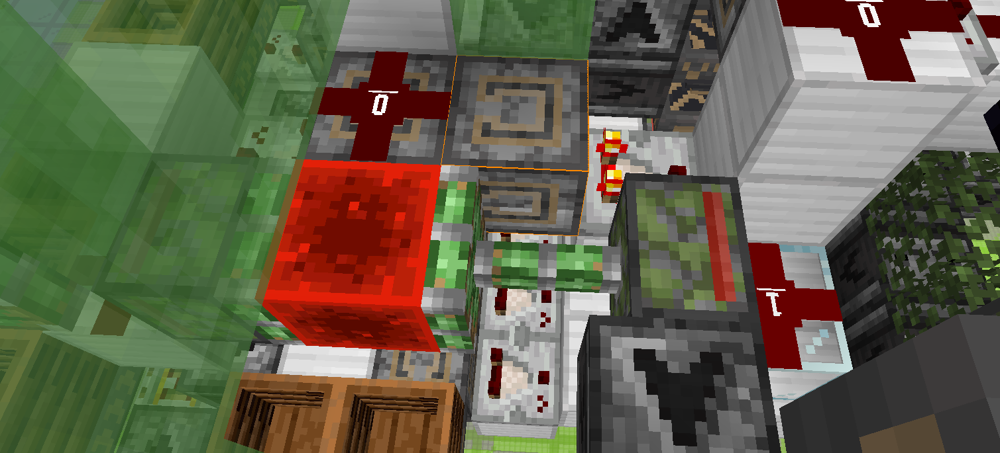

因为计算机配置不同，此处的卡服机的卡顿时长都是可调的，建议调整至10～20s为宜。

## 前景与当前设计的改进余地

根据前文所讲，此处的边境炮有望为位移在数十万格及以上的远程交通提供一个经济可行的方案。同时，相较于传统方法甚至是一般的下界传送门超传，这类方案下的区块生成数量也大大降低。不过，这些设计仍具有一些比较关键的缺陷：

### 单个装置覆盖范围有限

在此处的矢量炮设计中，射程的覆盖范围只有90度或仅略高与90度，这使得在仅适用一台边境炮的情况下无法实现对整个维度的覆盖。

对于这一问题，一个比较显然的思路是设置四台独立或共用部分部件的边境炮。

由于计时器可能会有最小计时时长的限制，而且因为配置精度的限制，一个方向上的被推进实体受到的冲量大小只能为某值的倍数只能在下列离散集合取值：

$$
\{I|I=nI_0,n\in Z,n\ge n_{min}\}
$$

进而可以绘制出被推进实体起点在原点处，两推进方向垂直，最短推进时长为38gt，每gt冲量为20m/gt的的边境炮1gt直达落点分布图：


为了实现对整个维度的全覆盖，这里的边境炮需要按一种交错的方式排列，即向东推进的边境炮放置到西边，向西推进的放置到东边，以此类推。简单地做成图形就是这样：

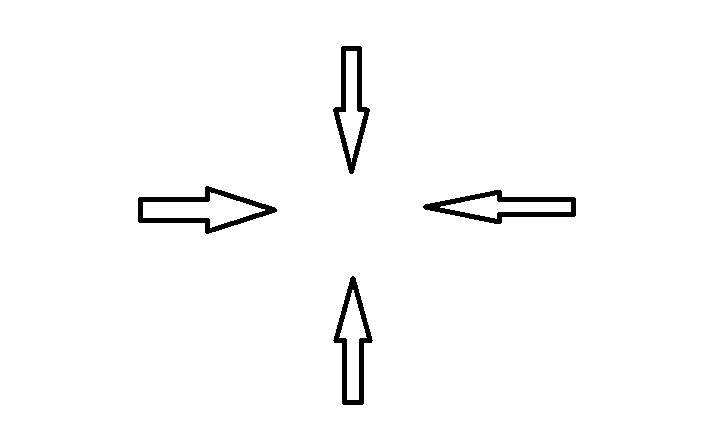

根据已有的研究，在单个边境炮中实现360度的射程范围也是有可能的，但是因为个人时间与实际设计能力有限，此处只给出几条基本思路：

- 利用机制“骑乘者的运算依赖于载具的运算”
  - 以羊驼为例。将羊驼所骑乘的矿车置于弱加载中，并使用活塞推动将羊驼推入强加载范围时羊驼不会被运算。所以，在避免羊驼不被运算的前提下将其置于强加载推进源的不同方位是有可能的。举个例子，这种思路下，假定一个界限的东、西两边分别为强加载、弱加载区块，则将羊驼置于推进源的东西两侧都是可能的，并且，若对炮膛中推进源的相对位置作出调整，想南北方向推进羊驼也是可能的。
  - 但是也有一条限制，就是1.16.5中羊驼推进羊驼的36号方块（或其他推动源）的检测范围距矿车所在的区块不能大于2m，否则羊驼将不能被推动。（1.17+兴许会有变化，但未测试）
- 利用TNT在爆炸发生的1gt中的位移使爆炸发生在弱加载区块中
  - TNT的运算中，运动运算早于爆炸，所以，若TNT在爆炸发生的1gt中处于强加载范围边缘且具有指向临近弱加载范围的速度，TNT在运算中会在以这一速度移动1gt进入弱加载区块后再爆炸。
  - 这使得给予被推进实体从弱加载区域指向强加载区域的冲量成为可能。
  - 但是，为实现这样的推进，需要防止先前的爆炸的变速作用影响到后运算的TNT，避免其无法到位或发生反方向的移动导致炸膛。使TNT在最后1gt中的位移大小大于爆炸范围，或是赋予TNT足够大的速度（不推荐）均可以解决这一问题。
- 借助[BV12k4y1u7Aw](https://www.bilibili.com/video/BV12k4y1u7Aw)中展示的原理实现
  - 本质上与给出的第一种思路类似，但此处应用了瞬时推动装置，使载具在方块实体运算阶段瞬间移入弱加载区块，并在接下来的实体运算中不能被运算，进而成功防止骑乘者被移动到载具中。
  - 与第一条思路不同的是，这一思路能不受上面“距离不超过2m”这一限制，极大地方便了360度推进的实现以及用户的操作。
  - 但是，瞬时推动装置耗材相对较多，提高了使用边境炮的门槛。

### 斜向远距离移动时卡顿较大

这一问题是在生存测试中发现的，当时得出的结论大致如下（有更正）：

> 使用Entity.move()移动的实体在碰撞检查时会检查包含其路径的一个轴对齐边界箱中的所有方块而不是像弹射物那样只检查其经过位置的方块。结果就是，在实体发生X，Z轴上分量都很大的位移时，会有远超所需数量的方块被检查。
> 直观一些，在处于两格方块的空间内的羊驼从原点移向主世界边角对应的下界位置时，本来只有约九千万个方块可能与羊驼发生碰撞，但实际上会有六十万亿个方块被遍历，足足多出了几十万倍，造成的卡顿时长可以有几个小时。
> 简单测了一下，具体的卡顿来源应该是尝试获取区块的过程，虽然因为区块不会被真正加载，这里获取单个空区块的耗时很不算太长，但是在这种区块数量动辄上千亿的情况下，卡顿就会相当大。
> 另外，因为弹射物检查途中实体的碰撞时尝试获取区块的过程中仍会有类似的问题，改用使用珍珠的边境炮并不会有明显的改善。
> 解决方法的话，Lithium的较新版本中对Entity.move()进行了优化，经测试卡顿时长相对原来明显减小，但仍不能使卡顿大小增速降低至与沿轴折线长度成正比的水平。弹射物这块有没有相关的优化暂时还不大清楚。（Not Vanilla）

简而言之，因为Bugjump的逻辑优化有缺陷，在实体的碰撞检查中，会有远超所需数十万倍的冗余的区块被遍历，产生极大，而且在原版中几乎无解的卡顿。

### 基于实体挤压的推进装置静态卡顿较大

现在的设计中，如果按常规将边境炮设置于下界，则堆叠船将被存储于下界中，使得玩家在进入该区域附近一个比较大的区域时产生明显的服务端卡顿。更糟糕的是，这一卡顿会进一步间接影响到在主世界中与之对应的更大的一个区域。同时，如果打算使用多台边境炮或多个独立堆叠船炮膛，在将其设置于同一位置时并同时将其强加载时，产生的卡顿大小可能是无法接受的。

此时，我们显然有两种思路解决该问题：

- 将船以物品的形式储存
  - 几乎不会产生额外卡顿，便于多个边境炮共享堆叠船，在建造中省去了专门准备堆叠船的步骤，但是蓄力前的启动时长会更长。
  - [BV12k4y1u7Aw](https://www.bilibili.com/video/BV12k4y1u7Aw)采用了这种方案
- 将堆叠船存储于玩家前往可能性更小的主世界相应位置
  - 蓄力前需要的准备时间更短，但这并未完全解决卡顿的问题。

### 使用羊驼的设计有约1/50的概率出发失败

前面提到，玩家在骑乘未被驯服的马类实体时，实体在每gt会有1/50的几率进行一轮特殊运算，若实体在此前与玩家没有交互，则玩家在特殊运算中一定会被甩下。

在蓄力结束羊驼恢复运算后，玩家会有1/50的概率在第1gt就被甩下，而这时羊驼的移动运算还未发生，所以，玩家会被留在羊驼移动前的位置而无法岁羊驼一起被发射。

为保证100%的成功率，这里有几种解决方案：

- 将羊驼驯服
- 喂给羊驼17个小麦或9个干草块，增加羊驼的`Temper`值，防止玩家在特殊运算中甩下
- 羊驼替换为赤足兽，并减少堆叠船的组数或调整堆叠船与赤足兽的相对高度（使矿车在堆叠船下方3像素处）

### 使用TNT的设计推进速度较慢

受复制机最短工作周期与堆叠TNT爆炸卡顿的双重限制，使用TNT蓄力的边境炮的蓄力时长非常长，使边境珍珠炮中的末影珍珠获得3750000m/gt的速度需要约4049700次爆炸，与测得的其他参数一同代入讲解矢量真猪炮设计时给出的公式

$$
t_{min}=NT_1+N\sqrt{TT_0}
$$

可得，在1.20.1中，一般的计算机上产生这些爆炸所需的时间约为2.84小时，其中前一项仅贡献了71s的耗时。在1.16.5中，总耗时估计会接近10小时。

如果我们用$n$个工作时序相互错开的阵列来蓄力，$T$就相当于被削减到原来的$\frac1n$倍。近似忽略公式中第一项的影响，此时，最优阵列规模与相应的推进时长均会变为原来的$\frac{1}{\sqrt{n}}$倍，整体阵列规模会增长到原来的$\sqrt{n}$倍，这不失为一个可行的解决方案。

但是，显然地，这种方案下整个边境炮的耗材会大大增加，而且，这时的阵列活动频率与存活的TNT实体个数也会增加，进而增大整机的卡顿，在交错时序时未能有效地错开各个阵列的卡顿峰值时这会尤为明显。另外，为了使公式仍能生效，此处还需要使TNT爆炸时相邻的子区块，至少是爆炸范围内没有其他TNT存在。

### 矢量羊驼炮配置加载时间过长

矢量羊驼炮中，加载配置时需要将输入的物品一个一个地使用漏斗进行两轮输送，物品最长需要约4.5分钟才能被全部送至目标位置，而且即使物品数目极少，这一耗时也不会缩短。

改用投掷器链或漏斗链运输可以减轻这一问题，然而，这样会进一步增大装置的复杂度与静态卡顿。

### 配置不可复用

在这些设计中，被加载的配置要么是在一次蓄力后随即丢失，要么就是在卸载配置后被丢失，没有像珍珠炮那样存储多个可以被很容易地加载的配置的能力。

这里给出两种解决方案：

- 使用珍珠炮中的配置存储，并改用二进制计数器计时。
  - [BV12k4y1u7Aw](https://www.bilibili.com/video/BV12k4y1u7Aw)采用了这种方案
  - 装置复杂度相对下降，但是耗材会更多
- 使用潜影盒存储配置
  - 这也是自己最初的配置思路
  - 但是实现会更困难，很可能增加装置的耗材数量

## 参考资料

1. Comedy. 【MC】360度猪炮【Comedy】[Z/OL]\(2023-08-04\)[2023-10-14]https://www.bilibili.com/video/BV12k4y1u7Aw
2. lovexyn0827. Minecraft实体运动研究与应用[R/OL]\(2023-10-04\)[2023-10-14]https://www.bilibili.com/read/cv12289098
3. lovexyn0827. 堆叠TNT爆炸卡顿分析[R/OL]\(2022-08-13\)[2023-10-14]https://www.bilibili.com/read/cv18082409
4. lovexyn0827. 又是一个关于卡顿的问题……[Z/OL]\(2023-02-05\)[2023-10-14]https://t.bilibili.com/758888242864979985
5. lovexyn0827. 断断续续做了大半年的矢量……[Z/OL]\(2023-08-22\)[2023-10-14]https://t.bilibili.com/832712485620416582
6. Comedy. 【MC】实体状态不同步讲解+边界炮【Comedy】[Z/OL]\(2022-07-18\)[2023-10-14]https://www.bilibili.com/video/BV1MV4y1J7DD